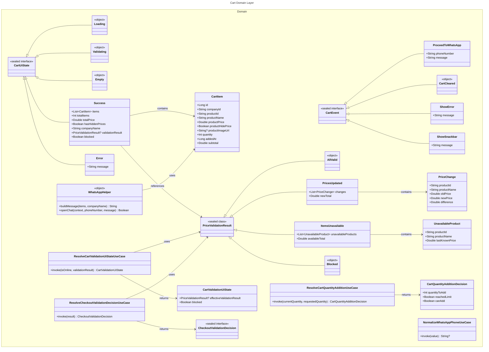
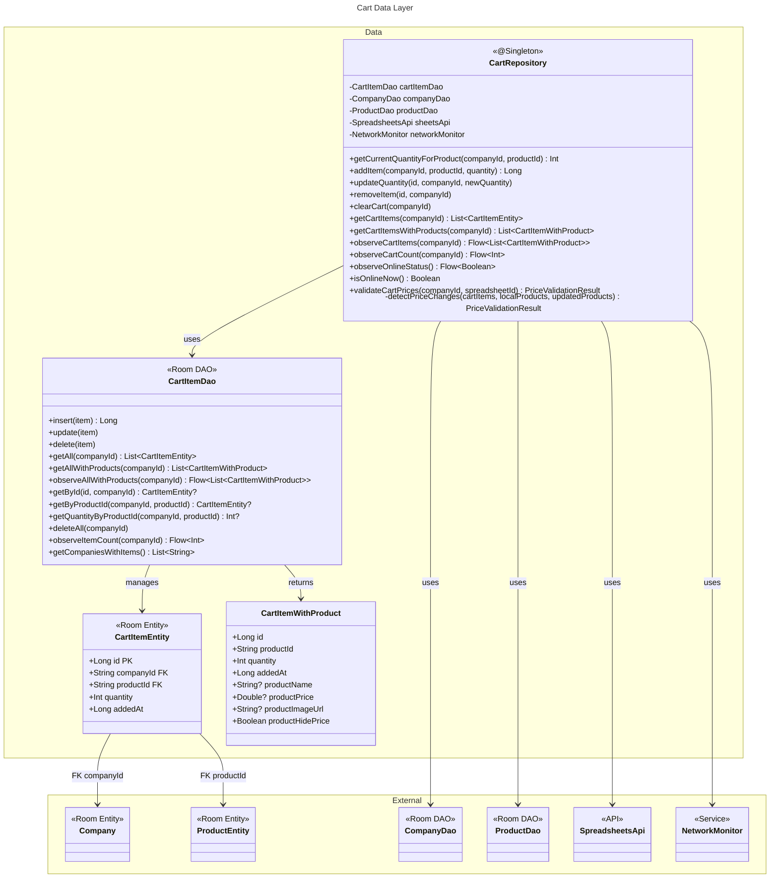
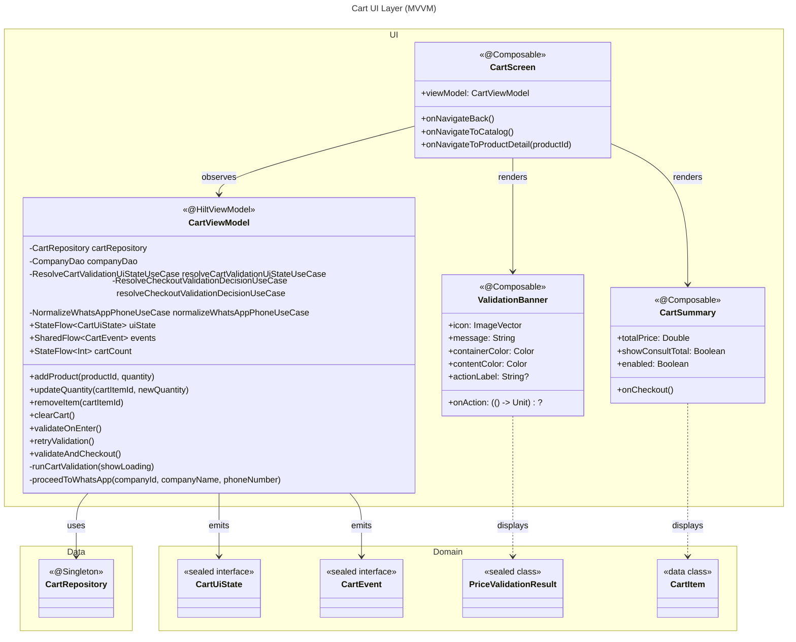

# C4 Code Level: Cart Module

## Overview

- **Name**: Cart Module (Carrito de Compras)
- **Description**: Shopping cart functionality with reactive Room persistence, price validation, and WhatsApp checkout
- **Location**: `app/src/main/java/com/brios/miempresa/cart/`
- **Language**: Kotlin
- **Architecture**: MVVM + Clean Architecture (Domain/Data/UI layers)
- **Key Technologies**: Jetpack Compose, Room, Kotlin Coroutines, Flow, Hilt
- **Purpose**: Enable users to add products to cart, validate prices against remote Google Sheets in real-time, and checkout via WhatsApp

## Architecture Layers

### Domain Layer (`cart/domain/`)

Defines business logic, models, and use cases independent of Android framework.

#### Models

**CartModels.kt** - Core domain models for cart state and events

- `CartItem` (data class)
  - Properties: `id: Long`, `companyId: String`, `productId: String`, `productName: String`, `productPrice: Double`, `productHidePrice: Boolean`, `productImageUrl: String?`, `quantity: Int`, `addedAt: Long`, `subtotal: Double`
  - Location: [CartModels.kt:3-14](../../../app/src/main/java/com/brios/miempresa/cart/domain/CartModels.kt)
  - Description: Domain representation of a cart item with product details and quantity
  - Calculated field: `subtotal = if (productHidePrice) 0.0 else productPrice * quantity`

- `CartUiState` (sealed interface)
  - Location: [CartModels.kt:16-34](../../../app/src/main/java/com/brios/miempresa/cart/domain/CartModels.kt)
  - Variants:
    - `Loading`: Initial loading state
    - `Validating`: Price validation in progress
    - `Empty`: No items in cart
    - `Success(items, totalItems, totalPrice, hasHiddenPrices, companyName, validationResult, blocked)`: Cart with data
    - `Error(message)`: Error state with message

- `CartEvent` (sealed interface)
  - Location: [CartModels.kt:36-47](../../../app/src/main/java/com/brios/miempresa/cart/domain/CartModels.kt)
  - Variants:
    - `ProceedToWhatsApp(phoneNumber, message)`: Navigate to WhatsApp with pre-filled message
    - `CartCleared`: Cart successfully emptied
    - `ShowError(message)`: Display error message
    - `ShowSnackbar(message)`: Display informational message

**PriceValidationModels.kt** - Price validation result types

- `PriceValidationResult` (sealed class)
  - Location: [PriceValidationModels.kt:3-34](../../../app/src/main/java/com/brios/miempresa/cart/domain/PriceValidationModels.kt)
  - Variants:
    - `AllValid`: No changes detected after validation sync ✅
    - `PricesUpdated(changes, newTotal)`: Prices updated after sync 🟡
    - `ItemsUnavailable(unavailableProducts, availableTotal)`: Some products deleted/hidden 🔴
    - `Blocked`: Validation blocked while offline 🔴

- `PriceChange` (data class)
  - Properties: `productId: String`, `productName: String`, `oldPrice: Double`, `newPrice: Double`, `difference: Double`
  - Location: [PriceValidationModels.kt:36-43](../../../app/src/main/java/com/brios/miempresa/cart/domain/PriceValidationModels.kt)

- `UnavailableProduct` (data class)
  - Properties: `productId: String`, `productName: String`, `lastKnownPrice: Double`
  - Location: [PriceValidationModels.kt:45-49](../../../app/src/main/java/com/brios/miempresa/cart/domain/PriceValidationModels.kt)

#### Use Cases

**ResolveCartQuantityAdditionUseCase.kt** - Business logic for adding items to cart with quantity limits

- `ResolveCartQuantityAdditionUseCase` (class)
  - Method: `operator fun invoke(currentQuantity: Int, requestedQuantity: Int): CartQuantityAdditionDecision`
  - Location: [ResolveCartQuantityAdditionUseCase.kt:13-41](../../../app/src/main/java/com/brios/miempresa/cart/domain/ResolveCartQuantityAdditionUseCase.kt)
  - Description: Enforces MAX_CART_QUANTITY_PER_PRODUCT (99), calculates remaining capacity, and returns decision
  - Returns: `CartQuantityAdditionDecision(quantityToAdd, reachedLimit)`
  - Constant: `MAX_CART_QUANTITY_PER_PRODUCT = 99`

- `CartQuantityAdditionDecision` (data class)
  - Properties: `quantityToAdd: Int`, `reachedLimit: Boolean`, `canAdd: Boolean`
  - Location: [ResolveCartQuantityAdditionUseCase.kt:6-11](../../../app/src/main/java/com/brios/miempresa/cart/domain/ResolveCartQuantityAdditionUseCase.kt)

**ResolveCartValidationUiStateUseCase.kt** - Determines effective UI state based on network status

- `ResolveCartValidationUiStateUseCase` (class)
  - Method: `operator fun invoke(isOnline: Boolean, validationResult: PriceValidationResult?): CartValidationUiState`
  - Location: [ResolveCartValidationUiStateUseCase.kt:10-34](../../../app/src/main/java/com/brios/miempresa/cart/domain/ResolveCartValidationUiStateUseCase.kt)
  - Description: Maps online status + validation result to effective UI state, blocks checkout if offline or items unavailable
  - Logic: If offline → force `Blocked` state; blocked = !isOnline || Blocked || ItemsUnavailable

- `CartValidationUiState` (data class)
  - Properties: `effectiveValidationResult: PriceValidationResult?`, `blocked: Boolean`
  - Location: [ResolveCartValidationUiStateUseCase.kt:5-8](../../../app/src/main/java/com/brios/miempresa/cart/domain/ResolveCartValidationUiStateUseCase.kt)

**ResolveCheckoutValidationDecisionUseCase.kt** - Maps validation result to checkout decision

- `ResolveCheckoutValidationDecisionUseCase` (class)
  - Method: `operator fun invoke(result: PriceValidationResult): CheckoutValidationDecision`
  - Location: [ResolveCheckoutValidationDecisionUseCase.kt:15-26](../../../app/src/main/java/com/brios/miempresa/cart/domain/ResolveCheckoutValidationDecisionUseCase.kt)
  - Description: Translates validation result into UI action (proceed, show notice, show error)
  - Mapping:
    - `AllValid` → `ProceedToWhatsApp`
    - `PricesUpdated` → `ShowPricesUpdatedNotice`
    - `ItemsUnavailable` → `ShowItemsUnavailableError`
    - `Blocked` → `ShowBlockedError`

- `CheckoutValidationDecision` (sealed interface)
  - Variants: `ProceedToWhatsApp`, `ShowPricesUpdatedNotice`, `ShowItemsUnavailableError`, `ShowBlockedError`
  - Location: [ResolveCheckoutValidationDecisionUseCase.kt:5-13](../../../app/src/main/java/com/brios/miempresa/cart/domain/ResolveCheckoutValidationDecisionUseCase.kt)

**NormalizeWhatsAppPhoneUseCase.kt** - Sanitizes phone numbers

- `NormalizeWhatsAppPhoneUseCase` (class)
  - Method: `operator fun invoke(value: String): String?`
  - Location: [NormalizeWhatsAppPhoneUseCase.kt:5-12](../../../app/src/main/java/com/brios/miempresa/cart/domain/NormalizeWhatsAppPhoneUseCase.kt)
  - Description: Removes all non-digit characters, returns null if blank
  - Regex: `\D` (any non-digit)

#### Helpers

**WhatsAppHelper.kt** - WhatsApp integration utilities

- `WhatsAppHelper` (object)
  - Methods:
    - `buildMessage(items: List<CartItem>, companyName: String): String`
      - Location: [WhatsAppHelper.kt:11-43](../../../app/src/main/java/com/brios/miempresa/cart/domain/WhatsAppHelper.kt)
      - Description: Builds formatted WhatsApp message with cart items, handles hidden prices
      - Format: "¡Hola! Quiero hacer este pedido a {companyName}:\n• {product} x{qty} - {price}\nTotal: {total}\nEnviado desde MiEmpresa"
    - `openChat(context: Context, phoneNumber: String, message: String): Boolean`
      - Location: [WhatsAppHelper.kt:45-66](../../../app/src/main/java/com/brios/miempresa/cart/domain/WhatsAppHelper.kt)
      - Description: Opens WhatsApp with pre-filled message using `wa.me` deep link
      - URL: `https://wa.me/{phone}?text={encodedMessage}`
      - Returns: `true` if WhatsApp opened, `false` if not installed

### Data Layer (`cart/data/`)

Implements repository pattern with Room database as single source of truth.

#### Entity

**CartItemEntity.kt** - Room entity for cart persistence

- `CartItemEntity` (data class, @Entity)
  - Table: `cart_items`
  - Primary Key: `id: Long` (auto-generated)
  - Properties: `companyId: String`, `productId: String`, `quantity: Int`, `addedAt: Long`
  - Location: [CartItemEntity.kt:30-37](../../../app/src/main/java/com/brios/miempresa/cart/data/CartItemEntity.kt)
  - Foreign Keys:
    - `companyId` → `Company.id` (CASCADE)
    - `productId` → `ProductEntity.id` (CASCADE)
  - Indices: `companyId`, `productId` (for FK + JOIN performance)

#### DAO

**CartItemDao.kt** - Room Data Access Object

- `CartItemDao` (interface, @Dao)
  - Location: [CartItemDao.kt:22-99](../../../app/src/main/java/com/brios/miempresa/cart/data/CartItemDao.kt)
  - CRUD Operations:
    - `suspend fun insert(item: CartItemEntity): Long` - Insert new cart item
    - `suspend fun update(item: CartItemEntity)` - Update quantity
    - `suspend fun delete(item: CartItemEntity)` - Remove item
  - Query Operations:
    - `suspend fun getAll(companyId: String): List<CartItemEntity>` - Get all cart items (entities only)
    - `suspend fun getAllWithProducts(companyId: String): List<CartItemWithProduct>` - JOIN with products table
    - `fun observeAllWithProducts(companyId: String): Flow<List<CartItemWithProduct>>` - Reactive Flow with JOIN
    - `suspend fun getById(id: Long, companyId: String): CartItemEntity?` - Find by ID
    - `suspend fun getByProductId(companyId: String, productId: String): CartItemEntity?` - Find by product
    - `suspend fun getQuantityByProductId(companyId: String, productId: String): Int?` - Get quantity only
    - `suspend fun deleteAll(companyId: String)` - Clear cart
    - `fun observeItemCount(companyId: String): Flow<Int>` - Reactive item count for badge
    - `suspend fun getCompaniesWithItems(): List<String>` - Find companies with non-empty carts

- `CartItemWithProduct` (data class)
  - Properties: `id: Long`, `productId: String`, `quantity: Int`, `addedAt: Long`, `productName: String?`, `productPrice: Double?`, `productImageUrl: String?`, `productHidePrice: Boolean`
  - Location: [CartItemDao.kt:10-19](../../../app/src/main/java/com/brios/miempresa/cart/data/CartItemDao.kt)
  - Description: JOIN result of cart_items + products, used for display

#### Repository

**CartRepository.kt** - Repository implementation with price validation

- `CartRepository` (class, @Singleton)
  - Constructor Dependencies: `cartItemDao`, `companyDao`, `productDao`, `sheetsApi`, `networkMonitor`
  - Location: [CartRepository.kt:18-222](../../../app/src/main/java/com/brios/miempresa/cart/data/CartRepository.kt)
  - Methods:
    - `suspend fun getCurrentQuantityForProduct(companyId: String, productId: String): Int` - Get current quantity for product
    - `suspend fun addItem(companyId: String, productId: String, quantity: Int): Long` - Add/update item, enforces max quantity (99)
    - `suspend fun updateQuantity(id: Long, companyId: String, newQuantity: Int)` - Update quantity (1-99)
    - `suspend fun removeItem(id: Long, companyId: String)` - Remove item by ID
    - `suspend fun clearCart(companyId: String)` - Delete all items
    - `suspend fun getCartItems(companyId: String): List<CartItemEntity>` - Get entities
    - `suspend fun getCartItemsWithProducts(companyId: String): List<CartItemWithProduct>` - Get with JOIN
    - `fun observeCartItems(companyId: String): Flow<List<CartItemWithProduct>>` - Reactive Flow
    - `fun observeCartCount(companyId: String): Flow<Int>` - Reactive count
    - `fun observeOnlineStatus(): Flow<Boolean>` - Observe network connectivity
    - `fun isOnlineNow(): Boolean` - Current online status
    - `suspend fun validateCartPrices(companyId: String, spreadsheetId: String): PriceValidationResult` - **Key method**: Validates cart against remote Google Sheets
  - Private Methods:
    - `private fun detectPriceChanges(cartItems, localProducts, updatedProducts): PriceValidationResult` - Compares local vs remote prices
    - Location: [CartRepository.kt:159-221](../../../app/src/main/java/com/brios/miempresa/cart/data/CartRepository.kt)

**Price Validation Flow** (validateCartPrices):
1. Check company and cart exist
2. Require online connectivity → return `Blocked` if offline
3. Fetch updated products from Google Sheets API (partial sync for cart items only)
4. Call `recoverMissingProductsByName()` if partial response (products deleted or ID mismatches)
5. Update Room with latest prices for instant UX feedback
6. Call `detectPriceChanges()` to compare local vs remote
7. Return validation result: `AllValid`, `PricesUpdated`, `ItemsUnavailable`, or `Blocked`

**recoverMissingProductsByName** (internal function)
- Signature: `internal fun recoverMissingProductsByName(requestedIds: Set<String>, localProducts: List<ProductEntity>, syncedProducts: List<ProductEntity>, publicProducts: List<ProductEntity>): List<ProductEntity>`
- Location: [CartRepository.kt:224-256](../../../app/src/main/java/com/brios/miempresa/cart/data/CartRepository.kt)
- Description: Recovers missing product IDs by matching name + category from full product list (handles ID changes in Sheets)
- Matching logic: Normalize name → filter by category → select if unique match

### UI Layer (`cart/ui/`)

Jetpack Compose UI with MVVM architecture.

#### ViewModel

**CartViewModel.kt** - Presentation logic

- `CartViewModel` (@HiltViewModel)
  - Constructor Dependencies: `savedStateHandle`, `cartRepository`, `companyDao`, `resolveCartValidationUiStateUseCase`, `resolveCheckoutValidationDecisionUseCase`, `normalizeWhatsAppPhoneUseCase`
  - Location: [CartViewModel.kt:40-362](../../../app/src/main/java/com/brios/miempresa/cart/ui/CartViewModel.kt)
  - State:
    - `uiState: StateFlow<CartUiState>` - Main UI state (reactive Flow with `combine`)
    - `events: SharedFlow<CartEvent>` - One-off events (navigation, snackbars)
    - `cartCount: StateFlow<Int>` - Badge count
    - `validationResult: MutableStateFlow<PriceValidationResult?>` - Cached validation result
    - `isValidating: MutableStateFlow<Boolean>` - Loading indicator
    - `isOnlineFlow: StateFlow<Boolean>` - Network status
  - Actions:
    - `fun addProduct(productId: String, quantity: Int = 1)` - Add product to cart
    - `fun updateQuantity(cartItemId: Long, newQuantity: Int)` - Update quantity (removes if ≤ 0)
    - `fun removeItem(cartItemId: Long)` - Remove item
    - `fun clearCart()` - Clear all items
    - `fun validateOnEnter()` - Validate prices on screen enter (background)
    - `fun retryValidation()` - Manual validation retry (with loading)
    - `fun validateAndCheckout()` - Validate + proceed to WhatsApp if valid
  - Private Methods:
    - `private fun runCartValidation(showLoading: Boolean)` - Runs price validation
    - `private suspend fun proceedToWhatsApp(companyId, companyName, phoneNumber)` - Build message + emit event
    - `private suspend fun getCompanyIdOrNull(): String?` - Safe company ID getter

**UI State Flow** (uiState):
```kotlin
companyIdFlow
  .flatMapLatest { companyId ->
    combine(
      cartRepository.observeCartItems(companyId),
      companyDao.observeCompanyById(companyId),
      validationResult,
      isValidating,
      isOnlineFlow
    ) { cartItems, company, validation, validating, isOnline ->
      // Map to CartUiState
      if (validating) CartUiState.Validating
      else if (items.isEmpty()) CartUiState.Empty
      else CartUiState.Success(
        items, totalItems, totalPrice, hasHiddenPrices,
        companyName, validationResult, blocked
      )
    }
  }
  .stateIn(...)
```

**Auto-validation on network restore**:
```kotlin
init {
  viewModelScope.launch {
    isOnlineFlow.collect { isOnline ->
      if (isOnline && !wasOnline) {
        runCartValidation(showLoading = false)
      }
      wasOnline = isOnline
    }
  }
}
```

#### Screens

**CartScreen.kt** - Main cart UI

- `CartScreen` (@Composable)
  - Parameters: `onNavigateBack`, `onNavigateToCatalog`, `onNavigateToProductDetail`, `viewModel`
  - Location: [CartScreen.kt:70-345](../../../app/src/main/java/com/brios/miempresa/cart/ui/CartScreen.kt)
  - Description: Displays cart items, price validation banners, checkout button
  - Lifecycle Handling:
    - `LaunchedEffect` - Validates on enter, collects events
    - `DisposableEffect` - Observes lifecycle for WhatsApp return flow
  - States:
    - `Loading` → CircularProgressIndicator
    - `Validating` → CircularProgressIndicator + "Validando precios..." text
    - `Empty` → EmptyStateView with "Explorar catálogo" action
    - `Error` → EmptyStateView with error message
    - `Success` → LazyColumn with cart items + validation banners + checkout button
  - Validation Banners:
    - `PricesUpdated` → 🟡 Yellow banner "Algunos precios se actualizaron"
    - `ItemsUnavailable` → 🔴 Red banner "N productos ya no están disponibles"
    - `Blocked` → 🔴 Red banner "Conectate para verificar precios" + Retry button
  - WhatsApp Return Flow:
    1. User taps checkout → opens WhatsApp → returns to app
    2. `LifecycleEventObserver` detects `ON_RESUME`
    3. Shows "¿Enviaste el pedido?" dialog
    4. User confirms → clears cart
    5. User dismisses → keeps cart

- `ValidationBanner` (@Composable, private)
  - Parameters: `icon`, `message`, `containerColor`, `contentColor`, `actionLabel?`, `onAction?`
  - Location: [CartScreen.kt:347-393](../../../app/src/main/java/com/brios/miempresa/cart/ui/CartScreen.kt)
  - Description: Reusable banner for validation states

#### Components

**CartSummary.kt** - Checkout section (bottom bar)

- `CartSummary` (@Composable)
  - Parameters: `totalPrice`, `showConsultTotal`, `onCheckout`, `enabled`
  - Location: [CartSummary.kt:38-113](../../../app/src/main/java/com/brios/miempresa/cart/ui/components/CartSummary.kt)
  - Description: Displays total price + WhatsApp checkout button
  - Features:
    - Currency formatting (es-AR locale)
    - "A consultar" label for hidden prices
    - WhatsApp green button with logo
    - Disabled state when offline or items unavailable

## Dependencies

### Internal Dependencies (MiEmpresa modules)

- **core.data.local.daos**
  - `CompanyDao` - Access company data (name, WhatsApp, spreadsheet ID)
- **core.data.local.entities**
  - `Company` - Company entity for foreign key
- **core.api.sheets**
  - `SpreadsheetsApi` - Fetch updated products from Google Sheets
- **core.network**
  - `NetworkMonitor` - Observe online/offline status
- **core.ui.components**
  - `EmptyStateView`, `MiEmpresaDialog`, `OrderProductListItem`, `OrderProductPriceChange` - Reusable UI components
- **core.ui.theme**
  - `AppDimensions`, `SlateGray200`, `WhatsAppGreen` - Design tokens
- **products.data**
  - `ProductEntity` - Product entity for foreign key
  - `ProductDao` - Update prices after validation

### External Dependencies

- **androidx.room** - Local database (CartItemEntity, CartItemDao)
- **androidx.lifecycle** - ViewModel, StateFlow, SharedFlow
- **androidx.compose** - Jetpack Compose UI
- **androidx.hilt** - Dependency injection
- **kotlinx.coroutines** - Async operations, Flow
- **javax.inject** - @Inject, @Singleton annotations
- **java.text.NumberFormat** - Currency formatting
- **android.content.Intent** - WhatsApp deep link
- **android.net.Uri** - URL encoding

## Data Flow

### 1. Add to Cart Flow

```
Catalog/ProductDetail (UI)
  ↓ addProduct(productId, quantity)
CartViewModel
  ↓ cartRepository.addItem(companyId, productId, quantity)
CartRepository
  ↓ Check if product exists in cart
  ├─ Exists → cartItemDao.update(existing.copy(quantity = new))
  └─ New → cartItemDao.insert(CartItemEntity)
Room Database
  ↓ Triggers Flow emission
CartItemDao.observeAllWithProducts()
  ↓ Flow<List<CartItemWithProduct>>
CartViewModel.uiState
  ↓ StateFlow<CartUiState.Success>
CartScreen (LazyColumn with items)
```

### 2. Price Validation Flow

```
CartViewModel.validateAndCheckout()
  ↓ Set isValidating = true
  ↓ cartRepository.validateCartPrices(companyId, publicSheetId)
CartRepository
  ↓ 1. Get cart items from Room
  ↓ 2. Get local products from Room
  ↓ 3. Fetch updated products from sheetsApi.getProductsByIds()
  ↓ 4. If partial response → recoverMissingProductsByName()
  ↓ 5. productDao.upsertAll(updatedProducts) ← Update Room
  ↓ 6. detectPriceChanges(cartItems, localProducts, updatedProducts)
  ├─ Unavailable products? → PriceValidationResult.ItemsUnavailable
  ├─ Price changes? → PriceValidationResult.PricesUpdated
  └─ No changes → PriceValidationResult.AllValid
  ↓ Return PriceValidationResult
CartViewModel
  ↓ validationResult.value = result
  ↓ resolveCheckoutValidationDecisionUseCase(result)
  ├─ AllValid → proceedToWhatsApp()
  ├─ PricesUpdated → emit ShowSnackbar event
  ├─ ItemsUnavailable → emit ShowError event
  └─ Blocked → emit ShowError event
CartScreen
  ↓ Collect events
  ├─ ProceedToWhatsApp → WhatsAppHelper.openChat()
  └─ Errors → Show snackbar
```

### 3. WhatsApp Checkout Flow

```
User taps "Enviar pedido por WhatsApp"
  ↓ CartViewModel.validateAndCheckout()
  ↓ [Price validation flow...]
  ↓ If AllValid → proceedToWhatsApp()
  ↓ Build message with WhatsAppHelper.buildMessage()
  ↓ Emit CartEvent.ProceedToWhatsApp(phone, message)
CartScreen.LaunchedEffect
  ↓ WhatsAppHelper.openChat(context, phone, message)
  ↓ Intent(ACTION_VIEW, "https://wa.me/{phone}?text={message}")
  ↓ Set pendingConfirmationOnReturn = true
WhatsApp App
  ↓ User sends message, taps back button
CartScreen.DisposableEffect (LifecycleEventObserver)
  ↓ ON_RESUME event
  ↓ If pendingConfirmationOnReturn → Show dialog
User confirms order sent
  ↓ viewModel.clearCart()
  ↓ cartRepository.clearCart(companyId)
  ↓ cartItemDao.deleteAll(companyId)
Room Database
  ↓ Triggers Flow emission
CartScreen
  ↓ uiState = CartUiState.Empty
```

### 4. Reactive State Synchronization

```
Room Database (cart_items table)
  ↓ Any insert/update/delete triggers Flow
CartItemDao.observeAllWithProducts(companyId)
  ↓ Flow<List<CartItemWithProduct>> (auto-JOIN with products)
CartRepository.observeCartItems()
  ↓ Pass-through Flow
CartViewModel.uiState
  ↓ combine(cartItems, company, validation, isValidating, isOnline)
  ↓ Map to CartUiState.Success(...)
  ↓ StateFlow<CartUiState>
CartScreen
  ↓ collectAsStateWithLifecycle()
  ↓ Recompose UI automatically on any state change
```

## Class Relationships

### Domain Layer Class Diagram



### Data Layer Class Diagram



### UI Layer Class Diagram



### Full Cart Module Architecture

```mermaid
---
title: Cart Module - Clean Architecture Layers
---
graph TB
    subgraph "UI Layer (Presentation)"
        CartScreen[CartScreen<br/>@Composable]
        CartSummary[CartSummary<br/>@Composable]
        ValidationBanner[ValidationBanner<br/>@Composable]
        CartViewModel[CartViewModel<br/>@HiltViewModel]
    end

    subgraph "Domain Layer (Business Logic)"
        CartModels[CartItem<br/>CartUiState<br/>CartEvent]
        PriceValidationModels[PriceValidationResult<br/>PriceChange<br/>UnavailableProduct]
        ResolveQuantityUC[ResolveCartQuantity<br/>AdditionUseCase]
        ResolveValidationUC[ResolveCartValidation<br/>UiStateUseCase]
        ResolveCheckoutUC[ResolveCheckoutValidation<br/>DecisionUseCase]
        NormalizePhoneUC[NormalizeWhatsApp<br/>PhoneUseCase]
        WhatsAppHelper[WhatsAppHelper<br/>object]
    end

    subgraph "Data Layer (Repository)"
        CartRepository[CartRepository<br/>@Singleton]
        CartItemDao[CartItemDao<br/>@Dao]
        CartItemEntity[CartItemEntity<br/>@Entity]
        CartItemWithProduct[CartItemWithProduct<br/>JOIN result]
    end

    subgraph "External Dependencies"
        Room[(Room Database)]
        SheetsAPI[Google Sheets API]
        NetworkMonitor[NetworkMonitor]
        CompanyDao[CompanyDao]
        ProductDao[ProductDao]
        WhatsAppApp[WhatsApp App<br/>via Intent]
    end

    CartScreen --> CartViewModel
    CartScreen --> CartSummary
    CartScreen --> ValidationBanner
    CartViewModel --> CartModels
    CartViewModel --> PriceValidationModels
    CartViewModel --> CartRepository
    CartViewModel --> ResolveValidationUC
    CartViewModel --> ResolveCheckoutUC
    CartViewModel --> NormalizePhoneUC
    CartViewModel --> WhatsAppHelper

    ResolveValidationUC --> PriceValidationModels
    ResolveCheckoutUC --> PriceValidationModels
    ResolveQuantityUC --> CartModels
    WhatsAppHelper --> CartModels
    WhatsAppHelper --> WhatsAppApp

    CartRepository --> CartItemDao
    CartRepository --> PriceValidationModels
    CartRepository --> SheetsAPI
    CartRepository --> NetworkMonitor
    CartRepository --> CompanyDao
    CartRepository --> ProductDao

    CartItemDao --> CartItemEntity
    CartItemDao --> CartItemWithProduct
    CartItemDao --> Room
    CartItemEntity --> Room

    style CartScreen fill:#e1f5ff
    style CartViewModel fill:#fff4e1
    style CartRepository fill:#e8f5e9
    style Room fill:#f3e5f5
```

## Key Architectural Patterns

### 1. Clean Architecture (3-Layer Separation)

- **Domain Layer**: Pure Kotlin, no Android dependencies, testable business logic
  - Models: `CartItem`, `CartUiState`, `PriceValidationResult`
  - Use Cases: 4 extracted use cases for single responsibility
- **Data Layer**: Repository pattern, Room as single source of truth
  - Repository implements business operations (addItem, validateCartPrices)
  - DAO provides reactive Flows and suspend functions
- **UI Layer**: MVVM with Jetpack Compose
  - ViewModel holds StateFlow/SharedFlow, no direct UI references
  - Composables are stateless, receive state via parameters

### 2. Reactive Architecture (Flow-Based)

- **Room → DAO → Repository → ViewModel → UI**
  - Any cart change triggers `Flow` emission
  - `observeAllWithProducts()` auto-JOINs products for instant UI updates
  - `combine()` operator merges multiple Flows into single UI state
- **Single Source of Truth**: Room database is always authoritative
  - Price validation writes back to Room → instant UX feedback
  - No manual state synchronization needed

### 3. Offline-First with Validation

- Cart persists locally in Room (works offline)
- Price validation requires online connectivity
  - If offline → UI shows "Conectate para verificar precios" banner
  - Auto-validates when network restores (via `isOnlineFlow.collect`)
- Checkout blocked if offline or items unavailable

### 4. Unidirectional Data Flow (UDF)

```
UI Event (user action)
  ↓
ViewModel (business logic)
  ↓
Repository (data operation)
  ↓
Room Database (persistence)
  ↓ (Flow emission)
Repository (Flow)
  ↓
ViewModel (StateFlow)
  ↓
UI (Recompose)
```

### 5. Use Case Pattern

4 extracted use cases for testability:
1. **ResolveCartQuantityAdditionUseCase** - Enforce max quantity (99)
2. **ResolveCartValidationUiStateUseCase** - Map network + validation → UI state
3. **ResolveCheckoutValidationDecisionUseCase** - Map validation → user action
4. **NormalizeWhatsAppPhoneUseCase** - Sanitize phone numbers

**Benefits**:
- Each use case has single responsibility
- Easy to unit test in isolation
- ViewModel delegates business logic to use cases

### 6. Repository Pattern with Partial Sync

- `validateCartPrices()` performs **partial sync** (cart items only, not full catalog)
- Optimizes network usage: only fetches products in cart
- Falls back to full catalog if ID mismatches detected (`recoverMissingProductsByName`)
- Updates Room with latest prices for instant UX

### 7. WhatsApp Integration Pattern

- Deep link: `https://wa.me/{phone}?text={message}`
- Pre-filled message with cart items formatted in Spanish
- Post-return confirmation dialog with optional cart clear
- Lifecycle-aware: `LifecycleEventObserver` detects return from WhatsApp

### 8. Sealed Interfaces for Type-Safe States

- `CartUiState`: `Loading | Validating | Empty | Success | Error`
- `CartEvent`: `ProceedToWhatsApp | CartCleared | ShowError | ShowSnackbar`
- `PriceValidationResult`: `AllValid | PricesUpdated | ItemsUnavailable | Blocked`
- Compile-time exhaustive `when` checks in UI

## Testing Strategies

### Unit Tests (Use Cases)

- `ResolveCartQuantityAdditionUseCase`: Test max quantity enforcement (99), boundary cases
- `ResolveCartValidationUiStateUseCase`: Test online/offline + validation result combinations
- `ResolveCheckoutValidationDecisionUseCase`: Test all validation result → decision mappings
- `NormalizeWhatsAppPhoneUseCase`: Test regex stripping, blank handling

### Integration Tests (Repository)

- `CartRepository.validateCartPrices()`: Mock `SheetsApi`, `NetworkMonitor`, verify Room updates
- `CartRepository.detectPriceChanges()`: Test price change detection logic
- `recoverMissingProductsByName()`: Test name+category matching fallback

### UI Tests (ViewModel)

- Test state transitions: `Loading → Success → Validating → Success`
- Test event emissions: `addProduct()` → `ShowSnackbar`, `validateAndCheckout()` → `ProceedToWhatsApp`
- Test reactive state: Mock `cartRepository.observeCartItems()` Flow, verify `uiState` updates

### Compose UI Tests (Screen)

- Test cart item rendering with `ComposeTestRule`
- Test validation banners (PricesUpdated, ItemsUnavailable, Blocked)
- Test WhatsApp return dialog flow
- Test empty state with navigation to catalog

### Hilt Tests

- Test dependency injection: `CartViewModel` receives correct repositories
- Test `@Singleton` scoping for `CartRepository`

## Performance Considerations

### 1. Reactive Flows with `stateIn`

```kotlin
.stateIn(
  scope = viewModelScope,
  started = SharingStarted.WhileSubscribed(5_000),
  initialValue = CartUiState.Loading
)
```

- `WhileSubscribed(5_000)`: Flow stops collecting after 5s of no subscribers (battery optimization)
- `initialValue`: Immediate UI state, no null checks needed

### 2. JOIN Query Performance

- Indices on `companyId` and `productId` in `CartItemEntity`
- Single JOIN query (`observeAllWithProducts`) instead of N+1 queries
- Room auto-caches query results

### 3. Partial Sync Strategy

- `validateCartPrices()` only fetches cart items from Sheets (not full catalog)
- Reduces network payload: ~10 products instead of 100+
- Fallback to full catalog only if ID mismatches detected

### 4. Debounced Validation

- Validation runs on screen enter (background, no loading indicator)
- Manual validation shows loading indicator
- Validation job cancellation prevents concurrent requests

### 5. Compose Recomposition Optimization

- `key = { it.id }` in LazyColumn prevents unnecessary recompositions
- `remember` for static values (currencyFormatter)
- `collectAsStateWithLifecycle()` auto-unsubscribes on pause

## Error Handling

### 1. Network Errors

- `validateCartPrices()` catches all exceptions → returns `PriceValidationResult.Blocked`
- UI shows "Conectate para verificar precios" banner with retry button
- Auto-retries when network restores

### 2. Room Errors

- All DAO operations are `suspend` → exceptions propagate to ViewModel
- ViewModel catches exceptions → emits `CartEvent.ShowError`
- UI shows snackbar with error message

### 3. WhatsApp Not Installed

- `WhatsAppHelper.openChat()` catches `ActivityNotFoundException` → returns `false`
- ViewModel emits `ShowSnackbar("WhatsApp no está instalado")`

### 4. Invalid Company/Product IDs

- Foreign key constraints in Room ensure data integrity
- CASCADE delete: deleting company/product auto-deletes cart items
- Safe null checks in ViewModel (`getCompanyIdOrNull()`)

### 5. Quantity Limits

- `ResolveCartQuantityAdditionUseCase` enforces max 99 items
- Repository coerces quantity to [1, 99] range
- UI shows snackbar if limit reached

## Localization

All user-facing strings use `stringResource(R.string.*)`:
- `cart_title`, `cart_empty_title`, `cart_validating_prices`
- `cart_banner_prices_updated`, `cart_banner_items_unavailable`, `cart_banner_offline_blocked`
- `cart_checkout_whatsapp`, `cart_total_consult`, `cart_order_sent_title`
- Supports multi-language apps (Spanish primary, extensible to English)

## Security Considerations

1. **No sensitive data in cart**: Prices are public, no payment info
2. **WhatsApp phone validation**: `NormalizeWhatsAppPhoneUseCase` strips non-digits
3. **Room foreign keys**: Cascade delete prevents orphaned cart items
4. **Network validation**: All price checks require online connectivity
5. **URL encoding**: `Uri.encode(message)` prevents injection attacks in WhatsApp deep link

## Future Enhancements

1. **Persistent validation cache**: Store last validation result in Room to survive app restart
2. **Optimistic UI updates**: Show quantity change immediately, rollback on error
3. **Batch operations**: Update multiple cart items in single transaction
4. **Price history**: Track price changes over time for analytics
5. **Discount codes**: Add coupon/promo code support
6. **Multi-company cart**: Support adding products from multiple companies
7. **Order history**: Persist sent orders for re-ordering
8. **Push notifications**: Notify when unavailable products return to stock

## Notes

- **Quantity limit**: Hardcoded max 99 per product (business rule, prevents abuse)
- **Currency**: Hardcoded to ARS (Argentine Peso) with `es-AR` locale
- **WhatsApp format**: Spanish message format, not localized
- **Price hiding**: `productHidePrice` flag allows merchants to hide prices ("Consultar")
- **Validation timing**: Validates on screen enter (silent) + on checkout (with loading)
- **Room as source of truth**: All UI state derives from Room, no in-memory caching
- **No authentication**: Cart is device-local, not synced to cloud
- **Cascade deletes**: Deleting company or product auto-deletes cart items (Room FK)

## Links to Source Code

- **Domain Layer**:
  - [CartModels.kt](../../../app/src/main/java/com/brios/miempresa/cart/domain/CartModels.kt)
  - [PriceValidationModels.kt](../../../app/src/main/java/com/brios/miempresa/cart/domain/PriceValidationModels.kt)
  - [ResolveCartQuantityAdditionUseCase.kt](../../../app/src/main/java/com/brios/miempresa/cart/domain/ResolveCartQuantityAdditionUseCase.kt)
  - [ResolveCartValidationUiStateUseCase.kt](../../../app/src/main/java/com/brios/miempresa/cart/domain/ResolveCartValidationUiStateUseCase.kt)
  - [ResolveCheckoutValidationDecisionUseCase.kt](../../../app/src/main/java/com/brios/miempresa/cart/domain/ResolveCheckoutValidationDecisionUseCase.kt)
  - [NormalizeWhatsAppPhoneUseCase.kt](../../../app/src/main/java/com/brios/miempresa/cart/domain/NormalizeWhatsAppPhoneUseCase.kt)
  - [WhatsAppHelper.kt](../../../app/src/main/java/com/brios/miempresa/cart/domain/WhatsAppHelper.kt)
- **Data Layer**:
  - [CartItemEntity.kt](../../../app/src/main/java/com/brios/miempresa/cart/data/CartItemEntity.kt)
  - [CartItemDao.kt](../../../app/src/main/java/com/brios/miempresa/cart/data/CartItemDao.kt)
  - [CartRepository.kt](../../../app/src/main/java/com/brios/miempresa/cart/data/CartRepository.kt)
- **UI Layer**:
  - [CartViewModel.kt](../../../app/src/main/java/com/brios/miempresa/cart/ui/CartViewModel.kt)
  - [CartScreen.kt](../../../app/src/main/java/com/brios/miempresa/cart/ui/CartScreen.kt)
  - [CartSummary.kt](../../../app/src/main/java/com/brios/miempresa/cart/ui/components/CartSummary.kt)
