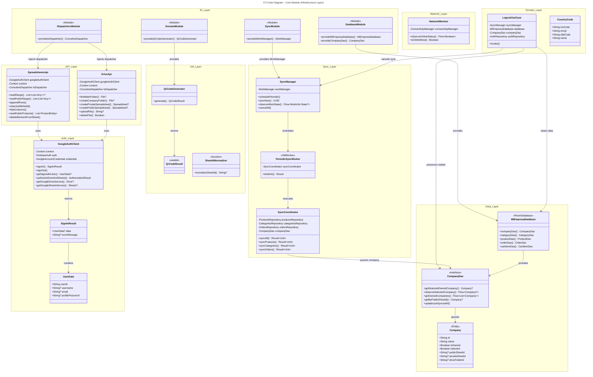
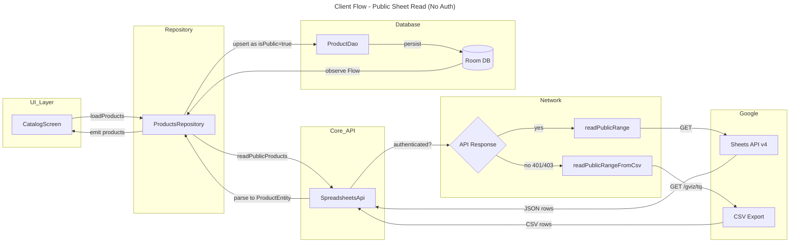

# C4 Code Level: Core Module

## Overview

- **Name**: MiEmpresa Core Module
- **Description**: Foundational infrastructure layer providing Google API integration, authentication, offline-first data persistence, background sync, dependency injection, and reusable UI components for the MiEmpresa Android app
- **Location**: [`app/src/main/java/com/brios/miempresa/core/`](../../../app/src/main/java/com/brios/miempresa/core/)
- **Language**: Kotlin
- **Purpose**: Provides the technical foundation for all feature modules, enabling offline-first architecture with Google Sheets as BaaS, Room as source of truth, and WorkManager for background sync

## Architecture Context

The Core module implements the infrastructure layer of MiEmpresa's Clean Architecture + MVVM pattern:

- **Offline-First Strategy**: Room database is the single source of truth
- **Backend-as-a-Service**: Google Sheets API for data, Google Drive API for file storage
- **Zero-Knowledge Principle**: All user data stays in Google ecosystem (developer has no access)
- **Multitenancy**: All queries filter by `companyId` to isolate company data
- **Background Sync**: WorkManager coordinates periodic and on-demand sync with Google APIs

## Module Structure

```
core/
├── api/                    # Google API wrappers
│   ├── drive/             # Google Drive operations
│   └── sheets/            # Google Sheets operations
├── auth/                  # Authentication with Google OAuth + Firebase
├── data/                  # Data layer
│   └── local/             # Room database, entities, DAOs
│       ├── daos/
│       ├── entities/
│       └── MiEmpresaDatabase.kt
├── di/                    # Hilt dependency injection modules
├── domain/                # Core domain models and use cases
│   └── model/
├── network/               # Network monitoring
├── sync/                  # Background synchronization
│   ├── di/
│   ├── domain/
│   └── workers/           # WorkManager workers
├── ui/                    # Reusable UI components
│   ├── components/        # Compose components
│   └── theme/             # Material 3 theme
└── util/                  # Utilities (QR generation, sheet ID normalization)
```

---

## Code Elements by Package

### 1. API Layer (`core/api/`)

#### 1.1 DriveApi (`core/api/drive/DriveApi.kt`)

**Purpose**: Wrapper for Google Drive API operations (folder/file management, spreadsheet creation).

**Class Definition**:
```kotlin
class DriveApi @Inject constructor(
    private val googleAuthClient: GoogleAuthClient,
    @ApplicationContext private val context: Context,
    @IoDispatcher private val ioDispatcher: CoroutineDispatcher
)
```

**Key Methods**:

- `suspend fun findMainFolder(): File?`
  - Description: Finds the main "MiEmpresa" folder in user's Drive root
  - Returns: Google Drive `File` object or null
  - Location: [DriveApi.kt:30](../../../app/src/main/java/com/brios/miempresa/core/api/drive/DriveApi.kt#L30)
  - Dependencies: GoogleAuthClient, DriveService

- `suspend fun listFoldersInFolder(parentFolderId: String): List<File>?`
  - Description: Lists all folders within a parent folder
  - Returns: List of folder File objects
  - Location: [DriveApi.kt:49](../../../app/src/main/java/com/brios/miempresa/core/api/drive/DriveApi.kt#L49)

- `suspend fun findSpreadsheetInFolder(parentFolderId: String, spreadsheetName: String): File?`
  - Description: Searches for a spreadsheet by name within a folder
  - Returns: Spreadsheet File object or null
  - Location: [DriveApi.kt:68](../../../app/src/main/java/com/brios/miempresa/core/api/drive/DriveApi.kt#L68)

- `suspend fun createMainFolder(): File?`
  - Description: Creates the main "MiEmpresa" folder (idempotent)
  - Returns: Created or existing folder
  - Location: [DriveApi.kt:92](../../../app/src/main/java/com/brios/miempresa/core/api/drive/DriveApi.kt#L92)

- `suspend fun createCompanyFolder(parentFolderId: String, companyName: String): File?`
  - Description: Creates a company-specific folder under main folder
  - Location: [DriveApi.kt:117](../../../app/src/main/java/com/brios/miempresa/core/api/drive/DriveApi.kt#L117)

- `suspend fun createPrivateSpreadsheet(parentFolderId: String, companyName: String): Spreadsheet?`
  - Description: Creates private spreadsheet with tabs: Info, Products, Categories, Orders
  - Returns: Created Spreadsheet with all tabs initialized
  - Location: [DriveApi.kt:152](../../../app/src/main/java/com/brios/miempresa/core/api/drive/DriveApi.kt#L152)

- `suspend fun createPublicSpreadsheet(parentFolderId: String, companyName: String): Spreadsheet?`
  - Description: Creates public-readable spreadsheet with tabs: Info, Products (sets anyone/reader permission)
  - Location: [DriveApi.kt:194](../../../app/src/main/java/com/brios/miempresa/core/api/drive/DriveApi.kt#L194)

- `suspend fun writeInfoTab(spreadsheetId: String, infoData: List<List<String>>): Boolean`
  - Description: Writes company info to Info tab (key-value pairs)
  - Location: [DriveApi.kt:241](../../../app/src/main/java/com/brios/miempresa/core/api/drive/DriveApi.kt#L241)

- `suspend fun initializeSheetHeaders(spreadsheetId: String, tabName: String, headers: List<String>): Boolean`
  - Description: Writes header row to a sheet tab
  - Location: [DriveApi.kt:268](../../../app/src/main/java/com/brios/miempresa/core/api/drive/DriveApi.kt#L268)

- `suspend fun uploadFile(file: File, mimeType: String, parentFolderId: String, fileName: String): String?`
  - Description: Uploads a file (image) to Drive folder
  - Returns: Drive file ID
  - Location: [DriveApi.kt:296](../../../app/src/main/java/com/brios/miempresa/core/api/drive/DriveApi.kt#L296)

- `suspend fun deleteFile(fileId: String): Boolean`
  - Description: Deletes a file from Drive
  - Location: [DriveApi.kt:324](../../../app/src/main/java/com/brios/miempresa/core/api/drive/DriveApi.kt#L324)

- `suspend fun makeFilePublic(fileId: String): Boolean`
  - Description: Sets file permissions to anyone/reader
  - Location: [DriveApi.kt:335](../../../app/src/main/java/com/brios/miempresa/core/api/drive/DriveApi.kt#L335)

**Dependencies**:
- Internal: GoogleAuthClient, IoDispatcher
- External: Google Drive API (`com.google.api.services.drive`), Google Sheets API types

---

#### 1.2 SpreadsheetsApi (`core/api/sheets/SpreadsheetsApi.kt`)

**Purpose**: Wrapper for Google Sheets API operations (read/write ranges, batch updates, public sheet access).

**Class Definition**:
```kotlin
class SpreadsheetsApi @Inject constructor(
    private val googleAuthClient: GoogleAuthClient,
    @ApplicationContext private val context: Context,
    @IoDispatcher private val ioDispatcher: CoroutineDispatcher
)
```

**Key Methods**:

- `suspend fun deleteElementFromSheet(spreadsheetId: String, rowIndex: Int, workingSheetId: Int)`
  - Description: Deletes a row from a sheet (for removing products/categories/orders)
  - Location: [SpreadsheetsApi.kt:52](../../../app/src/main/java/com/brios/miempresa/core/api/sheets/SpreadsheetsApi.kt#L52)
  - Dependencies: GoogleAuthClient.getGoogleSheetsService()

- `suspend fun getSheetId(spreadsheetId: String, sheetName: String): Int?`
  - Description: Gets numeric sheet ID from sheet name (required for batch operations)
  - Location: [SpreadsheetsApi.kt:80](../../../app/src/main/java/com/brios/miempresa/core/api/sheets/SpreadsheetsApi.kt#L80)

- `suspend fun readRange(spreadsheetId: String, range: String): List<List<Any>>?`
  - Description: Reads a range from an authenticated sheet (owner flow)
  - Location: [SpreadsheetsApi.kt:91](../../../app/src/main/java/com/brios/miempresa/core/api/sheets/SpreadsheetsApi.kt#L91)
  - Returns: List of rows, each row is a list of cell values

- `suspend fun readPublicRange(spreadsheetId: String, range: String, apiKey: String? = null): List<List<Any>>`
  - Description: Reads a range from a public sheet (client flow) with fallback to CSV export
  - Location: [SpreadsheetsApi.kt:105](../../../app/src/main/java/com/brios/miempresa/core/api/sheets/SpreadsheetsApi.kt#L105)
  - Fallback Strategy: On 400/401/403 errors, tries CSV export via `/gviz/tq?tqx=out:csv`
  - Dependencies: Internal CSV parser

- `private fun readPublicRangeFromCsv(spreadsheetId: String, range: String): List<List<Any>>`
  - Description: Fallback method to read public sheet via CSV export endpoint
  - Location: [SpreadsheetsApi.kt:139](../../../app/src/main/java/com/brios/miempresa/core/api/sheets/SpreadsheetsApi.kt#L139)
  - Dependencies: parseRangeSpec(), parseCsvRows()

- `private fun parseRangeSpec(range: String): CsvRangeSpec`
  - Description: Parses A1 notation range into structured spec (e.g., "Products!A2:F" → sheet="Products", cols=0-5, startRow=1)
  - Location: [SpreadsheetsApi.kt:182](../../../app/src/main/java/com/brios/miempresa/core/api/sheets/SpreadsheetsApi.kt#L182)

- `private fun parseCsvRows(csv: String): List<List<String>>`
  - Description: Parses RFC 4180 CSV into rows (handles quoted fields, escaped quotes)
  - Location: [SpreadsheetsApi.kt:216](../../../app/src/main/java/com/brios/miempresa/core/api/sheets/SpreadsheetsApi.kt#L216)

- `suspend fun appendRows(spreadsheetId: String, range: String, values: List<List<Any>>, valueInputOption: String = "USER_ENTERED")`
  - Description: Appends rows to the end of a range
  - Location: [SpreadsheetsApi.kt:263](../../../app/src/main/java/com/brios/miempresa/core/api/sheets/SpreadsheetsApi.kt#L263)

- `suspend fun clearAndWriteAll(spreadsheetId: String, tabName: String, headers: List<String>, rows: List<List<Any>>)`
  - Description: Clears entire tab and writes headers + rows (atomic operation for full sync)
  - Location: [SpreadsheetsApi.kt:278](../../../app/src/main/java/com/brios/miempresa/core/api/sheets/SpreadsheetsApi.kt#L278)

- `suspend fun hideColumns(spreadsheetId: String, tabName: String, columnIndices: List<Int>)`
  - Description: Hides columns in a sheet (used to hide internal IDs)
  - Location: [SpreadsheetsApi.kt:302](../../../app/src/main/java/com/brios/miempresa/core/api/sheets/SpreadsheetsApi.kt#L302)

- `suspend fun readPublicProducts(spreadsheetId: String, companyId: String): List<ProductEntity>`
  - Description: Reads products from public sheet and converts to ProductEntity (client flow)
  - Location: [SpreadsheetsApi.kt:344](../../../app/src/main/java/com/brios/miempresa/core/api/sheets/SpreadsheetsApi.kt#L344)
  - Data Mapping: Columns A2:F → name, description, price, categoryName, imageUrl, hidePrice
  - Dependencies: parsePublicPrice(), normalizePublicImageUrl(), buildPublicProductId()

- `suspend fun getProductsByIds(spreadsheetId: String, productIds: List<String>, companyId: String): List<ProductEntity>`
  - Description: Fetches specific products by ID from public sheet (cart validation)
  - Location: [SpreadsheetsApi.kt:386](../../../app/src/main/java/com/brios/miempresa/core/api/sheets/SpreadsheetsApi.kt#L386)

- `private fun buildPublicProductId(companyId: String, rowIndex: Int, name: String, categoryName: String?): String`
  - Description: Generates deterministic UUID from companyId|rowIndex|name|category (stable IDs for public products)
  - Location: [SpreadsheetsApi.kt:405](../../../app/src/main/java/com/brios/miempresa/core/api/sheets/SpreadsheetsApi.kt#L405)

- `private fun parsePublicPrice(rawPrice: String?): Double`
  - Description: Cleans price string (removes currency symbols, handles comma/dot)
  - Location: [SpreadsheetsApi.kt:415](../../../app/src/main/java/com/brios/miempresa/core/api/sheets/SpreadsheetsApi.kt#L415)

- `private fun normalizePublicImageUrl(value: String?): String?`
  - Description: Converts Drive file IDs to full Google User Content URLs
  - Location: [SpreadsheetsApi.kt:426](../../../app/src/main/java/com/brios/miempresa/core/api/sheets/SpreadsheetsApi.kt#L426)

**Inner Classes**:
- `private data class CsvRangeSpec(sheetName: String, startColumnIndex: Int, endColumnIndex: Int, startRowIndex: Int)`
  - Location: [SpreadsheetsApi.kt:432](../../../app/src/main/java/com/brios/miempresa/core/api/sheets/SpreadsheetsApi.kt#L432)

**Custom Exceptions**:
- `class PublicSheetHttpException(val statusCode: Int, message: String) : Exception(message)`
  - Location: [SpreadsheetsApi.kt:440](../../../app/src/main/java/com/brios/miempresa/core/api/sheets/SpreadsheetsApi.kt#L440)
  - Purpose: HTTP errors when accessing public sheets via CSV endpoint

**Dependencies**:
- Internal: GoogleAuthClient, IoDispatcher, ProductEntity (cross-module)
- External: Google Sheets API (`com.google.api.services.sheets.v4`), Gson

---

### 2. Authentication Layer (`core/auth/`)

#### 2.1 GoogleAuthClient (`core/auth/GoogleAuthClient.kt`)

**Purpose**: Manages Google Sign-In, OAuth scopes authorization, and service client creation for Drive/Sheets APIs.

**Class Definition**:
```kotlin
class GoogleAuthClient @Inject constructor(
    @ApplicationContext private val context: Context
)
```

**Key Methods**:

- `suspend fun signIn(activity: Activity): SignInResult`
  - Description: Initiates Google Sign-In with Firebase authentication
  - Returns: SignInResult with user data or error message
  - Location: [GoogleAuthClient.kt:55](../../../app/src/main/java/com/brios/miempresa/core/auth/GoogleAuthClient.kt#L55)
  - Flow: CredentialManager → Google ID token → Firebase signInWithCredential
  - Dependencies: CredentialManager, Firebase Auth

- `private suspend fun handleSignInResult(result: GetCredentialResponse): SignInResult`
  - Description: Processes credential response and authenticates with Firebase
  - Location: [GoogleAuthClient.kt:89](../../../app/src/main/java/com/brios/miempresa/core/auth/GoogleAuthClient.kt#L89)

- `suspend fun signOut(activity: Activity)`
  - Description: Signs out from Firebase and clears credential state
  - Location: [GoogleAuthClient.kt:126](../../../app/src/main/java/com/brios/miempresa/core/auth/GoogleAuthClient.kt#L126)

- `fun getSignedInUser(): UserData?`
  - Description: Gets currently signed-in user from Firebase Auth
  - Returns: UserData with userId, username, email, profilePictureUrl
  - Location: [GoogleAuthClient.kt:139](../../../app/src/main/java/com/brios/miempresa/core/auth/GoogleAuthClient.kt#L139)

- `suspend fun authorizeDriveAndSheets(): AuthorizationResult`
  - Description: Requests OAuth consent for Drive File + Sheets scopes (required for API calls)
  - Location: [GoogleAuthClient.kt:149](../../../app/src/main/java/com/brios/miempresa/core/auth/GoogleAuthClient.kt#L149)
  - Scopes: `DriveScopes.DRIVE_FILE`, `SheetsScopes.SPREADSHEETS`

- `suspend fun getGoogleDriveService(): Drive?`
  - Description: Creates authenticated Drive service client
  - Returns: Drive service or null if not authenticated
  - Location: [GoogleAuthClient.kt:153](../../../app/src/main/java/com/brios/miempresa/core/auth/GoogleAuthClient.kt#L153)
  - Dependencies: GoogleAccountCredential, NetHttpTransport, GsonFactory

- `suspend fun getGoogleSheetsService(): Sheets?`
  - Description: Creates authenticated Sheets service client
  - Returns: Sheets service or null if not authenticated
  - Location: [GoogleAuthClient.kt:168](../../../app/src/main/java/com/brios/miempresa/core/auth/GoogleAuthClient.kt#L168)

- `private fun generateNonce(length: Int = 32): String`
  - Description: Generates secure random nonce for sign-in request
  - Location: [GoogleAuthClient.kt:183](../../../app/src/main/java/com/brios/miempresa/core/auth/GoogleAuthClient.kt#L183)
  - Security: Uses SecureRandom

**Dependencies**:
- Internal: SignInResult, UserData
- External: Firebase Auth, Credential Manager, Google Identity, Google API services

---

#### 2.2 SignInResult (`core/auth/SignInResult.kt`)

**Purpose**: Data models for authentication results.

**Data Classes**:

```kotlin
data class SignInResult(
    val data: UserData?,
    val errorMessage: String?
)

data class UserData(
    val userId: String,
    val username: String?,
    val email: String? = null,
    val profilePictureUrl: String?
)
```

- Location: [SignInResult.kt](../../../app/src/main/java/com/brios/miempresa/core/auth/SignInResult.kt)
- Purpose: Type-safe result wrapper for sign-in operations

---

### 3. Data Layer (`core/data/local/`)

#### 3.1 MiEmpresaDatabase (`core/data/local/MiEmpresaDatabase.kt`)

**Purpose**: Room database definition with all entities and migrations.

**Class Definition**:
```kotlin
@Database(
    entities = [
        Company::class,
        Category::class,
        CartItemEntity::class,
        ProductEntity::class,
        OrderEntity::class,
        OrderItemEntity::class
    ],
    version = 15,
    exportSchema = false
)
abstract class MiEmpresaDatabase : RoomDatabase()
```

**Abstract DAO Providers**:

- `abstract fun companyDao(): CompanyDao`
- `abstract fun categoryDao(): CategoryDao`
- `abstract fun cartItemDao(): CartItemDao`
- `abstract fun productDao(): ProductDao`
- `abstract fun orderDao(): OrderDao`

**Migrations**:

- `MIGRATION_10_11`: Added `productsFolderId` to companies table
- `MIGRATION_11_12`: Created `orders` and `order_items` tables with indices
- `MIGRATION_12_13`: Added `categoryName` field and index to products table (client flow filtering)
- `MIGRATION_13_14`: Added `companyId` to `order_items` with multitenancy index
- `MIGRATION_14_15_HIDE_PRICE`: Added `hidePrice` column to products table

**Singleton Pattern**:
```kotlin
companion object {
    @Volatile private var INSTANCE: MiEmpresaDatabase? = null
    
    fun getDatabase(context: Context): MiEmpresaDatabase
}
```

**Dependencies**:
- Internal: Company, Category (cross-module), CartItemEntity, ProductEntity, OrderEntity, OrderItemEntity
- External: Room

---

#### 3.2 Company Entity (`core/data/local/entities/Company.kt`)

**Purpose**: Room entity representing a company (both owned and visited).

**Entity Definition**:
```kotlin
@Entity(tableName = "companies")
data class Company(
    @PrimaryKey
    val id: String,
    val name: String,
    val isOwned: Boolean = false,
    val selected: Boolean = false,
    val lastVisited: Long? = null,
    val lastSyncedAt: Long? = null,
    val logoUrl: String? = null,
    val whatsappNumber: String? = null,
    val whatsappCountryCode: String = "+54",
    val address: String? = null,
    val businessHours: String? = null,
    val publicSheetId: String? = null,
    val privateSheetId: String? = null,
    val driveFolderId: String? = null,
    val productsFolderId: String? = null,
    val specialization: String? = null
)
```

**Fields**:
- `isOwned`: Distinguishes owner vs client flow
- `selected`: Currently active company
- `publicSheetId`: Public spreadsheet for catalog sharing
- `privateSheetId`: Private spreadsheet for full data (owner only)
- `driveFolderId`: Parent folder for spreadsheets
- `productsFolderId`: Folder for product images

**Location**: [Company.kt](../../../app/src/main/java/com/brios/miempresa/core/data/local/entities/Company.kt)

---

#### 3.3 CompanyDao (`core/data/local/daos/CompanyDao.kt`)

**Purpose**: Room DAO for company operations with multitenancy support.

**Key Methods**:

- `suspend fun insert(friend: Company)`
- `suspend fun update(friend: Company)`
- `suspend fun delete(friend: Company)`
- `suspend fun getCompanyById(id: String): Company?`

**Company Selection**:
- `suspend fun unselectAllCompanies()`
- `fun getSelectedCompany(): LiveData<Company?>` - For UI observation
- `fun observeSelectedCompany(): Flow<Company?>` - For coroutine flow
- `suspend fun getSelectedOwnedCompany(): Company?` - For sync coordinator

**Owner Flow Queries**:
- `suspend fun getOwnedCompaniesList(): List<Company>`
- `fun getOwnedCompanies(): Flow<List<Company>>`
- `suspend fun getOwnedCompanyCount(): Int`

**Client Flow Queries**:
- `suspend fun getByPublicSheetId(sheetId: String): Company?` - Find by public sheet
- `suspend fun getVisitedByPublicSheetId(sheetId: String): Company?` - Visited companies only
- `fun getVisitedCompanies(): Flow<List<Company>>` - All visited companies
- `suspend fun countVisited(): Int`

**Sync Operations**:
- `suspend fun updateLastSyncedAt(companyId: String, timestamp: Long)`
- `suspend fun updateLastVisited(id: String, timestamp: Long)`

**Batch Operations**:
- `@Upsert suspend fun insertCompany(company: Company)` - Insert or update
- `@Upsert suspend fun upsertCompanies(companies: List<Company>)` - Bulk upsert

**Location**: [CompanyDao.kt](../../../app/src/main/java/com/brios/miempresa/core/data/local/daos/CompanyDao.kt)

---

### 4. Synchronization Layer (`core/sync/`)

#### 4.1 SyncManager (`core/sync/SyncManager.kt`)

**Purpose**: Coordinates WorkManager for periodic and on-demand sync.

**Class Definition**:
```kotlin
enum class SyncType { ALL, PRODUCTS, CATEGORIES, ORDERS }

@Singleton
class SyncManager @Inject constructor(
    private val workManager: WorkManager
)
```

**Key Methods**:

- `fun schedulePeriodic()`
  - Description: Schedules periodic background sync (every N minutes from BuildConfig)
  - Location: [SyncManager.kt:33](../../../app/src/main/java/com/brios/miempresa/core/sync/SyncManager.kt#L33)
  - Constraints: Requires network connectivity
  - Strategy: ExistingPeriodicWorkPolicy.KEEP (preserves existing schedule)

- `fun syncNow(type: SyncType = SyncType.ALL): UUID`
  - Description: Triggers immediate one-time sync
  - Returns: WorkRequest UUID for observing state
  - Location: [SyncManager.kt:55](../../../app/src/main/java/com/brios/miempresa/core/sync/SyncManager.kt#L55)

- `fun observeWorkState(workId: UUID): Flow<WorkInfo.State?>`
  - Description: Observe sync work state (ENQUEUED, RUNNING, SUCCEEDED, FAILED)
  - Location: [SyncManager.kt:65](../../../app/src/main/java/com/brios/miempresa/core/sync/SyncManager.kt#L65)

- `fun cancelAll()`
  - Description: Cancels all sync work (used during logout)
  - Location: [SyncManager.kt:70](../../../app/src/main/java/com/brios/miempresa/core/sync/SyncManager.kt#L70)
  - Implementation: Polls for work cancellation with timeout (5 seconds)

- `private fun waitForSyncWorkToStop()`
  - Description: Polls WorkManager until all sync work stops or timeout
  - Location: [SyncManager.kt:78](../../../app/src/main/java/com/brios/miempresa/core/sync/SyncManager.kt#L78)

**Dependencies**:
- Internal: PeriodicSyncWorker
- External: WorkManager

---

#### 4.2 PeriodicSyncWorker (`core/sync/workers/PeriodicSyncWorker.kt`)

**Purpose**: WorkManager worker that executes sync operations.

**Class Definition**:
```kotlin
@HiltWorker
class PeriodicSyncWorker @AssistedInject constructor(
    @Assisted appContext: Context,
    @Assisted workerParams: WorkerParameters,
    private val syncCoordinator: SyncCoordinator
) : CoroutineWorker(appContext, workerParams)
```

**Key Methods**:

- `override suspend fun doWork(): Result`
  - Description: Executes sync based on SyncType input data
  - Returns: Result.success() or Result.retry()
  - Location: [PeriodicSyncWorker.kt:21](../../../app/src/main/java/com/brios/miempresa/core/sync/workers/PeriodicSyncWorker.kt#L21)
  - Flow: Parses SyncType from input → calls SyncCoordinator → converts Result<Unit> to WorkManager Result

**Dependencies**:
- Internal: SyncCoordinator, SyncManager (for constants)
- External: Hilt WorkManager integration (@HiltWorker, @AssistedInject)

---

#### 4.3 SyncCoordinator (`core/sync/domain/SyncCoordinator.kt`)

**Purpose**: Orchestrates sync operations across feature repositories.

**Class Definition**:
```kotlin
@Singleton
class SyncCoordinator @Inject constructor(
    private val productsRepository: ProductsRepository,
    private val categoriesRepository: CategoriesRepository,
    private val ordersRepository: OrdersRepository,
    private val companyDao: CompanyDao
)
```

**Key Methods**:

- `suspend fun syncAll(): Result<Unit>`
  - Description: Full bidirectional sync (download all, upload dirty entities)
  - Location: [SyncCoordinator.kt:21](../../../app/src/main/java/com/brios/miempresa/core/sync/domain/SyncCoordinator.kt#L21)
  - Flow:
    1. Download: categories → products → orders
    2. Upload: categories → products → orders
    3. Update company.lastSyncedAt
  - Error Handling: Logs errors but continues (partial sync succeeds)

- `suspend fun syncProducts(): Result<Unit>`
  - Description: Sync only products (download + upload)
  - Location: [SyncCoordinator.kt:78](../../../app/src/main/java/com/brios/miempresa/core/sync/domain/SyncCoordinator.kt#L78)

- `suspend fun syncCategories(): Result<Unit>`
  - Description: Sync only categories (download + upload)
  - Location: [SyncCoordinator.kt:97](../../../app/src/main/java/com/brios/miempresa/core/sync/domain/SyncCoordinator.kt#L97)

- `suspend fun syncOrders(): Result<Unit>`
  - Description: Sync only orders (download + upload)
  - Location: [SyncCoordinator.kt:116](../../../app/src/main/java/com/brios/miempresa/core/sync/domain/SyncCoordinator.kt#L116)

- `private suspend fun getActiveCompanyId(): String?`
  - Description: Gets selected owned company ID (multitenancy)
  - Location: [SyncCoordinator.kt:135](../../../app/src/main/java/com/brios/miempresa/core/sync/domain/SyncCoordinator.kt#L135)
  - Returns null if no company selected (graceful no-op)

**Dependencies**:
- Internal: CompanyDao
- Cross-module: ProductsRepository, CategoriesRepository, OrdersRepository

---

### 5. Dependency Injection (`core/di/`)

#### 5.1 DatabaseModule (`core/di/DatabaseModule.kt`)

**Purpose**: Provides Room database and DAOs to Hilt dependency graph.

**Key Providers**:

```kotlin
@Provides @Singleton
fun provideMiEmpresaDatabase(@ApplicationContext context: Context): MiEmpresaDatabase

@Provides fun provideCompanyDao(database: MiEmpresaDatabase): CompanyDao
@Provides fun provideCategoryDao(database: MiEmpresaDatabase): CategoryDao
@Provides fun provideCartItemDao(database: MiEmpresaDatabase): CartItemDao
@Provides fun provideProductDao(database: MiEmpresaDatabase): ProductDao
@Provides fun provideOrderDao(database: MiEmpresaDatabase): OrderDao

@Provides @Singleton
fun providesConnectivityManager(@ApplicationContext context: Context): ConnectivityManager
```

**Location**: [DatabaseModule.kt](../../../app/src/main/java/com/brios/miempresa/core/di/DatabaseModule.kt)

---

#### 5.2 DispatchersModule (`core/di/DispatchersModule.kt`)

**Purpose**: Provides coroutine dispatchers with qualifiers.

**Providers**:

```kotlin
@Qualifier
@Retention(AnnotationRetention.BINARY)
annotation class IoDispatcher

@Provides @IoDispatcher
fun provideIoDispatcher(): CoroutineDispatcher = Dispatchers.IO
```

**Location**: [DispatchersModule.kt](../../../app/src/main/java/com/brios/miempresa/core/di/DispatchersModule.kt)
**Purpose**: Enables dispatcher injection for testability

---

#### 5.3 DomainModule (`core/di/DomainModule.kt`)

**Purpose**: Provides domain-layer services (utilities, use cases).

**Providers**:

```kotlin
@Provides @Singleton
fun provideQrCodeGenerator(): QrCodeGenerator
```

**Location**: [DomainModule.kt](../../../app/src/main/java/com/brios/miempresa/core/di/DomainModule.kt)
**Note**: QrCodeGenerator is stateless, safe as singleton

---

#### 5.4 RepositoryModule (`core/di/RepositoryModule.kt`)

**Purpose**: Binds repository implementations to interfaces.

**Bindings**:

```kotlin
@Binds abstract fun bindCategoriesRepository(impl: CategoriesRepositoryImpl): CategoriesRepository
@Binds abstract fun bindProductsRepository(impl: ProductsRepositoryImpl): ProductsRepository
@Binds abstract fun bindConfigRepository(impl: ConfigRepositoryImpl): ConfigRepository
@Binds abstract fun bindOrdersRepository(impl: OrdersRepositoryImpl): OrdersRepository
```

**Location**: [RepositoryModule.kt](../../../app/src/main/java/com/brios/miempresa/core/di/RepositoryModule.kt)
**Pattern**: Repository pattern with interface-based dependency injection

---

#### 5.5 SyncModule (`core/sync/di/SyncModule.kt`)

**Purpose**: Provides WorkManager instance.

**Providers**:

```kotlin
@Provides @Singleton
fun provideWorkManager(@ApplicationContext context: Context): WorkManager
```

**Location**: [SyncModule.kt](../../../app/src/main/java/com/brios/miempresa/core/sync/di/SyncModule.kt)

---

### 6. Domain Layer (`core/domain/`)

#### 6.1 LogoutUseCase (`core/domain/LogoutUseCase.kt`)

**Purpose**: Orchestrates logout flow (sign out, cancel sync, clear database, preserve visited companies).

**Class Definition**:
```kotlin
@Singleton
class LogoutUseCase @Inject constructor(
    private val syncManager: SyncManager,
    private val database: MiEmpresaDatabase,
    private val companyDao: CompanyDao,
    private val authRepository: AuthRepository
)
```

**Key Method**:

- `suspend operator fun invoke(activity: Activity)`
  - Description: Executes full logout sequence
  - Location: [LogoutUseCase.kt:22](../../../app/src/main/java/com/brios/miempresa/core/domain/LogoutUseCase.kt#L22)
  - Flow:
    1. Sign out Firebase (synchronous, prevents race conditions)
    2. Get visited companies
    3. Cancel all sync work
    4. Clear all database tables
    5. Re-insert visited companies (preserve client flow history)
  - Critical: Firebase sign-out happens FIRST to ensure getSignedInUser() returns null immediately

**Dependencies**:
- Internal: SyncManager, MiEmpresaDatabase, CompanyDao
- Cross-module: AuthRepository

---

#### 6.2 CountryCode (`core/domain/model/CountryCode.kt`)

**Purpose**: Domain model for country phone codes with emoji flags.

**Data Class**:
```kotlin
data class CountryCode(
    val isoCode: String,
    val emoji: String,
    val dialCode: String,
    val name: String
)
```

**Companion Object**:
```kotlin
fun fromIso(isoCode: String, dialCode: String, name: String): CountryCode
```
- Converts ISO code to emoji flag (e.g., "AR" → 🇦🇷)
- Algorithm: Converts letter to regional indicator symbol (Unicode range U+1F1E6 to U+1F1FF)

**Defaults**:
```kotlin
val defaultCountryCodes = listOf(
    CountryCode.fromIso("AR", "+54", "Argentina"),
    CountryCode.fromIso("MX", "+52", "México"),
    // ... 10 Latin American countries
)
```

**Location**: [CountryCode.kt](../../../app/src/main/java/com/brios/miempresa/core/domain/model/CountryCode.kt)

---

### 7. Network Layer (`core/network/`)

#### 7.1 NetworkMonitor (`core/network/NetworkMonitor.kt`)

**Purpose**: Reactive network connectivity monitoring.

**Class Definition**:
```kotlin
@Singleton
class NetworkMonitor @Inject constructor(
    private val connectivityManager: ConnectivityManager
)
```

**Key Methods**:

- `fun observeOnlineStatus(): Flow<Boolean>`
  - Description: Reactive Flow that emits true/false on connectivity changes
  - Location: [NetworkMonitor.kt:21](../../../app/src/main/java/com/brios/miempresa/core/network/NetworkMonitor.kt#L21)
  - Implementation: callbackFlow with ConnectivityManager.NetworkCallback
  - Emits: Initial state + updates on onAvailable/onLost/onCapabilitiesChanged

- `fun isOnlineNow(): Boolean`
  - Description: Synchronous check for current connectivity
  - Location: [NetworkMonitor.kt:74](../../../app/src/main/java/com/brios/miempresa/core/network/NetworkMonitor.kt#L74)

- `private fun hasInternet(capabilities: NetworkCapabilities?): Boolean`
  - Description: Validates network has internet + is validated (not captive portal)
  - Location: [NetworkMonitor.kt:80](../../../app/src/main/java/com/brios/miempresa/core/network/NetworkMonitor.kt#L80)
  - Checks: NET_CAPABILITY_INTERNET + NET_CAPABILITY_VALIDATED

**Dependencies**:
- External: ConnectivityManager, Kotlin Coroutines Flow

---

### 8. Utilities (`core/util/`)

#### 8.1 QrCodeGenerator (`core/util/QrCodeGenerator.kt`)

**Purpose**: Stateless utility for generating QR code bitmaps.

**Class Definition**:
```kotlin
class QrCodeGenerator
```

**Key Method**:

- `fun generate(content: String, sizePx: Int = 512): QrCodeResult`
  - Description: Generates QR code bitmap from text (typically deeplink)
  - Location: [QrCodeGenerator.kt:35](../../../app/src/main/java/com/brios/miempresa/core/util/QrCodeGenerator.kt#L35)
  - Parameters:
    - `content`: Text to encode (e.g., "miempresa://catalogo?sheetId=xyz")
    - `sizePx`: Bitmap size (default 512px, range 64-2048)
  - Returns: QrCodeResult.Success(bitmap) or QrCodeResult.Error(message)
  - Algorithm: ZXing QRCodeWriter → BitMatrix → Bitmap conversion
  - Security: Input validation (blank check, size range)

**Dependencies**:
- Internal: QrCodeResult
- External: ZXing (com.google.zxing)

---

#### 8.2 QrCodeResult (`core/util/QrCodeResult.kt`)

**Purpose**: Sealed result type for QR generation.

**Sealed Class**:
```kotlin
sealed class QrCodeResult {
    data class Success(val bitmap: Bitmap) : QrCodeResult()
    data class Error(val message: String) : QrCodeResult()
}
```

**Location**: [QrCodeResult.kt](../../../app/src/main/java/com/brios/miempresa/core/util/QrCodeResult.kt)
**Pattern**: Type-safe error handling without exceptions

---

#### 8.3 SheetIdNormalizer (`core/util/SheetIdNormalizer.kt`)

**Purpose**: Extracts Google Sheets ID from various input formats (URL, ID token, raw ID).

**Function**:

```kotlin
fun normalizeSheetId(rawValue: String?): String?
```

- Description: Normalizes sheet ID from URL or raw ID
- Location: [SheetIdNormalizer.kt:6](../../../app/src/main/java/com/brios/miempresa/core/util/SheetIdNormalizer.kt#L6)
- Strategies:
  1. Extract from URL: `/spreadsheets/d/([a-zA-Z0-9-_]+)`
  2. Extract ID token: `([a-zA-Z0-9-_]{20,})`
- Use Cases: User input parsing (paste URL or ID), QR code scanning
- Returns: Normalized ID or null if invalid

**Dependencies**: Kotlin Regex

---

### 9. UI Layer (`core/ui/`)

#### 9.1 Theme (`core/ui/theme/`)

##### Theme.kt

**Purpose**: Material 3 theme configuration for the app.

**Composable**:
```kotlin
@Composable
fun MiEmpresaTheme(content: @Composable () -> Unit)
```

- Location: [Theme.kt](../../../app/src/main/java/com/brios/miempresa/core/ui/theme/Theme.kt)
- Color Scheme: Light mode only (using lightColorScheme)
- Typography: Custom AppTypography
- Colors: Defined in Color.kt (Material 3 color tokens)

##### Type.kt

**Purpose**: Material 3 typography scale.

**Definition**:
```kotlin
val AppTypography = Typography(
    displayLarge = TextStyle(fontWeight = FontWeight.Normal, fontSize = 57.sp, ...),
    headlineLarge = TextStyle(fontWeight = FontWeight.SemiBold, fontSize = 32.sp, ...),
    titleLarge = TextStyle(fontWeight = FontWeight.Bold, fontSize = 20.sp, ...),
    bodyLarge = TextStyle(fontWeight = FontWeight.Normal, fontSize = 16.sp, ...),
    labelLarge = TextStyle(fontWeight = FontWeight.Medium, fontSize = 14.sp, ...),
    // ... all Material 3 type tokens
)
```

- Location: [Type.kt](../../../app/src/main/java/com/brios/miempresa/core/ui/theme/Type.kt)
- Follows Material 3 type scale exactly
- Letter spacing and line height per Material 3 spec

##### Color.kt

**Purpose**: Material 3 color palette definitions.

- Location: [Color.kt](../../../app/src/main/java/com/brios/miempresa/core/ui/theme/Color.kt)
- Tokens: primary, primaryContainer, secondary, tertiary, error, background, surface, outline, etc.
- All color roles defined per Material 3 spec

##### Dimens.kt

**Purpose**: Centralized dimension constants (padding, spacing, sizes).

- Location: [Dimens.kt](../../../app/src/main/java/com/brios/miempresa/core/ui/theme/Dimens.kt)
- Pattern: AppDimensions object with consistent spacing scale

---

#### 9.2 UI Components (`core/ui/components/`)

The core module includes 23 reusable Compose components. Key components:

##### SearchBar.kt

**Purpose**: Reusable search input with outlined/filled variants.

**Composable**:
```kotlin
enum class SearchBarVariant { Outlined, Filled }

@Composable
fun SearchBar(
    query: String,
    onQueryChange: (String) -> Unit,
    modifier: Modifier = Modifier,
    placeholderText: String = "",
    variant: SearchBarVariant = SearchBarVariant.Outlined
)
```

- Location: [SearchBar.kt](../../../app/src/main/java/com/brios/miempresa/core/ui/components/SearchBar.kt)
- Features: Focus state, search icon, placeholder, Material 3 styling

##### LoadingView.kt

**Purpose**: Centered loading indicator with optional message.

**Composable**:
```kotlin
@Composable
fun LoadingView(message: String = "")
```

- Location: [LoadingView.kt](../../../app/src/main/java/com/brios/miempresa/core/ui/components/LoadingView.kt)
- Layout: CircularProgressIndicator + Text (centered column)

##### EmptyStateView.kt

**Purpose**: Empty state with icon and message.

##### NotFoundView.kt

**Purpose**: Not found state with illustration.

##### DeleteDialog.kt

**Purpose**: Confirmation dialog for delete actions.

##### MiEmpresaFAB.kt

**Purpose**: Customized Floating Action Button with consistent styling.

##### OfflineBanner.kt

**Purpose**: Shows banner when network is unavailable.

##### CategoryBadge.kt, CategoryFilterChip.kt, CategorySelectorBottomSheet.kt

**Purpose**: Category selection UI components.

##### ItemCard.kt, InfoCard.kt

**Purpose**: Reusable card components for list items and info display.

##### Shimmer.kt

**Purpose**: Shimmer loading effect for skeleton screens.

##### FormComponents.kt

**Purpose**: Reusable form fields (TextField wrappers with validation).

##### OrderProductListItem.kt, QuantitySelector.kt

**Purpose**: Order-specific UI components.

##### CompanyAvatar.kt

**Purpose**: Company logo avatar with fallback initial.

##### CountryCodeDropdown.kt

**Purpose**: Country code selector with flags (uses CountryCode model).

##### PullToRefreshIndicator.kt

**Purpose**: Pull-to-refresh indicator for lists.

##### SpreadsheetNotFoundView.kt

**Purpose**: Error state when public sheet not found.

##### StateViewSpotIllustration.kt

**Purpose**: Illustrative image for empty/error states.

##### MessageWithIcon.kt

**Purpose**: Message with leading icon (info, warning, error).

---

## Dependencies

### Internal Dependencies (Within Core)

```
api/ → auth/GoogleAuthClient
sync/SyncCoordinator → data/local/daos/CompanyDao
sync/PeriodicSyncWorker → sync/domain/SyncCoordinator
domain/LogoutUseCase → sync/SyncManager, data/local/MiEmpresaDatabase, data/local/daos/CompanyDao
di/DatabaseModule → data/local/MiEmpresaDatabase
di/DispatchersModule → (provides @IoDispatcher)
util/QrCodeGenerator → util/QrCodeResult
ui/components/ → ui/theme/ (Material 3 theme tokens)
```

### Cross-Module Dependencies (From Core to Features)

```
api/sheets/SpreadsheetsApi → products/data/ProductEntity (for public sheet reading)
di/RepositoryModule → categories/, products/, orders/, config/ (feature repositories)
sync/domain/SyncCoordinator → categories/, products/, orders/ (feature repositories)
domain/LogoutUseCase → auth/domain/AuthRepository (feature module)
data/local/MiEmpresaDatabase → categories/, cart/, products/, orders/ (feature entities/DAOs)
```

### External Dependencies

```
Google APIs:
- com.google.api.services.drive (Drive v3 API)
- com.google.api.services.sheets.v4 (Sheets v4 API)
- com.google.api.client.googleapis.extensions.android.gms.auth (GoogleAccountCredential)
- com.google.api.client.http.javanet (NetHttpTransport)
- com.google.api.client.json.gson (GsonFactory)

Authentication:
- com.google.firebase:firebase-auth (Firebase Auth)
- androidx.credentials (Credential Manager)
- com.google.android.gms.auth.api.identity (Google Identity)
- com.google.android.libraries.identity.googleid (Google ID)

Database:
- androidx.room (Room ORM)
- androidx.sqlite (SQLite database)

Dependency Injection:
- dagger.hilt.android (Hilt DI)
- androidx.hilt.work (Hilt WorkManager)

Background Work:
- androidx.work (WorkManager)

UI:
- androidx.compose.material3 (Material 3 Compose)
- androidx.compose.foundation (Compose foundation)
- androidx.compose.ui (Compose UI)
- androidx.lifecycle (LiveData, ViewModel)

Utilities:
- com.google.zxing (QR code generation)
- kotlinx.coroutines (Coroutines, Flow)

Network:
- android.net (ConnectivityManager)
```

---

## Relationships and Data Flow

### Mermaid Class Diagram: Core Module Architecture



### Data Flow Diagram: Owner Flow Sync Process

```mermaid
---
title: Owner Flow - Background Sync Data Flow
---
flowchart TB
    subgraph WorkManager
        A[PeriodicSyncWorker]
    end
    
    subgraph Coordinator
        B[SyncCoordinator.syncAll]
    end
    
    subgraph Repositories
        C[CategoriesRepository]
        D[ProductsRepository]
        E[OrdersRepository]
    }
    
    subgraph Core_API
        F[SpreadsheetsApi]
    end
    
    subgraph Database
        G[Room DAOs]
        H[(Room DB)]
    end
    
    subgraph Google
        I[Google Sheets API]
    end
    
    A -->|execute| B
    B -->|1. download| C
    B -->|2. download| D
    B -->|3. download| E
    
    C -->|readRange| F
    D -->|readRange| F
    E -->|readRange| F
    F -->|HTTP GET| I
    
    I -->|sheet rows| F
    F -->|parsed entities| C
    F -->|parsed entities| D
    F -->|parsed entities| E
    
    C -->|upsert| G
    D -->|upsert| G
    E -->|upsert| G
    G -->|persist| H
    
    B -->|4. upload dirty| C
    B -->|5. upload dirty| D
    B -->|6. upload dirty| E
    
    G -->|getDirty| C
    G -->|getDirty| D
    G -->|getDirty| E
    
    C -->|appendRows| F
    D -->|appendRows| F
    E -->|appendRows| F
    F -->|HTTP POST| I
    
    B -->|7. updateLastSyncedAt| G
```

### Data Flow Diagram: Client Flow Public Sheet Access



---

## Notes

### Architecture Principles

1. **Offline-First**: Room is the single source of truth. All repositories expose Flow/LiveData from Room, not API responses.

2. **Sync Strategy**: 
   - Download: Sheets → SpreadsheetsApi → Repository → Room (upsert with lastSyncedAt)
   - Upload: Room dirty flag → Repository → SpreadsheetsApi → Sheets → clear dirty flag

3. **Multitenancy**: All Room queries include `companyId` filter. CompanyDao manages selected company state.

4. **Zero-Knowledge**: All data stored in user's Google Drive. Developer has no access. App never sends data to custom backend.

5. **Error Handling**: 
   - API errors logged but don't fail entire sync (partial success)
   - Public sheet access has fallback to CSV export
   - WorkManager retries failed sync

6. **Dependency Injection**: Hilt provides constructor injection for all classes. Modules are organized by layer (Database, Dispatchers, Domain, Sync).

### Key Design Decisions

1. **Room as Source of Truth**: Guarantees offline functionality. UI observes Room Flows, not API responses.

2. **Google Sheets as BaaS**: Avoids custom backend development. Users already trust Google. Enables direct sheet editing in Drive.

3. **WorkManager for Sync**: Respects Android battery optimization. Guaranteed execution with retry logic. Survives app process death.

4. **Public Sheet CSV Fallback**: Public sheets often fail with 401/403 due to API key restrictions. CSV export endpoint is more permissive.

5. **Deterministic Public Product IDs**: UUID based on `companyId|rowIndex|name|category` ensures stable IDs when sheet is re-scanned.

6. **Dirty Flag Pattern**: Entities have `dirty: Boolean` field. Set on local modifications. Cleared after successful upload.

7. **LogoutUseCase Orchestration**: Firebase sign-out happens first (synchronously) to prevent race conditions where navigation checks auth state before it's cleared.

### Testing Considerations

- **Unit Tests**: Test individual functions in SpreadsheetsApi (CSV parsing, ID normalization, price parsing)
- **Integration Tests**: Test repository sync with fake Room and fake API
- **E2E Tests**: Test full sync flow with real WorkManager and Room (use in-memory DB)
- **Hilt Test Modules**: Replace real APIs with fakes for testing

### Future Improvements

1. **Conflict Resolution**: Currently last-write-wins. Could add version vectors or timestamp-based merging.

2. **Delta Sync**: Download only changed rows since lastSyncedAt (requires timestamp column in sheets).

3. **Offline Image Handling**: Currently images reference Drive URLs. Could cache images locally with Coil.

4. **Batch API Calls**: Use Sheets API batchUpdate for multiple operations in one request.

5. **Pagination**: For large sheets (>1000 rows), implement cursor-based pagination.

6. **Optimistic UI**: Update UI immediately on write, rollback on sync failure.

---

## Related Documentation

- **C4 Component Level**: See `c4-component-*.md` for how core components are composed into features
- **C4 Container Level**: See `c4-container-*.md` for deployment architecture (Android app, Google Sheets, Firebase)
- **C4 Context Level**: See `c4-context-*.md` for system context and user journeys

---

**Document Version**: 1.0  
**Last Updated**: 2025-01-XX  
**Author**: AI Agent (C4 Code Specialist)  
**Review Status**: Draft
