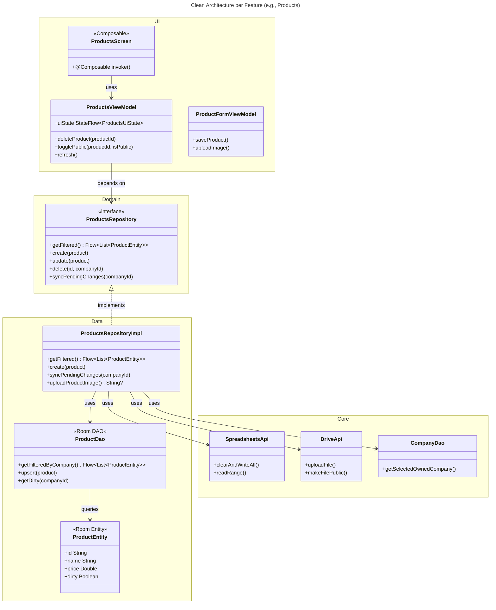
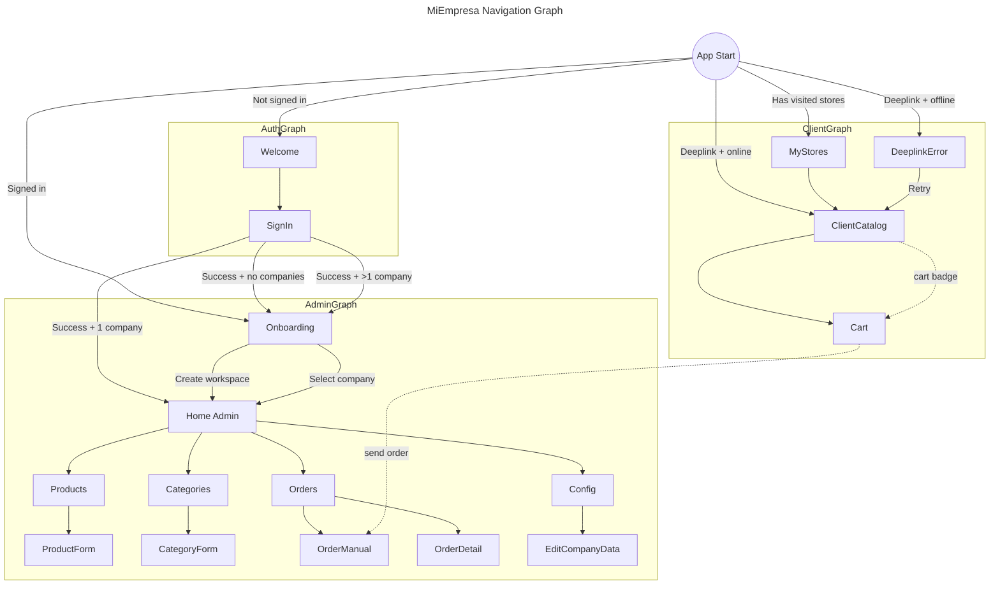
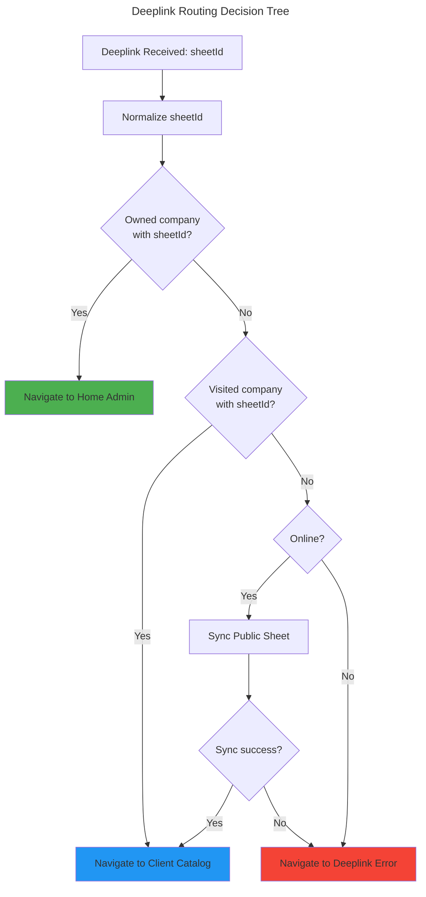
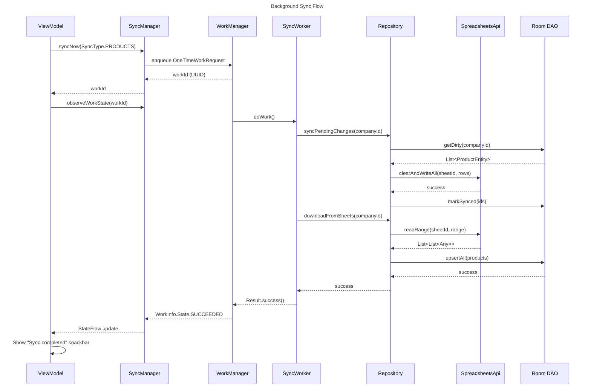

# C4 Code Level: MiEmpresa Feature Modules

## Overview

- **Name**: MiEmpresa Android App Feature Modules
- **Description**: Complete feature set for admin and client catalog management following Clean Architecture patterns
- **Location**: `app/src/main/java/com/brios/miempresa/`
- **Language**: Kotlin with Jetpack Compose
- **Architecture**: Package-by-feature with Clean Architecture (domain/data/ui layers)
- **Purpose**: Multitenancy product catalog management with dual context (Admin authenticated CRUD + Client anonymous read-only)

---

## 1. Entry Point & Application Class

### MainActivity.kt

**Location**: `app/src/main/java/com/brios/miempresa/MainActivity.kt`

**Purpose**: App entry point, deeplink handling, and navigation setup

**Key Classes**:
- `MainActivity : FragmentActivity`
  - `onCreate(savedInstanceState: Bundle?): void` — Sets up Compose UI and NavHost
  - `onNewIntent(intent: Intent): void` — Handles runtime deeplinks
  - `extractSheetId(intent: Intent?): String?` — Extracts sheet ID from deeplink or share intent
  - Properties:
    - `pendingDeeplinkSheetId: String?` — Tracks pending deeplink for consumption

**Functions**:
- `extractSheetIdFromIncomingPayload(action: String?, deeplinkPayload: String?, sharedTextPayload: String?): String?`
  - Resolves sheet ID from ACTION_SEND or deeplink intent

**Dependencies**:
- Internal: `core.util.normalizeSheetId`, `core.ui.theme.MiEmpresaTheme`, `navigation.NavHostComposable`
- External: Jetpack Compose, AndroidX Navigation, Hilt

### MiEmpresa.kt

**Location**: `app/src/main/java/com/brios/miempresa/MiEmpresa.kt`

**Purpose**: Application class for DI, WorkManager, and Coil configuration

**Key Classes**:
- `MiEmpresa : Application, Configuration.Provider, ImageLoaderFactory`
  - `onCreate(): void` — Schedules periodic sync on app start
  - `newImageLoader(): ImageLoader` — Configures Coil with memory/disk cache
  - Properties:
    - `workerFactory: HiltWorkerFactory` — Hilt-aware WorkManager factory
    - `syncManager: SyncManager` — Handles periodic background sync

**Dependencies**:
- Internal: `core.sync.SyncManager`
- External: Hilt, WorkManager, Coil

---

## 2. Authentication Feature

### Domain Layer

**Location**: `app/src/main/java/com/brios/miempresa/auth/domain/`

**AuthRepository.kt**:
- `interface AuthRepository`
  - `signIn(activity: Activity): SignInResult` — Triggers Google One Tap
  - `authorizeDriveAndSheets(): AuthState` — Requests Drive/Sheets OAuth scopes
  - `signOut(activity: Activity): void` — Signs out and revokes tokens
  - `getSignedInUser(): SignInResult?` — Returns cached user info

- `sealed class AuthState`
  - `Authorized` — User has Drive/Sheets access
  - `Unauthorized` — Missing scopes
  - `PendingAuth(intentSender: IntentSender?)` — Needs consent UI
  - `Failed` — Authorization failed

**Dependencies**: `core.auth.SignInResult`

### Data Layer

**Location**: `app/src/main/java/com/brios/miempresa/auth/data/`

**AuthRepositoryImpl.kt**:
- `class AuthRepositoryImpl @Inject constructor(googleAuthClient: GoogleAuthClient) : AuthRepository`
  - Delegates to `core.auth.GoogleAuthClient` for OAuth flows
  - Wraps `AuthorizationResult` into domain `AuthState`

**Dependencies**: `core.auth.GoogleAuthClient`, Google Sign-In API

### UI Layer

**Location**: `app/src/main/java/com/brios/miempresa/auth/ui/`

**SignInViewModel.kt**:
- `class SignInViewModel @Inject constructor(authRepository, companyDao, logoutUseCase) : ViewModel`
  - `signIn(activity: Activity): void` — Starts sign-in flow
  - `signOut(activity: Activity): void` — Logs out and resets state
  - `determinePostAuthDestination(): void` — Routes to Onboarding or CompanySelector
  - `authorizeDriveAndSheets(activity: Activity): void` — Requests OAuth scopes
  - `checkDriveAuthorization(): AuthState` — Checks existing scopes
  - StateFlows:
    - `signInStateFlow: StateFlow<SignInState>`
    - `authStateFlow: StateFlow<AuthState?>`
    - `postAuthDestination: StateFlow<PostAuthDestination?>`

- `sealed class PostAuthDestination`
  - `Onboarding`, `Home`, `CompanySelector`

**SignInScreen.kt**:
- `@Composable SignInScreen(state: SignInState, onSignInClick: () -> Unit)`
  - Google One Tap button, privacy notice, app logo

**Dependencies**: Core (`auth`, `domain.LogoutUseCase`, `data.local.daos.CompanyDao`)

---

## 3. Onboarding Feature

### Domain Layer

**Location**: `app/src/main/java/com/brios/miempresa/onboarding/domain/`

**OnboardingRepository.kt**:
- `interface OnboardingRepository`
  - `createWorkspace(request: WorkspaceSetupRequest): WorkspaceCreationResult` — Creates Drive folders + Sheets
  - `validateExistingWorkspace(): WorkspaceValidationResult` — Checks if workspace is valid
  - `syncCompaniesFromDrive(): List<Company>` — Discovers companies from Drive
  - `getOwnedCompanies(): List<Company>` — Fetches from Room
  - `selectCompany(company: Company): void` — Marks company as selected
  - `deleteCompany(company: Company): void` — Deletes from Drive and Room
  - `createSpreadsheetsForCompany(company: Company): WorkspaceCreationResult` — Recovery flow
  - `stepProgress: Flow<WorkspaceStep>` — Emits creation progress

**Models**:
- `data class WorkspaceSetupRequest(companyName, whatsappCountryCode, whatsappNumber, specialization, logoUri, logoFile, address, businessHours)`
- `sealed class WorkspaceCreationResult { Success(companyId), Error(step, message) }`
- `sealed class WorkspaceValidationResult { Valid(companyId), MissingSheets(company), NoCompany, Error(message) }`
- `enum class WorkspaceStep { CREATE_FOLDER, UPLOAD_LOGO, CREATE_PRIVATE_SHEET, CREATE_PUBLIC_SHEET, CREATE_IMAGES_FOLDER, SAVE_CONFIG }`

### Data Layer

**Location**: `app/src/main/java/com/brios/miempresa/onboarding/data/`

**OnboardingRepositoryImpl.kt** (406 lines):
- `class OnboardingRepositoryImpl @Inject constructor(driveApi, sheetsApi, companyDao) : OnboardingRepository`
  - **createWorkspace()**: 6-step process
    1. Creates `MiEmpresa/` → `CompanyName/` folders in Drive
    2. Uploads logo (optional)
    3. Creates private sheet with tabs: Info, Products, Categories, Pedidos
    4. Creates public sheet with tabs: Info, Products
    5. Creates `Images/` folder
    6. Saves Company to Room
  - **enrichCompanyFromSheets()**: Reads Info tab to populate metadata (logoUrl, whatsapp, etc.)
  - **syncCompaniesFromDrive()**: Lists folders, matches with Room, syncs metadata
  - **validateExistingWorkspace()**: Offline-fast validation using Room cache
  - **createSpreadsheetsForCompany()**: Recovery flow to recreate missing sheets

**Dependencies**: `core.api.drive.DriveApi`, `core.api.sheets.SpreadsheetsApi`, `core.data.local.daos.CompanyDao`

### UI Layer

**Location**: `app/src/main/java/com/brios/miempresa/onboarding/ui/`

**OnboardingViewModel.kt** (504 lines):
- `class OnboardingViewModel @Inject constructor(repository, googleAuthClient, syncManager, savedStateHandle) : ViewModel`
  - Entry modes: initial onboarding (default), selector, create (via SavedStateHandle)
  - `initializeOnboarding()`: Offline-first company discovery → routes to wizard or selector
  - `startWorkspaceCreation()`: Validates form, triggers repository creation
  - `retryWorkspaceCreation()`: Resumes from failure (can reuse existing Drive folder)
  - `selectCompany(company: Company): void` — Validates and navigates home
  - `deleteCompany(company: Company): void` — Confirms and deletes
  - Form updates: `updateCompanyName()`, `updateWhatsappNumber()`, `updateLogoUri()`, etc.
  - StateFlows:
    - `uiState: StateFlow<OnboardingUiState>`
    - `events: SharedFlow<OnboardingEvent>`

- `sealed class OnboardingUiState { Loading, DiscoveringWorkspace, WizardStep1, WizardStep2, WizardStep3, CompanySelector, WorkspaceIssue, Error }`
- `sealed class OnboardingEvent { NavigateToHome, NavigateBack, SignOutRequested, ShowError }`

**Dependencies**: Core (`auth.GoogleAuthClient`, `sync.SyncManager`, `data.local.entities.Company`)

---

## 4. Products Feature (Admin CRUD)

### Domain Layer

**Location**: `app/src/main/java/com/brios/miempresa/products/domain/`

**ProductsRepository.kt**:
- `interface ProductsRepository`
  - `getFiltered(companyId, searchQuery, categoryId, isPublicFilter): Flow<List<ProductEntity>>` — Reactive filtered list
  - `getCategoryCountsByFilter(companyId, searchQuery, isPublicFilter): Flow<Map<String, Int>>` — Product count per category
  - `getById(id, companyId): ProductEntity?`
  - `create(product: ProductEntity): void` — Inserts with generated UUID
  - `update(product: ProductEntity): void` — Marks dirty
  - `delete(id, companyId): void` — Soft delete (marks deleted + dirty)
  - `togglePublic(id, companyId, isPublic: Boolean): void` — Updates visibility
  - `syncPendingChanges(companyId): void` — Writes dirty products to Sheets
  - `downloadFromSheets(companyId): void` — Reads Sheet → Room
  - `uploadProductImage(companyId, localImagePath, productName): String?` — Uploads to Drive, returns fileId

### Data Layer

**Location**: `app/src/main/java/com/brios/miempresa/products/data/`

**ProductsRepositoryImpl.kt** (318 lines):
- `class ProductsRepositoryImpl @Inject constructor(productDao, categoryDao, companyDao, sheetsApi, driveApi, @IoDispatcher dispatcher)`
  - **syncPendingChanges()**:
    - Writes all active products to private sheet with VLOOKUP formula for CategoryName
    - Writes public products to public sheet (filters by `isPublic`)
    - Hides ID columns
  - **uploadProductImage()**:
    - Gets/creates `Images/Products/` folder
    - Uploads JPEG, makes public, deletes local file
    - Returns fileId (Google Drive lh3 URL format)
  - **downloadFromSheets()**:
    - Reads private sheet Products tab
    - Upserts to Room (skips dirty rows)
    - Deletes stale products not in Sheet

**ProductDao.kt**:
- `@Dao interface ProductDao`
  - `getFilteredByCompany(companyId, searchQuery, categoryId, isPublicFilter): Flow<List<ProductEntity>>`
  - `getCategoryCountsByFilter(companyId, searchQuery, isPublicFilter): Flow<List<CategoryCount>>`
  - `getDirty(companyId): List<ProductEntity>`
  - `upsert(product: ProductEntity): void`
  - `markSynced(ids: List<String>, timestamp: Long, companyId: String): void`

**ProductEntity.kt**:
- `@Entity(tableName = "products") data class ProductEntity`
  - Fields: `id, name, description, price, categoryId, isPublic, hidePrice, imageUrl, companyId, dirty, deleted, lastSyncedAt`

### UI Layer

**Location**: `app/src/main/java/com/brios/miempresa/products/ui/`

**ProductsViewModel.kt** (223 lines):
- `class ProductsViewModel @Inject constructor(productsRepository, categoriesRepository, companyDao, syncManager, networkMonitor)`
  - Filters: `searchQuery`, `categoryId`, `publicFilter` (ALL/PUBLIC/PRIVATE)
  - `deleteProduct(productId: String): void` — Soft delete + sync
  - `togglePublic(productId, isPublic): void` — Updates visibility + sync
  - `refresh(): void` — Triggers SyncType.ALL
  - `syncAndNotifyAfterFormEdit(): void` — Post-save sync with WorkInfo timeout
  - StateFlows:
    - `uiState: StateFlow<ProductsUiState>` — Success/Empty/EmptyFiltered/Error/Loading
    - `productCountByCategory: StateFlow<Map<String, Int>>`
    - `isOffline: StateFlow<Boolean>`
    - `syncMessages: SharedFlow<String>`

**ProductFormViewModel.kt**:
- Handles create/edit with camera/gallery image capture
- `saveProduct(): void` — Validates, uploads image if changed, marks product dirty

**ProductsScreen.kt**:
- Search bar, category chips, FAB, swipe-to-delete, visibility toggle

**Dependencies**: Core (`sync.SyncManager`, `network.NetworkMonitor`), Categories (for count queries)

---

## 5. Categories Feature (Admin CRUD)

### Domain Layer

**Location**: `app/src/main/java/com/brios/miempresa/categories/domain/`

**CategoriesRepository.kt**:
- `interface CategoriesRepository`
  - `getAll(companyId): Flow<List<Category>>`
  - `getById(id, companyId): Category?`
  - `create(category: Category): void`
  - `update(category: Category): void`
  - `delete(id, companyId): void` — Soft delete
  - `getProductCount(categoryId, companyId): Int`
  - `syncPendingChanges(companyId): void`
  - `downloadFromSheets(companyId): void`

**EmojiData.kt**:
- `val emojiList: List<String>` — Predefined emoji picker list

### Data Layer

**Location**: `app/src/main/java/com/brios/miempresa/categories/data/`

**CategoriesRepositoryImpl.kt**:
- `class CategoriesRepositoryImpl @Inject constructor(categoryDao, productDao, companyDao, sheetsApi)`
  - **syncPendingChanges()**:
    - Writes categories with COUNTIF formula for ProductCount
    - Deletes soft-deleted categories from Room
    - Clears categoryId from orphaned products
  - **downloadFromSheets()**:
    - Reads Categories tab
    - Only deletes categories with 0 products

**CategoryDao.kt**:
- `@Dao interface CategoryDao`
  - `getAllFlow(companyId): Flow<List<Category>>`
  - `getDirty(companyId): List<Category>`
  - `markSynced(ids, timestamp, companyId): void`

**Category.kt** (via CategoryEntity):
- `data class Category(id, name, iconEmoji, companyId, dirty, deleted, lastSyncedAt)`

### UI Layer

**Location**: `app/src/main/java/com/brios/miempresa/categories/ui/`

**CategoriesViewModel.kt**:
- `class CategoriesViewModel @Inject constructor(categoriesRepository, companyDao, syncManager, networkMonitor)`
  - Search filter
  - `deleteCategory(categoryId): void` — Soft delete + sync
  - `uiState: StateFlow<CategoriesUiState>` — Lists `CategoryWithCount(category, productCount)`

**CategoryFormViewModel.kt**:
- Emoji picker, name validation
- `saveCategory(): void` — Marks dirty, triggers sync

**CategoriesScreen.kt**:
- Search bar, category cards with product count, FAB

**Dependencies**: Products (for count queries), Core (sync, network)

---

## 6. Catalog Feature (Client Read-Only)

### Domain Layer

**Location**: `app/src/main/java/com/brios/miempresa/catalog/domain/`

**ClientCatalogRepository.kt**:
- `interface ClientCatalogRepository`
  - `syncPublicSheet(publicSheetId: String): Result<Company>` — First-visit sync (marks lastVisited)
  - `refreshCatalog(companyId, publicSheetId): Result<Unit>` — Refresh without updating lastVisited

**CatalogAccessError.kt**:
- `enum class CatalogAccessError { NO_INTERNET_FIRST_VISIT, CATALOG_NOT_FOUND, CATALOG_NOT_AVAILABLE, UNKNOWN }`
- `class CatalogSyncException(error: CatalogAccessError, message: String) : Exception`

### Data Layer

**Location**: `app/src/main/java/com/brios/miempresa/catalog/data/`

**ClientCatalogRepositoryImpl.kt** (220+ lines):
- `class ClientCatalogRepositoryImpl @Inject constructor(spreadsheetsApi, companyDao, productDao, cartItemDao, database, connectivityManager)`
  - **syncCatalog()**: Uses public Sheets API (no OAuth)
    - Reads Info + Products tabs
    - Parses company metadata (name, logo, whatsapp)
    - Protects cart items from deletion
    - Marks stale products as `publicDeleted` if in cart, else deletes
  - **Error mapping**: Maps GoogleJsonResponseException (403, 404) to CatalogAccessError

**Dependencies**: `core.api.sheets.SpreadsheetsApi` (public API), Cart (to protect items)

### UI Layer

**Location**: `app/src/main/java/com/brios/miempresa/catalog/ui/`

**ClientCatalogViewModel.kt** (311 lines):
- `class ClientCatalogViewModel @Inject constructor(companyDao, productDao, cartItemDao, cartRepository, resolveCartQuantityAdditionUseCase, clientCatalogRepository, networkMonitor, savedStateHandle)`
  - `companyId` from SavedStateHandle
  - Filters: `searchQuery`, `selectedCategory`
  - `refreshCatalog(): void` — Pulls latest from public sheet
  - `addProductToCart(productId): void` — Validates quantity (max 99), adds to cart
  - StateFlows:
    - `uiState: StateFlow<ClientCatalogState>` — Success/Empty/Error/Offline/Loading
    - `isRefreshing: StateFlow<Boolean>`
  - Events: `ShowSnackbar(message)`

**ClientCatalogScreen.kt**:
- Search bar, category chips, product grid, cart badge, pull-to-refresh
- WhatsApp button (launches intent)

**DeeplinkRoutingViewModel.kt**:
- `handleDeeplink(sheetId: String): void` — Resolves deeplink routing with 4-priority system:
  1. Existing visited store → direct navigation
  2. Owned store → admin home
  3. New store + online → sync and navigate
  4. New store + offline → error screen
- `routeToMyStoresIfVisited(): void` — Startup routing for anon users with history
- Emits `DeeplinkNavigationEvent`: NavigateClientCatalog, NavigateError, NavigateHome, NavigateMyStores

**MyStoresViewModel.kt**:
- Lists visited stores with last accessed timestamp

**Dependencies**: Cart (for quantity validation), Core (network, util)

---

## 7. Orders Feature (Pedidos)

### Domain Layer

**Location**: `app/src/main/java/com/brios/miempresa/orders/domain/`

**OrdersRepository.kt**:
- `interface OrdersRepository`
  - `getAllOrders(companyId): Flow<List<OrderEntity>>`
  - `getOrderById(id, companyId): OrderEntity?`
  - `getOrderItems(orderId, companyId): Flow<List<OrderItemEntity>>`
  - `createOrder(order: OrderEntity, items: List<OrderItemEntity>): void`
  - `downloadFromSheets(companyId): void`
  - `syncPendingChanges(companyId): void`

**Models** (in `orders/domain/model/`):
- `data class Order(id, companyId, customerName, customerPhone, notes, totalAmount, orderDate, orderNumber)`
- `data class OrderItem(id, orderId, companyId, productId, productName, quantity, unitPrice)`

### Data Layer

**Location**: `app/src/main/java/com/brios/miempresa/orders/data/`

**OrdersRepositoryImpl.kt**:
- `class OrdersRepositoryImpl @Inject constructor(orderDao, companyDao, sheetsApi)`
  - **createOrder()**: Inserts order + items with dirty flag
  - **downloadFromSheets()**: Parses Pedidos tab, handles date parsing, skips dirty rows
  - **syncPendingChanges()**: Appends dirty orders to Sheet, duplication guard via existing IDs
  - **parseRemoteOrderItemsSummary()**: Parses "Producto × Cantidad" summary string
  - **Auto-increment orderNumber**: Queries max order number from Sheet

**OrderDao.kt**:
- `@Dao interface OrderDao`
  - `getAllByCompanyFlow(companyId): Flow<List<OrderEntity>>`
  - `getItemsByOrderIdFlow(orderId, companyId): Flow<List<OrderItemEntity>>`
  - `insertOrderWithItems(order, items): void` — Transaction
  - `replaceOrderWithItems(order, items): void` — Deletes old items, inserts new

**OrderEntity.kt**:
- `@Entity(tableName = "orders") data class OrderEntity`
  - Fields: `id, companyId, customerName, customerPhone, notes, totalAmount, orderDate, dirty, lastSyncedAt`

**OrderItemEntity.kt**:
- `@Entity(tableName = "order_items") data class OrderItemEntity`
  - Fields: `id, orderId, companyId, productId, productName, quantity, unitPrice`

### UI Layer

**Location**: `app/src/main/java/com/brios/miempresa/orders/ui/`

**OrdersListViewModel.kt**:
- `class OrdersListViewModel @Inject constructor(ordersRepository, companyDao)`
  - `uiState: StateFlow<OrdersListUiState>` — Success(orders)/Empty/Loading/Error
  - `refresh(): void` — Reloads company + orders

**OrderManualViewModel.kt**:
- Manual order creation flow
- `addProductToOrder(productId, quantity, unitPrice): void` — Adds to cart-like list
- `saveOrder(customerName, phone, notes): void` — Creates order with items

**OrderDetailViewModel.kt**:
- Displays order header + items
- `loadOrder(orderId): void`

**AddProductToOrderSheet.kt**:
- Bottom sheet for adding products to manual order (search, select, quantity)

**Dependencies**: Products (for product lookup), Core (sync)

---

## 8. Config Feature (Company Settings)

### Domain Layer

**Location**: `app/src/main/java/com/brios/miempresa/config/domain/`

**ConfigRepository.kt**:
- `interface ConfigRepository`
  - `observeCompany(companyId): Flow<Company?>`
  - `updateCompanyInfo(company: Company): void`
  - `syncCompanyInfoToSheets(companyId): void` — Writes Info tab to both sheets
  - `uploadCompanyLogo(companyId, localImagePath, companyName): String?` — Returns fileId

### Data Layer

**Location**: `app/src/main/java/com/brios/miempresa/config/data/`

**ConfigRepositoryImpl.kt**:
- `class ConfigRepositoryImpl @Inject constructor(companyDao, driveApi)`
  - **syncCompanyInfoToSheets()**: Writes 7 key-value rows to Info tab (company_id, name, specialization, whatsapp_number, logo_url, address, business_hours)
  - **uploadCompanyLogo()**: Uploads to company Drive folder root

**Dependencies**: Core (`api.drive.DriveApi`, `data.local.daos.CompanyDao`)

### UI Layer

**Location**: `app/src/main/java/com/brios/miempresa/config/ui/`

**ConfigViewModel.kt** (293 lines):
- `class ConfigViewModel @Inject constructor(configRepository, companyDao, syncManager, logoutUseCase)`
  - Form fields: `companyName`, `whatsappCountryCode`, `whatsappNumber`, `specialization`, `logoUrl`, `address`, `businessHours`, `localLogoUri`
  - `save(): void` — Validates form, uploads logo if changed, updates Room + Sheets
  - `syncNow(): void` — Triggers SyncType.ALL with WorkInfo feedback
  - `signOut(activity: Activity): void` — Logs out, emits NavigateToWelcome event
  - `showShareSheet(): void` — Emits ShowShareSheet event (for QR/link sharing)
  - StateFlows:
    - `form: StateFlow<ConfigFormState>`
    - `uiState: StateFlow<ConfigUiState>` — Loading/Ready/Saving/Error
    - `publicSheetId: StateFlow<String?>` — For QR generation
  - Events: `ShowSnackbar`, `NavigateToWelcome`, `NavigateToOrders`, `ShowShareSheet`

**ConfigScreen.kt**:
- Company logo, name, whatsapp, specialization, address, business hours
- QR code display for public catalog
- Sync button, sign out button

**EditCompanyDataScreen.kt**:
- Form screen for editing company info
- Camera/gallery picker for logo

**Dependencies**: Core (`sync.SyncManager`, `domain.LogoutUseCase`)

---

## 9. Navigation Module

**Location**: `app/src/main/java/com/brios/miempresa/navigation/`

### Core Navigation Files

**NavHost.kt** (500+ lines):
- `@Composable NavHostComposable(applicationContext, navController, pendingDeeplinkSheetId, onDeeplinkConsumed)`
  - Entry routing: resolves `signedOutEntryRoute` vs `signedInEntryRoute`
  - Deeplink handling: `LaunchedEffect(pendingDeeplinkSheetId)` → `deeplinkRoutingViewModel.handleDeeplink()`
  - Drive authorization check for signed-in users
  - **Graphs**:
    - `authGraph`: Welcome → SignIn
    - `clientGraph`: ClientCatalog, DeeplinkError, MyStores, Cart
    - `adminGraph`: Home, Onboarding, Products, Categories, Orders, Config
  - Navigation guards: `NavigationTapGuard` (debounce), `ScreenActionGuard` (auth state protection)

**MiEmpresaRoutes.kt**:
- `object MiEmpresaRoutes`
  - Graph routes: `authGraph`, `clientGraph`, `adminGraph`
  - Screen routes: `welcome`, `onboarding`, `home`, `myStores`
  - Builders: `Cart.create(companyId)`

**TypeSafeNavRoutes.kt** (Kotlin serialization):
- Type-safe routes using `@Serializable` data classes
- Examples: `ClientCatalogRoute(companyId)`, `DeeplinkErrorRoute(errorType, sheetId)`, `ProductFormRoute(productId?, mode)`, `OrderDetailRoute(orderId)`

**MiEmpresaNavigator.kt**:
- `fun NavHostController.navigateClearingBackStack(route: String)` — Clears entire back stack
- `fun NavHostController.navigateClearingBackStack(route: T)` — Type-safe overload

**NavigationTapGuard.kt**:
- `class NavigationTapGuard`
  - `canNavigateNow(): Boolean` — Debounces rapid navigation taps (300ms cooldown)

**ScreenActionGuard.kt**:
- `class ScreenActionGuard`
  - Prevents navigation during critical auth flows

### UI Components

**TopBar.kt**:
- `@Composable TopBar(title: String, canNavigateBack: Boolean, navigateUp: () -> Unit, actions: @Composable RowScope.() -> Unit)`
  - Dynamic title, back button, action icons

**TopBarViewModel.kt**:
- `class TopBarViewModel : ViewModel`
  - `topBarTitle: String` — Shared mutable state for title updates

**BottomBar.kt**:
- `@Composable BottomBar(currentRoute: String?, onNavigate: (String) -> Unit)`
  - 3 tabs: Products, Categories, Orders
  - Active state highlighting

**Drawer.kt**:
- `@Composable Drawer(selectedCompanyName: String?, publicSheetUrl: String?, onNavigateConfig: () -> Unit, onNavigateMyStores: () -> Unit, onSwitchCompany: () -> Unit, onCreateCompany: () -> Unit)`
  - Company switcher, config, sign out

**HomeAdminScreen.kt**:
- `@Composable HomeAdminScreen()`
  - Scaffold with TopBar, BottomBar, Drawer
  - NavHost for admin feature screens

**AdminTopLevelTab.kt**:
- `enum class AdminTopLevelTab { PRODUCTS, CATEGORIES, ORDERS }`
  - Defines bottom bar tabs

### Deeplink Routing

**DeeplinkRoutingViewModel.kt** (130 lines):
- Priority system:
  1. **Owned company** → Admin home
  2. **Visited company** → Client catalog (offline-capable)
  3. **New + online** → Sync public sheet → Client catalog
  4. **New + offline** → Error screen
- `handleDeeplink(sheetId: String): void` — Resolves and emits navigation event
- `routeToMyStoresIfVisited(): void` — Auto-routes anon users with visit history

**Dependencies**: All features (for route definitions), Core (for guards and utilities)

---

## Cross-Feature Dependencies (via Core)

### Dependency Flow

All features depend on `core/` but NOT on each other (package-by-feature isolation):

```
┌─────────────────────────────────────────────────────────────────┐
│                         core/ module                             │
│  • auth (GoogleAuthClient, SignInResult)                         │
│  • api (DriveApi, SpreadsheetsApi)                               │
│  • data (MiEmpresaDatabase, CompanyDao, entities)                │
│  • sync (SyncManager, SyncType, SyncWorker)                      │
│  • network (NetworkMonitor)                                      │
│  • domain (LogoutUseCase, validation utils)                      │
│  • util (normalizeSheetId, sanitizeFilename)                     │
│  • ui (theme, components)                                        │
└─────────────────────────────────────────────────────────────────┘
          ▲           ▲           ▲           ▲           ▲
          │           │           │           │           │
    ┌─────┴─┐  ┌──────┴───┐  ┌───┴────┐  ┌───┴────┐  ┌──┴─────┐
    │ auth  │  │onboarding│  │products│  │catalog │  │ orders │
    └───────┘  └──────────┘  └────────┘  └────────┘  └────────┘
```

### Shared Data Entities

**Company** (central multitenancy entity):
- Fields: `id, name, isOwned, selected, lastVisited, whatsappNumber, whatsappCountryCode, logoUrl, specialization, address, businessHours, privateSheetId, publicSheetId, driveFolderId, productsFolderId`
- Used by: All features (via `CompanyDao`)

**ProductEntity**:
- Fields: `id, name, description, price, categoryId, isPublic, hidePrice, imageUrl, companyId, dirty, deleted, lastSyncedAt`
- Used by: Products (owner), Categories (count queries), Catalog (read-only), Cart, Orders (lookup)

**Category**:
- Fields: `id, name, iconEmoji, companyId, dirty, deleted, lastSyncedAt`
- Used by: Categories (owner), Products (foreign key)

### Sync Coordination

**SyncManager** (`core/sync/SyncManager.kt`):
- `syncNow(type: SyncType): UUID` — Enqueues one-time sync WorkRequest
- `schedulePeriodic(): void` — Schedules 15-minute periodic sync
- `observeWorkState(workId: UUID): Flow<WorkInfo?>` — Tracks WorkInfo state
- `enum class SyncType { ALL, PRODUCTS, CATEGORIES, ORDERS, CONFIG }`

**SyncWorker** (`core/sync/SyncWorker.kt`):
- Calls repository sync methods in order:
  1. `configRepository.syncCompanyInfoToSheets()`
  2. `categoriesRepository.syncPendingChanges()` → `downloadFromSheets()`
  3. `productsRepository.syncPendingChanges()` → `downloadFromSheets()`
  4. `ordersRepository.syncPendingChanges()` → `downloadFromSheets()`

### Network Monitoring

**NetworkMonitor** (`core/network/NetworkMonitor.kt`):
- `observeOnlineStatus(): Flow<Boolean>` — Reactive network state
- `isOnlineNow(): Boolean` — Immediate check
- Used by: All ViewModels to show offline UI state

---

## Architecture Diagrams

### Package-by-Feature Structure

```mermaid
---
title: MiEmpresa Package-by-Feature Structure
---
flowchart TB
    subgraph App Entry
        MA[MainActivity]
        ME[MiEmpresa Application]
    end

    subgraph Core Infrastructure
        CORE[core/]
        CORE --> AUTH[auth/]
        CORE --> API[api/]
        CORE --> DATA[data/]
        CORE --> SYNC[sync/]
        CORE --> NETWORK[network/]
        CORE --> DOMAIN[domain/]
    end

    subgraph Authentication
        AUTHF[auth/]
        AUTHF --> AUTHD[domain/]
        AUTHF --> AUTHDA[data/]
        AUTHF --> AUTHU[ui/]
    end

    subgraph Onboarding
        ONB[onboarding/]
        ONB --> ONBD[domain/]
        ONB --> ONBDA[data/]
        ONB --> ONBU[ui/]
    end

    subgraph Products
        PROD[products/]
        PROD --> PRODD[domain/]
        PROD --> PRODDA[data/]
        PROD --> PRODU[ui/]
    end

    subgraph Categories
        CAT[categories/]
        CAT --> CATD[domain/]
        CAT --> CATDA[data/]
        CAT --> CATU[ui/]
    end

    subgraph Catalog
        CATA[catalog/]
        CATA --> CATAD[domain/]
        CATA --> CATADA[data/]
        CATA --> CATAU[ui/]
    end

    subgraph Orders
        ORD[orders/]
        ORD --> ORDD[domain/]
        ORD --> ORDDA[data/]
        ORD --> ORDU[ui/]
    end

    subgraph Config
        CONF[config/]
        CONF --> CONFD[domain/]
        CONF --> CONFDA[data/]
        CONF --> CONFU[ui/]
    end

    subgraph Navigation
        NAV[navigation/]
        NAV --> NAVCOMP[NavHost]
        NAV --> NAVROUTES[Routes]
        NAV --> NAVBARS[TopBar/BottomBar/Drawer]
    end

    MA --> CORE
    ME --> CORE
    AUTHF --> CORE
    ONB --> CORE
    PROD --> CORE
    CAT --> CORE
    CATA --> CORE
    ORD --> CORE
    CONF --> CORE
    NAV --> CORE
    NAV -.defines routes for.-> AUTHF
    NAV -.defines routes for.-> ONB
    NAV -.defines routes for.-> PROD
    NAV -.defines routes for.-> CAT
    NAV -.defines routes for.-> CATA
    NAV -.defines routes for.-> ORD
    NAV -.defines routes for.-> CONF
```



### Clean Architecture Layers (per feature)



### Navigation Graph



### Deeplink Routing Priority System



### Sync Flow



---

## Feature Comparison Matrix

| Feature | Domain Interface | Data Implementation | UI ViewModel | Key Operations | Sync Direction | Deeplink Support |
|---------|-----------------|---------------------|--------------|----------------|----------------|------------------|
| **Auth** | AuthRepository | GoogleAuthClient | SignInViewModel | signIn, signOut, authorizeDriveAndSheets | N/A | No |
| **Onboarding** | OnboardingRepository | Drive + Sheets API | OnboardingViewModel | createWorkspace, syncCompaniesFromDrive, selectCompany | Drive → Room | No |
| **Products** | ProductsRepository | ProductDao + Sheets + Drive | ProductsViewModel | create, update, delete, togglePublic, uploadImage | Bidirectional (dirty flag) | No |
| **Categories** | CategoriesRepository | CategoryDao + Sheets | CategoriesViewModel | create, update, delete | Bidirectional (dirty flag) | No |
| **Catalog** | ClientCatalogRepository | Public Sheets API | ClientCatalogViewModel | syncPublicSheet, refreshCatalog | Sheets → Room (read-only) | Yes (primary) |
| **Orders** | OrdersRepository | OrderDao + Sheets | OrdersListViewModel, OrderManualViewModel | createOrder, downloadFromSheets, syncPendingChanges | Bidirectional (append-only) | No |
| **Config** | ConfigRepository | CompanyDao + Drive | ConfigViewModel | updateCompanyInfo, syncCompanyInfoToSheets, uploadCompanyLogo | Bidirectional | No |
| **Navigation** | N/A | N/A | TopBarViewModel, DeeplinkRoutingViewModel | Route resolution, deeplink handling | N/A | Yes (resolver) |

---

## State Management Patterns

### StateFlow Usage

All ViewModels use **StateFlow** for UI state and **SharedFlow** for one-time events:

```kotlin
// UI State (reactive, replays last value)
val uiState: StateFlow<ProductsUiState> = ...

// One-time events (no replay)
val syncMessages: SharedFlow<String> = ...
val events: SharedFlow<OnboardingEvent> = ...
```

### Dirty Flag Pattern

Products, Categories, Orders use **dirty flag** for offline-first sync:

```kotlin
// On create/update:
productDao.upsert(product.copy(dirty = true))

// On sync:
val dirtyProducts = productDao.getDirty(companyId)
sheetsApi.clearAndWriteAll(spreadsheetId, rows)
productDao.markSynced(ids, timestamp)
```

### Lifecycle-Aware Flows

All data streams use `stateIn()` with 5-second timeout:

```kotlin
val uiState: StateFlow<UiState> = 
    repository.getData(companyId)
        .map { data -> UiState.Success(data) }
        .stateIn(
            scope = viewModelScope,
            started = SharingStarted.WhileSubscribed(5_000),
            initialValue = UiState.Loading
        )
```

---

## Testing Strategy

### Unit Tests (per feature)

- **Domain**: Repository interface contracts
- **Data**: RepositoryImpl logic with mocked DAOs and APIs
- **UI**: ViewModel state transitions and business logic

### Integration Tests

- **Sync flows**: WorkManager + Repository + Room (in-memory DB)
- **Deeplink routing**: DeeplinkRoutingViewModel with mocked CompanyDao

### UI Tests (Compose)

- **Screen rendering**: ComposeTestRule with fake ViewModels
- **Navigation**: NavHostController with fake back stack

---

## Key Design Decisions

### 1. Package-by-Feature (not layer-by-layer)

✅ **Benefit**: Colocation of related code, easy to find and modify features independently

### 2. Clean Architecture with Repository Pattern

✅ **Benefit**: Testable, swappable data sources, clear separation of concerns

### 3. Dirty Flag for Offline-First Sync

✅ **Benefit**: Users can edit without internet, changes sync when online

### 4. Multitenancy via `companyId` Foreign Key

✅ **Benefit**: Single app supports multiple workspaces, easy company switching

### 5. Dual Context (Admin + Client)

✅ **Benefit**: Admin uses private OAuth, Client uses public API (no sign-in required)

### 6. Deeplink Priority System

✅ **Benefit**: Smart routing based on user context (owned > visited > online sync)

### 7. Google Sheets as Backend

✅ **Benefit**: No server cost, spreadsheet-like admin UX, version history, sharable links

---

## External Dependencies

### Google Services

- **Google Sign-In**: OAuth 2.0 authentication
- **Google Drive API**: Folder/file management, public file hosting
- **Google Sheets API v4**: Read/write spreadsheet data
- **Credential Manager**: Modern auth UI (One Tap)

### AndroidX

- **Jetpack Compose**: Declarative UI
- **Navigation Compose**: Type-safe navigation
- **Room**: Local database (SQLite)
- **WorkManager**: Background sync jobs
- **Hilt**: Dependency injection
- **Lifecycle**: ViewModel, StateFlow integration

### Third-Party

- **Coil**: Image loading (with Drive URL support)
- **Kotlin Coroutines**: Async programming
- **Kotlin Serialization**: Type-safe routes

---

## Files Summary

| Module | Total Files | Domain | Data | UI | DI |
|--------|-------------|--------|------|----|----|
| Entry | 2 | 0 | 0 | 0 | 0 |
| auth | ~7 | 2 | 1 | 4 | 0 |
| onboarding | ~15 | 3 | 1 | 10+ | 1 |
| products | ~20 | 2 | 4 | 10+ | 0 |
| categories | ~12 | 3 | 4 | 5 | 0 |
| catalog | ~15 | 2 | 1 | 8+ | 1 |
| orders | ~15 | 2 | 3 | 6+ | 0 |
| config | ~8 | 1 | 1 | 3+ | 0 |
| navigation | ~12 | 0 | 0 | 10+ | 0 |
| **Total Features** | **~106** | **15** | **15** | **56+** | **2** |

---

## Notes

### Multitenancy Implementation

All entities have `companyId` foreign key. All DAOs filter by `companyId`. CompanyDao tracks:
- **Owned companies**: `isOwned = true`, full CRUD access
- **Visited companies**: `isOwned = false`, read-only catalog access
- **Selected company**: `selected = true` (only one at a time)

### Offline-First Philosophy

1. **Room is source of truth** for UI
2. **Sheets is source of truth** for multi-device sync
3. **Dirty flag** tracks local changes
4. **Sync conflict resolution**: Last write wins (timestamp-based)
5. **Catalog caching**: Client can browse offline after first visit

### Security Model

- **Admin context**: OAuth tokens never leave device, Drive API enforces file ownership
- **Client context**: Public Sheets API with read-only access, no auth required
- **Sheet IDs as access tokens**: Knowing the public sheet ID grants read access
- **No user data collection**: App never sends analytics, all data stays in user's Google Drive

### Future Extensibility

- Add **Categories** to public sheet for client filtering
- Add **Order status** tracking (pending/confirmed/completed)
- Add **Product variants** (size, color)
- Add **Batch import** from CSV
- Add **Print invoice** feature
- Add **Multi-language** catalog support

---

**Document Version**: 1.0  
**Last Updated**: 2025-01-XX  
**Maintainer**: MiEmpresa Development Team
