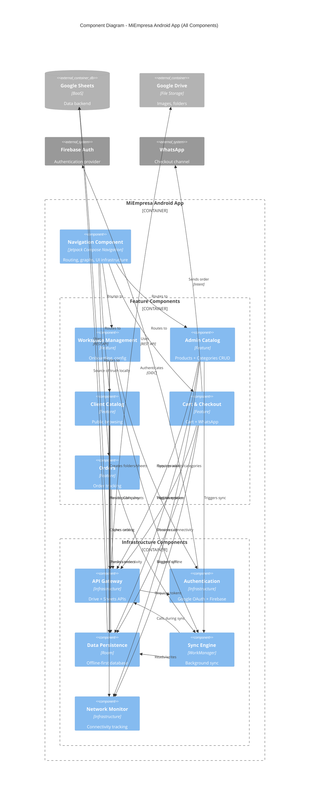
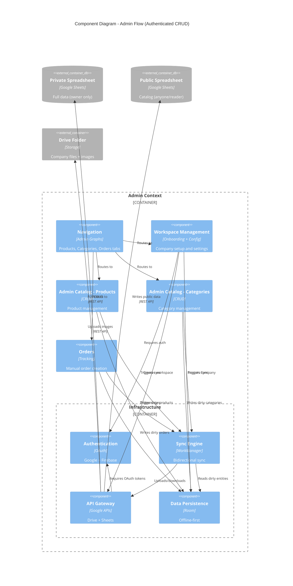
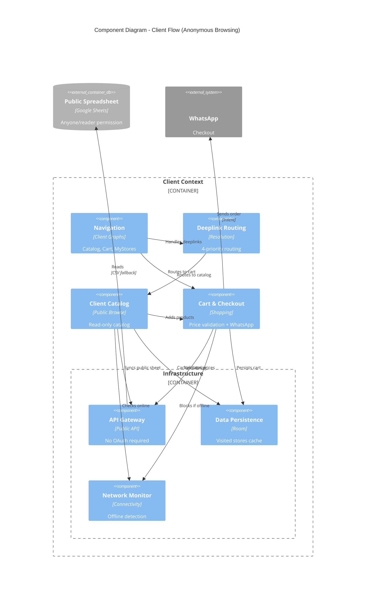

# C4 Component Level: MiEmpresa Android App

## Overview

This document synthesizes the C4 Code-level documentation into Component-level architecture for the MiEmpresa Android application. Components represent logical groupings of code that provide cohesive functionality following Clean Architecture and package-by-feature patterns.

**Architecture Context:**
- **Offline-First**: Room database as source of truth → WorkManager sync → Google Sheets API (BaaS)
- **Zero-Knowledge**: User data stays in Google ecosystem, developer has no access
- **Multitenancy**: All operations filter by `companyId`
- **Dual Context**: Admin (authenticated, full CRUD) + Client (anonymous, read-only catalog + cart)

---

## Component Boundaries

MiEmpresa is organized into 11 logical components across 3 architectural layers:

### Infrastructure Layer (Core)
1. **API Gateway Component** - Google API integration (Drive + Sheets)
2. **Authentication Component** - Google OAuth + Firebase Auth
3. **Data Persistence Component** - Room database + DataStore
4. **Sync Engine Component** - Background synchronization orchestration
5. **Network Monitor Component** - Connectivity tracking

### Business Logic Layer (Features)
6. **Workspace Management Component** - Onboarding and configuration
7. **Admin Catalog Component** - Product and category CRUD
8. **Client Catalog Component** - Public browsing and deeplink routing
9. **Cart & Checkout Component** - Shopping cart with price validation
10. **Orders Component** - Order tracking and manual creation

### Presentation Layer
11. **Navigation Component** - Routing, graphs, and UI infrastructure

---

## Component Details

### 1. API Gateway Component

**Purpose**: Provides unified interface to Google Drive and Sheets APIs, abstracting BaaS operations for all features.

**Type**: Infrastructure Service  
**Technology**: Kotlin, Google API Client Libraries, Coroutines

**Software Features**:
- Drive folder and file management (create, list, delete, share)
- Spreadsheet creation with template tabs (Info, Products, Categories, Orders)
- Public permission management (anyone/reader for client flow)
- CSV fallback for public sheet reading (when API key unavailable)
- Batch spreadsheet operations (write ranges, clear tabs, hide columns)
- Product image upload to Drive with public URL generation

**Code Elements**:
- [c4-code-core.md](./c4-code-core.md) - Section 1.1: DriveApi
- [c4-code-core.md](./c4-code-core.md) - Section 1.2: SpreadsheetsApi

**Interfaces**:

**DriveApi**:
```kotlin
// Drive Operations
suspend fun findMainFolder(): File?
suspend fun createMainFolder(): File?
suspend fun createCompanyFolder(parentFolderId: String, companyName: String): File?
suspend fun listFoldersInFolder(parentFolderId: String): List<File>?
suspend fun findSpreadsheetInFolder(parentFolderId: String, spreadsheetName: String): File?

// Spreadsheet Creation
suspend fun createPrivateSpreadsheet(parentFolderId: String, companyName: String): Spreadsheet?
suspend fun createPublicSpreadsheet(parentFolderId: String, companyName: String): Spreadsheet?
suspend fun initializeSheetHeaders(spreadsheetId: String, tabName: String, headers: List<String>): Boolean
suspend fun writeInfoTab(spreadsheetId: String, infoData: List<List<String>>): Boolean

// File Management
suspend fun uploadFile(file: File, mimeType: String, parentFolderId: String, fileName: String): String?
suspend fun deleteFile(fileId: String): Boolean
suspend fun makeFilePublic(fileId: String): Boolean
```

**SpreadsheetsApi**:
```kotlin
// Authenticated Read/Write
suspend fun readRange(spreadsheetId: String, range: String): List<List<Any>>?
suspend fun appendRows(spreadsheetId: String, range: String, values: List<List<Any>>)
suspend fun clearAndWriteAll(spreadsheetId: String, tabName: String, headers: List<String>, rows: List<List<Any>>)
suspend fun deleteElementFromSheet(spreadsheetId: String, rowIndex: Int, workingSheetId: Int)
suspend fun hideColumns(spreadsheetId: String, tabName: String, columnIndices: List<Int>)

// Public Read (Client Flow)
suspend fun readPublicRange(spreadsheetId: String, range: String, apiKey: String?): List<List<Any>>
suspend fun readPublicProducts(spreadsheetId: String, companyId: String): List<ProductEntity>
suspend fun getProductsByIds(spreadsheetId: String, productIds: List<String>, companyId: String): List<ProductEntity>

// Utilities
suspend fun getSheetId(spreadsheetId: String, sheetName: String): Int?
```

**Dependencies**:
- **External Systems**: Google Drive API v3, Google Sheets API v4
- **Internal Components**: Authentication Component (GoogleAuthClient), Data Persistence (ProductEntity)

---

### 2. Authentication Component

**Purpose**: Manages user authentication, OAuth consent, and session lifecycle for Google services integration.

**Type**: Infrastructure Service  
**Technology**: Firebase Auth, Google Identity Services, Credential Manager

**Software Features**:
- Google One Tap sign-in with Firebase authentication
- OAuth consent flow for Drive File + Sheets scopes
- Service client creation (authenticated Drive and Sheets clients)
- Session management (sign-out, token revocation)
- Secure nonce generation for OIDC
- User data retrieval (userId, email, profile picture)

**Code Elements**:
- [c4-code-core.md](./c4-code-core.md) - Section 2.1: GoogleAuthClient
- [c4-code-core.md](./c4-code-core.md) - Section 2.2: SignInResult
- [c4-code-features.md](./c4-code-features.md) - Section 2: Authentication Feature

**Interfaces**:

**GoogleAuthClient**:
```kotlin
// Authentication
suspend fun signIn(activity: Activity): SignInResult
suspend fun signOut(activity: Activity)
fun getSignedInUser(): UserData?

// OAuth Authorization
suspend fun authorizeDriveAndSheets(): AuthorizationResult

// Service Client Creation
suspend fun getGoogleDriveService(): Drive?
suspend fun getGoogleSheetsService(): Sheets?
```

**AuthRepository** (Feature Domain):
```kotlin
interface AuthRepository {
    suspend fun signIn(activity: Activity): SignInResult
    suspend fun authorizeDriveAndSheets(): AuthState
    suspend fun signOut(activity: Activity)
    fun getSignedInUser(): SignInResult?
}

sealed class AuthState {
    object Authorized
    object Unauthorized
    data class PendingAuth(val intentSender: IntentSender?)
    object Failed
}
```

**Dependencies**:
- **External Systems**: Firebase Auth, Google Identity Services, Credential Manager
- **Internal Components**: None (foundational layer)
- **Used By**: All authenticated features, API Gateway Component

---

### 3. Data Persistence Component

**Purpose**: Provides offline-first data storage using Room database with multitenancy support, serving as single source of truth.

**Type**: Infrastructure Service  
**Technology**: Room, DataStore, SQLite

**Software Features**:
- Multitenancy isolation (all queries filter by `companyId`)
- Reactive data access (Flow-based DAOs)
- Dirty flag tracking for offline-first sync
- Cascade deletion with foreign keys
- Database migrations (version 10 → 15)
- Company selection and session management
- Visited companies history (client flow)

**Code Elements**:
- [c4-code-core.md](./c4-code-core.md) - Section 3: Data Layer
- [c4-code-cart.md](./c4-code-cart.md) - Section: Data Layer
- All feature `data/` packages

**Interfaces**:

**MiEmpresaDatabase**:
```kotlin
@Database(entities = [Company::class, Category::class, CartItemEntity::class, 
                      ProductEntity::class, OrderEntity::class, OrderItemEntity::class])
abstract class MiEmpresaDatabase : RoomDatabase() {
    abstract fun companyDao(): CompanyDao
    abstract fun categoryDao(): CategoryDao
    abstract fun cartItemDao(): CartItemDao
    abstract fun productDao(): ProductDao
    abstract fun orderDao(): OrderDao
}
```

**CompanyDao** (Key DAO):
```kotlin
// Company Selection (Multitenancy)
suspend fun getSelectedOwnedCompany(): Company?
fun observeSelectedCompany(): Flow<Company?>
suspend fun unselectAllCompanies()

// Owner Flow
suspend fun getOwnedCompaniesList(): List<Company>
fun getOwnedCompanies(): Flow<List<Company>>

// Client Flow
suspend fun getByPublicSheetId(sheetId: String): Company?
fun getVisitedCompanies(): Flow<List<Company>>
suspend fun updateLastVisited(id: String, timestamp: Long)

// Sync
suspend fun updateLastSyncedAt(companyId: String, timestamp: Long)
@Upsert suspend fun upsertCompanies(companies: List<Company>)
```

**Entities**:
- **Company**: Central multitenancy entity with owned/visited distinction
- **ProductEntity**: Products with dirty flags, public/private visibility
- **Category**: Categories with emoji icons
- **CartItemEntity**: Cart items with foreign keys to Company + Product
- **OrderEntity** + **OrderItemEntity**: Order tracking with dirty sync

**Dependencies**:
- **External Systems**: None (local storage)
- **Used By**: All components that need data persistence

---

### 4. Sync Engine Component

**Purpose**: Orchestrates bidirectional synchronization between Room database (source of truth) and Google Sheets (BaaS), using WorkManager for background execution.

**Type**: Infrastructure Service  
**Technology**: WorkManager, Kotlin Coroutines

**Software Features**:
- Periodic background sync (configurable interval from BuildConfig)
- On-demand sync triggered by user actions or app launch
- Selective sync by entity type (ALL, PRODUCTS, CATEGORIES, ORDERS)
- Bidirectional sync: download Sheet → Room, upload dirty Room → Sheet
- Partial sync success (continues on error, logs failures)
- Sync work observation (ENQUEUED, RUNNING, SUCCEEDED, FAILED)
- Graceful cancellation during logout

**Code Elements**:
- [c4-code-core.md](./c4-code-core.md) - Section 4: Synchronization Layer

**Interfaces**:

**SyncManager**:
```kotlin
enum class SyncType { ALL, PRODUCTS, CATEGORIES, ORDERS }

// Sync Scheduling
fun schedulePeriodic()
fun syncNow(type: SyncType = SyncType.ALL): UUID

// Sync Observation
fun observeWorkState(workId: UUID): Flow<WorkInfo.State?>

// Lifecycle
fun cancelAll()
```

**SyncCoordinator** (Internal):
```kotlin
// Sync Operations
suspend fun syncAll(): Result<Unit>
suspend fun syncProducts(): Result<Unit>
suspend fun syncCategories(): Result<Unit>
suspend fun syncOrders(): Result<Unit>
```

**PeriodicSyncWorker** (Internal):
```kotlin
override suspend fun doWork(): Result // Delegates to SyncCoordinator
```

**Sync Flow**:
1. WorkManager enqueues PeriodicSyncWorker
2. Worker calls SyncCoordinator.syncAll()
3. SyncCoordinator orchestrates:
   - Download: categories → products → orders (from Sheets)
   - Upload: categories → products → orders (dirty entities to Sheets)
4. Update Company.lastSyncedAt timestamp
5. Return Result.success() or Result.retry()

**Dependencies**:
- **Internal Components**: API Gateway (Sheets operations), Data Persistence (DAOs, entities)
- **External Systems**: WorkManager
- **Used By**: Feature repositories trigger sync after mutations

---

### 5. Network Monitor Component

**Purpose**: Provides reactive network connectivity monitoring for offline-first UI states and validation blocking.

**Type**: Infrastructure Service  
**Technology**: ConnectivityManager, Kotlin Flow

**Software Features**:
- Reactive connectivity stream (Flow<Boolean>)
- Immediate connectivity check (synchronous)
- Validated internet detection (not just network availability, excludes captive portals)
- Network capability filtering (Internet + Validated)

**Code Elements**:
- [c4-code-core.md](./c4-code-core.md) - Section 7.1: NetworkMonitor

**Interfaces**:

**NetworkMonitor**:
```kotlin
// Reactive Monitoring
fun observeOnlineStatus(): Flow<Boolean>

// Immediate Check
fun isOnlineNow(): Boolean
```

**Dependencies**:
- **External Systems**: ConnectivityManager (Android system service)
- **Used By**: All ViewModels for offline UI state management, Cart Component for validation blocking

---

### 6. Workspace Management Component

**Purpose**: Manages company workspace lifecycle - onboarding (Drive folder + spreadsheet creation), company discovery, and configuration updates.

**Type**: Business Feature  
**Technology**: Kotlin, Jetpack Compose, Hilt

**Software Features**:
- First-time workspace creation (6-step wizard with progress tracking)
- Drive folder structure setup: `MiEmpresa/CompanyName/`
- Private spreadsheet creation with tabs: Info, Products, Categories, Pedidos
- Public spreadsheet creation (anyone/reader permissions) with tabs: Info, Products
- Company logo upload to Drive
- Workspace validation and recovery (recreate missing sheets)
- Company discovery from Drive (existing workspaces)
- Multi-company support (selector UI)
- Company info updates (name, WhatsApp, logo, specialization, address, hours)
- Sync company metadata to both sheets (Info tab)
- QR code generation for public catalog sharing

**Code Elements**:
- [c4-code-features.md](./c4-code-features.md) - Section 3: Onboarding Feature
- [c4-code-features.md](./c4-code-features.md) - Section 8: Config Feature

**Interfaces**:

**OnboardingRepository**:
```kotlin
// Workspace Creation
suspend fun createWorkspace(request: WorkspaceSetupRequest): WorkspaceCreationResult
suspend fun createSpreadsheetsForCompany(company: Company): WorkspaceCreationResult
val stepProgress: Flow<WorkspaceStep>

// Workspace Discovery
suspend fun syncCompaniesFromDrive(): List<Company>
suspend fun validateExistingWorkspace(): WorkspaceValidationResult

// Company Management
suspend fun getOwnedCompanies(): List<Company>
suspend fun selectCompany(company: Company)
suspend fun deleteCompany(company: Company)

// Models
enum class WorkspaceStep {
    CREATE_FOLDER, UPLOAD_LOGO, CREATE_PRIVATE_SHEET, 
    CREATE_PUBLIC_SHEET, CREATE_IMAGES_FOLDER, SAVE_CONFIG
}

sealed class WorkspaceCreationResult {
    data class Success(val companyId: String)
    data class Error(val step: WorkspaceStep, val message: String)
}
```

**ConfigRepository**:
```kotlin
// Company Info Management
fun observeCompany(companyId: String): Flow<Company?>
suspend fun updateCompanyInfo(company: Company)
suspend fun syncCompanyInfoToSheets(companyId: String)
suspend fun uploadCompanyLogo(companyId: String, localImagePath: String, companyName: String): String?
```

**UI Screens**: OnboardingScreen (3-step wizard), CompanySelectorScreen, ConfigScreen, EditCompanyDataScreen

**Dependencies**:
- **Internal Components**: API Gateway (Drive + Sheets operations), Data Persistence (CompanyDao), Authentication, Sync Engine
- **Used By**: Entry point for first-time users, navigation routing

---

### 7. Admin Catalog Component

**Purpose**: Provides full CRUD operations for products and categories in authenticated admin flow, with offline-first mutation and background sync.

**Type**: Business Feature  
**Technology**: Kotlin, Jetpack Compose, Hilt

**Software Features**:
- **Products**:
  - CRUD operations (create, read, update, delete)
  - Product image capture (camera/gallery) and upload to Drive
  - Public/private visibility toggle
  - Price visibility control (hidePrice flag)
  - Category association
  - Search and category filtering
  - Dirty flag tracking for offline mutations
  - Background sync to private + public sheets
- **Categories**:
  - CRUD operations with emoji icon picker
  - Product count tracking
  - Search filtering
  - Dirty flag tracking
  - Sync to spreadsheet with COUNTIF formulas
  - Orphaned product handling (clear categoryId when category deleted)

**Code Elements**:
- [c4-code-features.md](./c4-code-features.md) - Section 4: Products Feature
- [c4-code-features.md](./c4-code-features.md) - Section 5: Categories Feature

**Interfaces**:

**ProductsRepository**:
```kotlin
// Query
fun getFiltered(companyId: String, searchQuery: String, categoryId: String?, isPublicFilter: Boolean?): Flow<List<ProductEntity>>
fun getCategoryCountsByFilter(companyId: String, searchQuery: String, isPublicFilter: Boolean?): Flow<Map<String, Int>>
suspend fun getById(id: String, companyId: String): ProductEntity?

// Mutation (Offline-First)
suspend fun create(product: ProductEntity)
suspend fun update(product: ProductEntity)
suspend fun delete(id: String, companyId: String)
suspend fun togglePublic(id: String, companyId: String, isPublic: Boolean)

// Sync
suspend fun syncPendingChanges(companyId: String)
suspend fun downloadFromSheets(companyId: String)

// File Upload
suspend fun uploadProductImage(companyId: String, localImagePath: String, productName: String): String?
```

**CategoriesRepository**:
```kotlin
// Query
fun getAll(companyId: String): Flow<List<Category>>
suspend fun getById(id: String, companyId: String): Category?
suspend fun getProductCount(categoryId: String, companyId: String): Int

// Mutation
suspend fun create(category: Category)
suspend fun update(category: Category)
suspend fun delete(id: String, companyId: String)

// Sync
suspend fun syncPendingChanges(companyId: String)
suspend fun downloadFromSheets(companyId: String)
```

**UI Screens**: ProductsScreen (list with search/filter), ProductFormScreen (create/edit), CategoriesScreen (list with search), CategoryFormScreen (create/edit with emoji picker)

**Dependencies**:
- **Internal Components**: API Gateway (Sheets for sync, Drive for images), Data Persistence (ProductDao, CategoryDao), Sync Engine (trigger sync), Network Monitor (offline UI)
- **Used By**: Orders Component (product lookup), Cart Component (price validation)

---

### 8. Client Catalog Component

**Purpose**: Provides public read-only catalog browsing for anonymous users, with deeplink routing and visited stores history.

**Type**: Business Feature  
**Technology**: Kotlin, Jetpack Compose, Hilt

**Software Features**:
- Public spreadsheet synchronization (no OAuth required)
- First-visit catalog download with company metadata
- Refresh catalog from public sheet (pull-to-refresh)
- Product browsing with search and category filtering
- WhatsApp integration (launch intent)
- Deeplink routing with 4-priority resolution:
  1. Existing visited store → direct navigation
  2. Owned store → admin home
  3. New store + online → sync and navigate
  4. New store + offline → error screen
- Visited stores history (last accessed tracking)
- Cart protection during catalog sync (prevent deletion of in-cart products)
- Error mapping (403/404 → user-friendly messages)

**Code Elements**:
- [c4-code-features.md](./c4-code-features.md) - Section 6: Catalog Feature

**Interfaces**:

**ClientCatalogRepository**:
```kotlin
// Public Sync (No OAuth)
suspend fun syncPublicSheet(publicSheetId: String): Result<Company>
suspend fun refreshCatalog(companyId: String, publicSheetId: String): Result<Unit>

// Error Handling
enum class CatalogAccessError {
    NO_INTERNET_FIRST_VISIT, CATALOG_NOT_FOUND, 
    CATALOG_NOT_AVAILABLE, UNKNOWN
}
```

**DeeplinkRoutingViewModel** (Sub-component):
```kotlin
// Deeplink Resolution
suspend fun handleDeeplink(sheetId: String)
suspend fun routeToMyStoresIfVisited()

// Navigation Events
sealed class DeeplinkNavigationEvent {
    data class NavigateClientCatalog(val companyId: String)
    data class NavigateError(val errorType: CatalogAccessError, val sheetId: String)
    object NavigateHome
    object NavigateMyStores
}
```

**UI Screens**: ClientCatalogScreen (public browsing), DeeplinkErrorScreen, MyStoresScreen (visited stores list)

**Dependencies**:
- **Internal Components**: API Gateway (public Sheets API), Data Persistence (CompanyDao, ProductDao), Cart Component (add to cart), Network Monitor (offline detection)
- **External Systems**: WhatsApp (via Intent)

---

### 9. Cart & Checkout Component

**Purpose**: Manages shopping cart with reactive persistence, real-time price validation against remote Google Sheets, and WhatsApp checkout.

**Type**: Business Feature  
**Technology**: Kotlin, Jetpack Compose, Room, Hilt

**Software Features**:
- **Cart Management**:
  - Add products to cart with quantity validation (max 99 per product)
  - Update quantity (1-99 range)
  - Remove items
  - Clear cart
  - Reactive cart count badge
  - Multitenancy isolation (cart per company)
- **Price Validation**:
  - Real-time validation against public Google Sheets
  - Detects price changes and displays diff (old → new)
  - Detects unavailable products (deleted/hidden)
  - Blocks checkout if offline or products unavailable
  - Effective UI state resolution (online status + validation result)
- **Checkout**:
  - WhatsApp integration with pre-filled message
  - Formatted order message with company name, items, prices
  - Handles hidden prices (display as "Consultar")
  - Opens WhatsApp via deep link (wa.me)

**Code Elements**:
- [c4-code-cart.md](./c4-code-cart.md) - All sections

**Interfaces**:

**CartRepository**:
```kotlin
// Cart Operations
suspend fun getCurrentQuantityForProduct(companyId: String, productId: String): Int
suspend fun addItem(companyId: String, productId: String, quantity: Int): Long
suspend fun updateQuantity(id: Long, companyId: String, newQuantity: Int)
suspend fun removeItem(id: Long, companyId: String)
suspend fun clearCart(companyId: String)

// Reactive Queries
fun observeCartItems(companyId: String): Flow<List<CartItemWithProduct>>
fun observeCartCount(companyId: String): Flow<Int>

// Connectivity
fun observeOnlineStatus(): Flow<Boolean>
fun isOnlineNow(): Boolean

// Price Validation
suspend fun validateCartPrices(companyId: String, spreadsheetId: String): PriceValidationResult

// Models
sealed class PriceValidationResult {
    object AllValid
    data class PricesUpdated(val changes: List<PriceChange>, val newTotal: Double)
    data class ItemsUnavailable(val unavailableProducts: List<UnavailableProduct>, val availableTotal: Double)
    object Blocked
}
```

**Use Cases**:
```kotlin
// Business Logic
class ResolveCartQuantityAdditionUseCase {
    operator fun invoke(currentQuantity: Int, requestedQuantity: Int): CartQuantityAdditionDecision
    companion object { const val MAX_CART_QUANTITY_PER_PRODUCT = 99 }
}

class ResolveCartValidationUiStateUseCase {
    operator fun invoke(isOnline: Boolean, validationResult: PriceValidationResult?): CartValidationUiState
}

class ResolveCheckoutValidationDecisionUseCase {
    operator fun invoke(result: PriceValidationResult): CheckoutValidationDecision
}

class NormalizeWhatsAppPhoneUseCase {
    operator fun invoke(value: String): String?
}
```

**WhatsAppHelper**:
```kotlin
object WhatsAppHelper {
    fun buildMessage(items: List<CartItem>, companyName: String): String
    fun openChat(context: Context, phoneNumber: String, message: String): Boolean
}
```

**UI Screens**: CartScreen (item list with validation status, checkout button)

**Dependencies**:
- **Internal Components**: API Gateway (public Sheets for validation), Data Persistence (CartItemDao, ProductDao, CompanyDao), Network Monitor (validation blocking)
- **External Systems**: WhatsApp (via Intent)

---

### 10. Orders Component

**Purpose**: Provides manual order tracking for admin flow, with spreadsheet persistence and order history browsing.

**Type**: Business Feature  
**Technology**: Kotlin, Jetpack Compose, Hilt

**Software Features**:
- Manual order creation with product selection
- Order items summary with quantities and prices
- Order history browsing (list + detail views)
- Customer info capture (name, phone, notes)
- Auto-increment order numbers
- Sync to private spreadsheet (Pedidos tab)
- Dirty flag tracking for offline mutations
- Order item parsing from spreadsheet (summary format: "Producto × Cantidad")

**Code Elements**:
- [c4-code-features.md](./c4-code-features.md) - Section 7: Orders Feature

**Interfaces**:

**OrdersRepository**:
```kotlin
// Query
fun getAllOrders(companyId: String): Flow<List<OrderEntity>>
suspend fun getOrderById(id: String, companyId: String): OrderEntity?
fun getOrderItems(orderId: String, companyId: String): Flow<List<OrderItemEntity>>

// Mutation
suspend fun createOrder(order: OrderEntity, items: List<OrderItemEntity>)

// Sync
suspend fun downloadFromSheets(companyId: String)
suspend fun syncPendingChanges(companyId: String)
```

**UI Screens**: OrdersListScreen (history), OrderManualScreen (create order), OrderDetailScreen (view order + items), AddProductToOrderSheet (bottom sheet)

**Dependencies**:
- **Internal Components**: API Gateway (Sheets for sync), Data Persistence (OrderDao, ProductDao), Admin Catalog Component (product lookup)

---

### 11. Navigation Component

**Purpose**: Orchestrates app navigation with nested graphs, deeplink resolution, and UI infrastructure (TopBar, BottomBar, Drawer).

**Type**: Presentation Infrastructure  
**Technology**: Jetpack Compose Navigation, Kotlin Serialization

**Software Features**:
- Nested navigation graphs (authGraph, clientGraph, adminGraph)
- Type-safe routes using Kotlin Serialization
- Deeplink resolution with priority system
- Navigation guards (debounce rapid taps, auth state protection)
- Back stack management (clear stack on logout/context switch)
- Dynamic TopBar with route-aware titles
- BottomBar with 3 admin tabs (Products, Categories, Orders)
- Navigation Drawer for company management
- Entry routing (signed-in vs signed-out)
- Pending deeplink handling after sign-in

**Code Elements**:
- [c4-code-features.md](./c4-code-features.md) - Section 9: Navigation Module

**Interfaces**:

**MiEmpresaRoutes** (Route Contract):
```kotlin
object MiEmpresaRoutes {
    // Graph Routes
    const val authGraph = "auth_graph"
    const val clientGraph = "client_graph"
    const val adminGraph = "admin_graph"
    
    // Screen Routes
    const val welcome = "welcome"
    const val signIn = "sign_in"
    const val onboarding = "onboarding"
    const val home = "home"
    const val myStores = "my_stores"
    
    // Type-Safe Builders
    object Cart { fun create(companyId: String): String }
    object ClientCatalog { fun create(companyId: String): String }
    object ProductForm { fun create(productId: String?, mode: String): String }
}
```

**Type-Safe Routes** (Kotlin Serialization):
```kotlin
@Serializable data class ClientCatalogRoute(val companyId: String)
@Serializable data class DeeplinkErrorRoute(val errorType: String, val sheetId: String)
@Serializable data class ProductFormRoute(val productId: String?, val mode: String)
@Serializable data class OrderDetailRoute(val orderId: String)
```

**Navigation Helpers**:
```kotlin
// Clear Back Stack
fun NavHostController.navigateClearingBackStack(route: String)
fun NavHostController.navigateClearingBackStack(route: T)

// Navigation Guards
class NavigationTapGuard {
    fun canNavigateNow(): Boolean // 300ms debounce
}

class ScreenActionGuard {
    // Prevents navigation during critical auth flows
}
```

**UI Components**: TopBar, BottomBar, Drawer, HomeAdminScreen (Scaffold wrapper)

**Dependencies**:
- **Internal Components**: All feature components (for route definitions), Authentication (for entry routing), Workspace Management (for company switcher)

---

## Component Relationships

### Dependency Rules

Following Clean Architecture and package-by-feature principles:

✅ **Allowed Dependencies**:
- Features → Core (all features can depend on infrastructure)
- Core/Sync → Feature/Domain (SyncCoordinator depends on Repository interfaces)
- Presentation → Business Logic (UI depends on ViewModels)
- Business Logic → Data (Repositories implement domain interfaces)

❌ **Prohibited Dependencies**:
- Features → Features (no cross-feature dependencies)
- Core → Feature/Data or Feature/UI (infrastructure cannot depend on feature implementations)
- Data → UI (data layer is UI-agnostic)

### Component Interaction Patterns

#### Synchronous Interactions (Direct Calls)
- **UI → ViewModel**: User actions trigger ViewModel methods
- **ViewModel → Repository**: Business logic calls repository methods
- **Repository → DAO**: Data operations call Room DAOs
- **Repository → API Gateway**: Sync operations call DriveApi/SpreadsheetsApi

#### Reactive Interactions (Flow-based)
- **DAO → ViewModel**: Database changes emit via Flow
- **Network Monitor → ViewModel**: Connectivity changes emit via Flow
- **CompanyDao → All Features**: Selected company changes propagate reactively

#### Asynchronous Interactions (WorkManager)
- **ViewModel → Sync Engine**: Trigger background sync (one-way)
- **Sync Engine → Repositories**: WorkManager executes sync operations
- **WorkManager → ViewModel**: Work state observation via Flow

---

## Component Diagram: System Overview



---

## Component Diagram: Admin Flow (Authenticated)



---

## Component Diagram: Client Flow (Anonymous)



---

## Data Flow Between Components

### Admin Flow: Product Creation with Image Upload

```
User → Navigation Component → Admin Catalog Component (UI)
  ↓
Admin Catalog ViewModel.saveProduct()
  ↓
ProductsRepository.create(product)
  ↓
[Offline-First Write]
ProductDao.insert(product.copy(dirty = true))
  ↓
[Image Upload]
ProductsRepository.uploadProductImage(companyId, localPath, productName)
  ↓
API Gateway Component.DriveApi.uploadFile(file, mimeType, parentFolderId, fileName)
  ↓
Google Drive API
  ↓
[Returns Drive fileId]
  ↓
Update product.imageUrl = fileId
  ↓
[Trigger Sync]
Sync Engine Component.syncNow(SyncType.PRODUCTS)
  ↓
WorkManager enqueues PeriodicSyncWorker
  ↓
SyncCoordinator.syncProducts()
  ↓
ProductsRepository.syncPendingChanges(companyId)
  ↓
[Read Dirty Products]
ProductDao.getDirty(companyId)
  ↓
[Write to Sheets]
API Gateway.SpreadsheetsApi.clearAndWriteAll(
  privateSheetId, "Products", headers, productRows
)
API Gateway.SpreadsheetsApi.clearAndWriteAll(
  publicSheetId, "Products", headers, publicProductRows
)
  ↓
[Mark Clean]
ProductDao.markSynced(ids, timestamp, companyId)
  ↓
[Sync Complete]
Update Company.lastSyncedAt
  ↓
[Reactive UI Update]
ProductDao.getFilteredByCompany() emits via Flow → ViewModel → UI refreshes
```

### Client Flow: Deeplink to Cart Checkout

```
User clicks deeplink (miempresa://catalogo?sheetId=xyz)
  ↓
MainActivity.extractSheetIdFromIncomingPayload()
  ↓
Navigation Component.DeeplinkRoutingViewModel.handleDeeplink(sheetId)
  ↓
[Priority Resolution]
1. Check CompanyDao.getVisitedByPublicSheetId(sheetId)
   → Found: Navigate to ClientCatalog (offline-capable)
2. Check CompanyDao.getOwnedCompanyByPublicSheet(sheetId)
   → Found: Navigate to Admin Home
3. New + Online: Sync public sheet
   ↓
   Client Catalog Component.ClientCatalogRepository.syncPublicSheet(sheetId)
   ↓
   API Gateway.SpreadsheetsApi.readPublicRange(sheetId, "Info!A:B")
   → Parse company metadata (name, logo, whatsapp)
   ↓
   API Gateway.SpreadsheetsApi.readPublicProducts(sheetId, companyId)
   → CSV fallback if API unavailable
   ↓
   Data Persistence.ProductDao.upsert(products)
   Data Persistence.CompanyDao.upsert(company)
   ↓
   Navigate to ClientCatalog(companyId)
4. New + Offline: Navigate to DeeplinkError
  ↓
[User browses catalog]
Client Catalog Component.ClientCatalogViewModel.addProductToCart(productId)
  ↓
Cart Component.CartRepository.addItem(companyId, productId, quantity)
  ↓
[Quantity Validation]
ResolveCartQuantityAdditionUseCase.invoke(currentQty, requestedQty)
  → Enforces MAX 99 per product
  ↓
Data Persistence.CartItemDao.insert(cartItem)
  ↓
[Reactive Badge Update]
CartItemDao.observeItemCount(companyId) emits → Navigation shows badge
  ↓
[User navigates to Cart]
Navigation Component → Cart & Checkout Component (UI)
  ↓
CartViewModel.loadCart()
  ↓
CartRepository.observeCartItems(companyId) emits Flow<List<CartItemWithProduct>>
  ↓
[Price Validation Trigger]
CartViewModel.validatePrices()
  ↓
Cart Component.CartRepository.validateCartPrices(companyId, publicSheetId)
  ↓
API Gateway.SpreadsheetsApi.getProductsByIds(sheetId, cartProductIds, companyId)
  ↓
[Price Comparison Logic]
detectPriceChanges(cartItems, localProducts, remoteProducts)
  → AllValid | PricesUpdated | ItemsUnavailable
  ↓
[UI State Resolution]
ResolveCartValidationUiStateUseCase.invoke(isOnline, validationResult)
  → Blocks checkout if offline or items unavailable
  ↓
[User clicks "Finalizar Pedido"]
CartViewModel.checkout()
  ↓
[Checkout Decision]
ResolveCheckoutValidationDecisionUseCase.invoke(validationResult)
  → ProceedToWhatsApp | ShowPricesUpdatedNotice | ShowItemsUnavailableError
  ↓
[If AllValid or PricesUpdated after confirmation]
WhatsAppHelper.buildMessage(cartItems, companyName)
  → Formats: "¡Hola! Quiero hacer este pedido a {company}:\n• {items}\nTotal: {total}"
  ↓
WhatsAppHelper.openChat(context, phoneNumber, message)
  → Deep link: https://wa.me/{phone}?text={encodedMessage}
  ↓
WhatsApp opens with pre-filled message
```

### Background Sync Flow (Bidirectional)

```
[Periodic Trigger - Every 15 minutes]
Application.onCreate() → Sync Engine.SyncManager.schedulePeriodic()
  ↓
WorkManager schedules PeriodicWorkRequest
  ↓
[OR User Manual Trigger]
ViewModel → Sync Engine.SyncManager.syncNow(SyncType.ALL)
  ↓
WorkManager enqueues OneTimeWorkRequest
  ↓
[Worker Execution]
PeriodicSyncWorker.doWork()
  ↓
SyncCoordinator.syncAll()
  ↓
[Get Active Company]
Data Persistence.CompanyDao.getSelectedOwnedCompany()
  → Returns companyId (multitenancy isolation)
  ↓
[Download Phase - Sheet → Room]
1. CategoriesRepository.downloadFromSheets(companyId)
   ↓
   API Gateway.SpreadsheetsApi.readRange(privateSheetId, "Categories!A2:E")
   ↓
   Data Persistence.CategoryDao.upsert(categories)
   ↓
2. ProductsRepository.downloadFromSheets(companyId)
   ↓
   API Gateway.SpreadsheetsApi.readRange(privateSheetId, "Products!A2:H")
   ↓
   Data Persistence.ProductDao.upsert(products)
   ↓
3. OrdersRepository.downloadFromSheets(companyId)
   ↓
   API Gateway.SpreadsheetsApi.readRange(privateSheetId, "Pedidos!A2:G")
   ↓
   Data Persistence.OrderDao.upsert(orders, orderItems)
  ↓
[Upload Phase - Dirty Room → Sheet]
1. CategoriesRepository.syncPendingChanges(companyId)
   ↓
   Data Persistence.CategoryDao.getDirty(companyId)
   ↓
   API Gateway.SpreadsheetsApi.clearAndWriteAll(privateSheetId, "Categories", headers, rows)
   ↓
   Data Persistence.CategoryDao.markSynced(ids, timestamp, companyId)
   ↓
2. ProductsRepository.syncPendingChanges(companyId)
   ↓
   Data Persistence.ProductDao.getDirty(companyId)
   ↓
   API Gateway.SpreadsheetsApi.clearAndWriteAll(privateSheetId, "Products", headers, rows)
   API Gateway.SpreadsheetsApi.clearAndWriteAll(publicSheetId, "Products", headers, publicRows)
   ↓
   Data Persistence.ProductDao.markSynced(ids, timestamp, companyId)
   ↓
3. OrdersRepository.syncPendingChanges(companyId)
   ↓
   Data Persistence.OrderDao.getDirty(companyId)
   ↓
   API Gateway.SpreadsheetsApi.appendRows(privateSheetId, "Pedidos!A:G", orderRows)
   ↓
   Data Persistence.OrderDao.markSynced(ids, timestamp, companyId)
  ↓
[Update Sync Timestamp]
Data Persistence.CompanyDao.updateLastSyncedAt(companyId, System.currentTimeMillis())
  ↓
[Return Result]
WorkManager Result.success() or Result.retry()
  ↓
[Reactive UI Update]
All DAOs emit Flow updates → ViewModels → UI refreshes automatically
```

---

## Component Technology Stack Summary

| Component | Primary Technologies | Key Libraries |
|-----------|---------------------|---------------|
| API Gateway | Kotlin Coroutines, REST | Google API Client, Gson, OkHttp |
| Authentication | Firebase Auth, OAuth 2.0 | Google Identity Services, Credential Manager |
| Data Persistence | Room, SQLite | AndroidX Room, Kotlin Flow |
| Sync Engine | WorkManager, Coroutines | AndroidX WorkManager, Hilt Worker |
| Network Monitor | ConnectivityManager | Kotlin Flow |
| Workspace Management | Jetpack Compose, MVVM | Hilt, ViewModel, Coil (images) |
| Admin Catalog | Jetpack Compose, MVVM | Hilt, ViewModel, CameraX |
| Client Catalog | Jetpack Compose, MVVM | Hilt, ViewModel |
| Cart & Checkout | Jetpack Compose, MVVM | Hilt, ViewModel, Room |
| Orders | Jetpack Compose, MVVM | Hilt, ViewModel |
| Navigation | Jetpack Compose Navigation | Kotlin Serialization, SavedStateHandle |

---

## Component Deployment Notes

All components are deployed within a single Android APK (monolithic architecture). However, they are logically separated:

- **Infrastructure Components** (Core): Loaded on app start, singleton lifecycle
- **Feature Components**: Lazy-loaded on navigation, ViewModel lifecycle scoped to Compose navigation
- **Navigation Component**: Loaded on MainActivity creation

Future modularization considerations:
- Infrastructure components → `:core` Gradle module
- Feature components → `:feature:products`, `:feature:cart`, etc.
- Dependency rules enforced via Gradle module dependencies

---

## References

### Code-Level Documentation
- [c4-code-core.md](./c4-code-core.md) - Core module infrastructure
- [c4-code-cart.md](./c4-code-cart.md) - Cart feature implementation
- [c4-code-features.md](./c4-code-features.md) - All feature modules

### Architecture Decisions
- [ADR-001: Package-by-Feature + Clean Architecture](../decisions/ADR-001-package-by-feature-clean-architecture.md)
- [ADR-002: Navigation Architecture](../decisions/ADR-002-navigation-architecture.md)

### Architecture Overview
- [Architecture README](../README.md)

---

## Next Steps

This Component-level documentation should be synthesized further into:
- **C4 Container Level**: Mapping components to deployment containers (Android App, Google Sheets, Firebase Auth, WhatsApp)
- **C4 Context Level**: System context with user personas, external systems, and high-level interactions

---

**Document Version**: 1.0  
**Last Updated**: 2025-01-20  
**Status**: Complete - All 11 components documented with interfaces, relationships, and data flows
