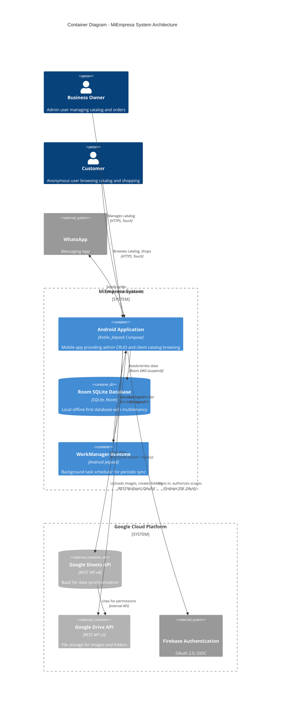
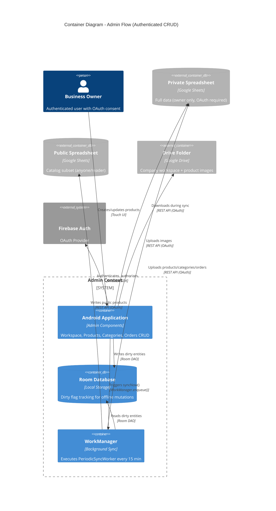
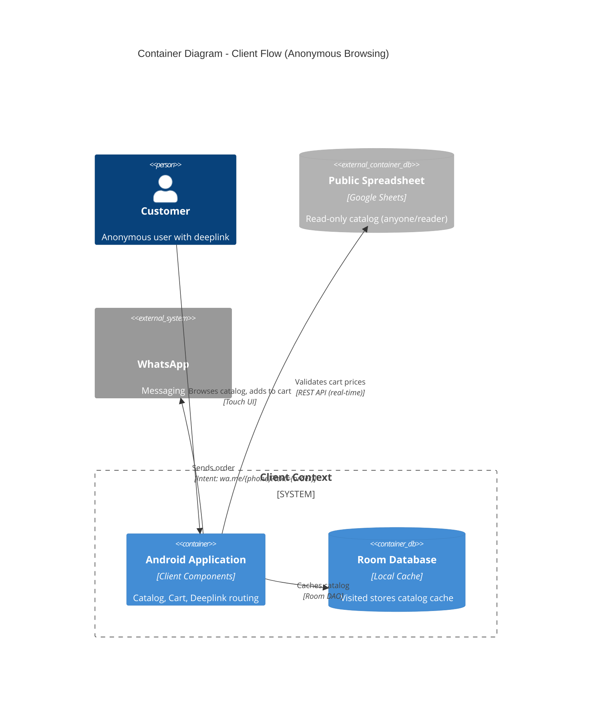

# C4 Container Level: MiEmpresa System Deployment

## Overview

This document presents the C4 Container-level architecture for MiEmpresa, mapping the 11 logical components documented at the Component level into 6 physical deployment containers. Containers represent deployable/executable units that must be running for the system to work.

**Key Architectural Characteristics:**
- **Offline-First Mobile App**: Single Android APK containing all business logic
- **Zero-Knowledge BaaS**: User data stays in Google ecosystem (Sheets + Drive)
- **No Custom Backend**: Eliminates server infrastructure, hosting, and maintenance costs
- **Academic MVP Scope**: Direct APK distribution (no Play Store deployment)

---

## Containers

### 1. Android Application Container

**Name**: MiEmpresa Android App  
**Description**: Monolithic Android application containing all 11 components across Infrastructure, Business Logic, and Presentation layers. Provides both authenticated admin flow (full CRUD) and anonymous client flow (read-only catalog + cart).  
**Type**: Mobile Application  
**Technology**: Kotlin, Jetpack Compose, Android SDK 24-34  
**Deployment**: Single APK distributed via direct install (academic project)

#### Purpose

The Android Application is the primary container where all user interaction and business logic execution occurs. It orchestrates:
- User authentication and OAuth consent flows
- Offline-first data persistence with Room SQLite
- Background synchronization with Google Sheets API
- Product catalog management (admin) and browsing (client)
- Shopping cart with real-time price validation
- Order tracking and creation
- Company workspace onboarding and configuration

#### Components Deployed

This container hosts all 11 components from the Component-level architecture:

**Infrastructure Layer (Core)**:
1. **API Gateway Component**: Google Drive + Sheets API integration
   - Documentation: [c4-component.md](./c4-component.md#1-api-gateway-component)
2. **Authentication Component**: Google OAuth + Firebase Auth
   - Documentation: [c4-component.md](./c4-component.md#2-authentication-component)
3. **Data Persistence Component**: Room database + DataStore
   - Documentation: [c4-component.md](./c4-component.md#3-data-persistence-component)
4. **Sync Engine Component**: WorkManager-based synchronization
   - Documentation: [c4-component.md](./c4-component.md#4-sync-engine-component)
5. **Network Monitor Component**: Connectivity tracking
   - Documentation: [c4-component.md](./c4-component.md#5-network-monitor-component)

**Business Logic Layer (Features)**:
6. **Workspace Management Component**: Onboarding and configuration
   - Documentation: [c4-component.md](./c4-component.md#6-workspace-management-component)
7. **Admin Catalog Component**: Product and category CRUD
   - Documentation: [c4-component.md](./c4-component.md#7-admin-catalog-component)
8. **Client Catalog Component**: Public browsing and deeplink routing
   - Documentation: [c4-component.md](./c4-component.md#8-client-catalog-component)
9. **Cart & Checkout Component**: Shopping cart with price validation
   - Documentation: [c4-component.md](./c4-component.md#9-cart--checkout-component)
10. **Orders Component**: Order tracking and manual creation
    - Documentation: [c4-component.md](./c4-component.md#10-orders-component)

**Presentation Layer**:
11. **Navigation Component**: Routing, graphs, and UI infrastructure
    - Documentation: [c4-component.md](./c4-component.md#11-navigation-component)

#### Interfaces

##### Internal: Android App → Room SQLite Database

**Protocol**: Room DAO (SQLite via Android framework)  
**Description**: Local data persistence with multitenancy support. All queries filter by `companyId` for workspace isolation.  
**Type**: Synchronous-like (Kotlin suspend functions, but blocks thread)

**Key DAOs**:

```kotlin
// Company Management (Multitenancy Root)
interface CompanyDao {
    suspend fun getSelectedOwnedCompany(): Company?
    fun observeSelectedCompany(): Flow<Company?>
    suspend fun getOwnedCompaniesList(): List<Company>
    fun getVisitedCompanies(): Flow<List<Company>>
    @Upsert suspend fun upsertCompanies(companies: List<Company>)
}

// Product CRUD
interface ProductDao {
    fun getFilteredByCompany(companyId: String, searchQuery: String, 
                             categoryId: String?, isPublic: Boolean?): Flow<List<ProductEntity>>
    suspend fun getById(id: String, companyId: String): ProductEntity?
    suspend fun getDirty(companyId: String): List<ProductEntity>
    @Upsert suspend fun upsertAll(products: List<ProductEntity>)
    suspend fun markSynced(ids: List<String>, timestamp: Long, companyId: String)
}

// Category CRUD
interface CategoryDao {
    fun getAllByCompany(companyId: String): Flow<List<Category>>
    suspend fun getDirty(companyId: String): List<Category>
    @Upsert suspend fun upsert(category: Category)
}

// Cart Operations
interface CartItemDao {
    fun observeItemsWithProducts(companyId: String): Flow<List<CartItemWithProduct>>
    fun observeItemCount(companyId: String): Flow<Int>
    suspend fun getCurrentQuantityForProduct(companyId: String, productId: String): Int
    @Insert suspend fun insert(item: CartItemEntity): Long
    suspend fun deleteById(id: Long, companyId: String)
}

// Order Tracking
interface OrderDao {
    fun getAllOrders(companyId: String): Flow<List<OrderEntity>>
    fun getOrderItems(orderId: String, companyId: String): Flow<List<OrderItemEntity>>
    @Transaction suspend fun insertOrderWithItems(order: OrderEntity, items: List<OrderItemEntity>)
}
```

**Entities (6 tables)**:
- `Company`: Central multitenancy entity (owned vs visited stores)
- `ProductEntity`: Products with dirty flags, public/private visibility
- `Category`: Categories with emoji icons
- `CartItemEntity`: Cart items with foreign keys
- `OrderEntity` + `OrderItemEntity`: Order tracking with dirty flags

**References**:
- [c4-component.md - Data Persistence Component](./c4-component.md#3-data-persistence-component)
- [c4-code-core.md - Section 3: Data Layer](./c4-code-core.md)

---

##### External: Android App → Google Sheets API

**Protocol**: REST (HTTPS)  
**Description**: Backend-as-a-Service (BaaS) for data synchronization. Bidirectional sync: Room (source of truth) ↔ Sheets (backup/sharing). Supports both authenticated (OAuth) and public (API key + CSV fallback) access.  
**Authentication**: 
- **Admin flow**: OAuth 2.0 with Drive.File + Sheets scopes
- **Client flow**: Public API key (optional) + CSV fallback

**API Specification**: Google Sheets API v4

**Endpoints Used**:

```yaml
# Authenticated Operations (Admin Flow)
GET /v4/spreadsheets/{spreadsheetId}/values/{range}
  summary: Read spreadsheet range (e.g., "Products!A2:H")
  parameters:
    - spreadsheetId: String (Google Sheets ID)
    - range: String (A1 notation)
  responses:
    200: { values: Array<Array<Any>> }
  authentication: OAuth 2.0 Bearer token

POST /v4/spreadsheets/{spreadsheetId}/values/{range}:append
  summary: Append rows to sheet (e.g., new orders)
  requestBody: { values: Array<Array<Any>> }
  responses:
    200: { updates: { updatedRows: Int } }

POST /v4/spreadsheets/{spreadsheetId}:batchUpdate
  summary: Batch operations (clear range, write, hide columns)
  requestBody: { requests: Array<UpdateRequest> }

# Public Operations (Client Flow)
GET /v4/spreadsheets/{spreadsheetId}/values/{range}?key={apiKey}
  summary: Read public spreadsheet (anyone/reader permission)
  parameters:
    - key: Optional API key (fallback to CSV if unavailable)
  responses:
    200: { values: Array<Array<Any>> }
    403: Permission denied (sheet not public)
    404: Spreadsheet not found
  authentication: None (public access) or API key

# CSV Fallback (Client Flow - when API key unavailable)
GET https://docs.google.com/spreadsheets/d/{spreadsheetId}/export?format=csv&gid={sheetId}
  summary: Export sheet as CSV (public access)
  responses:
    200: text/csv
```

**Data Schemas**:

```yaml
# Private Spreadsheet (Admin - OAuth required)
Info Tab:
  - Campo: String (metadata keys)
  - Valor: String (metadata values)
  
Products Tab:
  - ID: String (UUID)
  - Nombre: String
  - Descripción: String
  - Precio: Double
  - Es público?: Boolean
  - Ocultar precio?: Boolean
  - Categoría ID: String (FK)
  - Imagen URL: String (Drive fileId)

Categories Tab:
  - ID: String (UUID)
  - Nombre: String
  - Emoji: String (single emoji character)
  - Cant. Productos: Int (COUNTIF formula)
  - Descripción: String

Pedidos Tab:
  - N°: Int (auto-increment)
  - Cliente: String
  - Teléfono: String
  - Items: String (formatted: "Producto × Cantidad")
  - Total: Double
  - Fecha: Timestamp
  - Notas: String

# Public Spreadsheet (Client - anonymous/API key)
Info Tab:
  - Campo: String (only public metadata)
  - Valor: String (companyName, logo, whatsapp, etc.)

Products Tab:
  - ID: String
  - Nombre: String
  - Descripción: String
  - Precio: Double (only if hidePrice = false)
  - Categoría ID: String
  - Imagen URL: String
```

**Sync Flow**:
1. **Download (Sheet → Room)**: Read ranges → Parse rows → Upsert entities
2. **Upload (Dirty Room → Sheet)**: Query dirty entities → Format rows → Clear + Write

**References**:
- [c4-component.md - API Gateway Component](./c4-component.md#1-api-gateway-component)
- [c4-component.md - Sync Engine Component](./c4-component.md#4-sync-engine-component)
- [Google Sheets API v4 Reference](https://developers.google.com/sheets/api/reference/rest)

---

##### External: Android App → Google Drive API

**Protocol**: REST (HTTPS)  
**Description**: File storage for company logos and product images. Provides folder hierarchy management and public URL generation.  
**Authentication**: OAuth 2.0 with Drive.File scope

**API Specification**: Google Drive API v3

**Endpoints Used**:

```yaml
GET /drive/v3/files
  summary: List files/folders with query filter
  parameters:
    - q: String (query filter, e.g., "name='MiEmpresa' and mimeType='application/vnd.google-apps.folder'")
    - spaces: "drive"
    - fields: "files(id, name, mimeType)"
  responses:
    200: { files: Array<File> }
  authentication: OAuth 2.0 Bearer token

POST /drive/v3/files
  summary: Create folder
  requestBody:
    name: String
    mimeType: "application/vnd.google-apps.folder"
    parents: Array<String> (parent folder IDs)
  responses:
    200: File (folder metadata)

POST /upload/drive/v3/files?uploadType=multipart
  summary: Upload file (image)
  requestBody: multipart/related
    - metadata: { name, parents, mimeType }
    - content: File binary
  responses:
    200: File (with id)

POST /drive/v3/files/{fileId}/permissions
  summary: Share file publicly (make anyone/reader)
  requestBody:
    role: "reader"
    type: "anyone"
  responses:
    200: Permission

DELETE /drive/v3/files/{fileId}
  summary: Delete file
```

**Folder Structure**:
```
Google Drive Root
└── MiEmpresa/                          (Main app folder)
    └── {CompanyName}/                  (Per-company workspace)
        ├── logo.jpg                    (Company logo)
        ├── private_sheet (Spreadsheet) (Admin-only data)
        ├── public_sheet (Spreadsheet)  (Client-accessible catalog)
        └── imagenes_productos/         (Product images folder)
            ├── product_uuid_1.jpg
            ├── product_uuid_2.jpg
            └── ...
```

**Use Cases**:
- Onboarding: Create folder structure during workspace setup
- Product images: Upload and generate public URLs
- Company logo: Upload during configuration

**References**:
- [c4-component.md - API Gateway Component](./c4-component.md#1-api-gateway-component)
- [c4-component.md - Workspace Management Component](./c4-component.md#6-workspace-management-component)
- [Google Drive API v3 Reference](https://developers.google.com/drive/api/v3/reference)

---

##### External: Android App → Firebase Authentication

**Protocol**: Firebase Auth SDK + Credential Manager (Android)  
**Description**: OAuth identity provider for Google Sign-In with One Tap. Provides user authentication and session management.  
**Authentication**: Google OIDC (OpenID Connect)

**Integration Flow**:

```kotlin
// Sign-In with One Tap
BeginSignInRequest {
    googleIdTokenRequestOptions {
        supported = true
        serverClientId = BuildConfig.GOOGLE_CLIENT_ID
        filterByAuthorizedAccounts = false
    }
    autoSelectEnabled = true
}

// Firebase Authentication
FirebaseAuth.signInWithCredential(GoogleAuthProvider.getCredential(idToken))

// OAuth Authorization (Drive + Sheets scopes)
AuthorizationRequest {
    scopes = listOf(
        "https://www.googleapis.com/auth/drive.file",
        "https://www.googleapis.com/auth/spreadsheets"
    )
}
```

**API Specification**: Firebase Auth SDK for Android

**Key Methods**:

```kotlin
interface GoogleAuthClient {
    // Authentication
    suspend fun signIn(activity: Activity): SignInResult
    suspend fun signOut(activity: Activity)
    fun getSignedInUser(): UserData?
    
    // OAuth Authorization
    suspend fun authorizeDriveAndSheets(): AuthorizationResult
    
    // Service Client Creation
    suspend fun getGoogleDriveService(): Drive?
    suspend fun getGoogleSheetsService(): Sheets?
}

sealed class SignInResult {
    data class Success(val userData: UserData)
    data class Cancelled(val message: String)
    data class Error(val message: String)
}

data class UserData(
    val userId: String,
    val username: String?,
    val email: String?,
    val profilePictureUrl: String?
)

sealed class AuthorizationResult {
    object Authorized
    data class PendingAuth(val intentSender: IntentSender?)
    object Unauthorized
    object Error
}
```

**User Journey**:
1. User clicks "Iniciar Sesión con Google"
2. One Tap UI shows Google accounts
3. User selects account
4. Firebase Auth creates session
5. App requests Drive + Sheets OAuth consent
6. User grants permissions
7. App receives access tokens
8. API Gateway uses tokens for Drive/Sheets operations

**References**:
- [c4-component.md - Authentication Component](./c4-component.md#2-authentication-component)
- [Firebase Auth Android SDK](https://firebase.google.com/docs/auth/android/start)
- [Credential Manager](https://developer.android.com/training/sign-in/credential-manager)

---

##### Internal: Android App → WorkManager Runtime

**Protocol**: WorkManager API (Android Jetpack)  
**Description**: Background task scheduler for periodic and one-time synchronization. Executes SyncCoordinator operations in a background thread, respecting Android battery optimization and network constraints.  
**Type**: Asynchronous

**API Specification**: WorkManager 2.9.x

**Worker Definition**:

```kotlin
@HiltWorker
class PeriodicSyncWorker @AssistedInject constructor(
    @Assisted appContext: Context,
    @Assisted params: WorkerParameters,
    private val syncCoordinator: SyncCoordinator
) : CoroutineWorker(appContext, params) {

    override suspend fun doWork(): Result {
        return try {
            syncCoordinator.syncAll().fold(
                onSuccess = { Result.success() },
                onFailure = { Result.retry() }
            )
        } catch (e: Exception) {
            Result.retry()
        }
    }
}
```

**Scheduling Interface**:

```kotlin
interface SyncManager {
    enum class SyncType { ALL, PRODUCTS, CATEGORIES, ORDERS }
    
    // Periodic scheduling (background)
    fun schedulePeriodic()
    
    // On-demand scheduling (user-triggered)
    fun syncNow(type: SyncType = SyncType.ALL): UUID
    
    // Work observation
    fun observeWorkState(workId: UUID): Flow<WorkInfo.State?>
    
    // Lifecycle
    fun cancelAll()
}
```

**Periodic Work Configuration**:

```kotlin
PeriodicWorkRequestBuilder<PeriodicSyncWorker>(
    repeatInterval = 15, // From BuildConfig
    repeatIntervalTimeUnit = TimeUnit.MINUTES
).setConstraints(
    Constraints.Builder()
        .setRequiredNetworkType(NetworkType.CONNECTED)
        .build()
).build()
```

**Sync Workflow**:
1. WorkManager enqueues PeriodicSyncWorker
2. Worker calls SyncCoordinator.syncAll()
3. SyncCoordinator orchestrates:
   - Download: Categories → Products → Orders (from Sheets to Room)
   - Upload: Dirty categories → Dirty products → Dirty orders (from Room to Sheets)
4. Update Company.lastSyncedAt timestamp
5. Return Result.success() or Result.retry()

**References**:
- [c4-component.md - Sync Engine Component](./c4-component.md#4-sync-engine-component)
- [WorkManager Documentation](https://developer.android.com/topic/libraries/architecture/workmanager)

---

##### External: Android App → WhatsApp

**Protocol**: Android Intent (Deep Link)  
**Description**: Checkout channel for cart orders. Opens WhatsApp with pre-filled message containing order summary.  
**Authentication**: None (public deep link)

**Integration**:

```kotlin
object WhatsAppHelper {
    fun buildMessage(items: List<CartItem>, companyName: String): String {
        val header = "¡Hola! Quiero hacer este pedido a $companyName:\n\n"
        val itemsText = items.joinToString("\n") { item ->
            val price = if (item.product.hidePrice) "Consultar" 
                        else "$${item.product.price}"
            "• ${item.product.name} × ${item.quantity} — $price"
        }
        val total = items.filter { !it.product.hidePrice }
            .sumOf { it.product.price * it.quantity }
        val footer = "\n\nTotal: $${"%.2f".format(total)}"
        return header + itemsText + footer
    }
    
    fun openChat(context: Context, phoneNumber: String, message: String): Boolean {
        val encodedMessage = URLEncoder.encode(message, "UTF-8")
        val intent = Intent(Intent.ACTION_VIEW).apply {
            data = Uri.parse("https://wa.me/$phoneNumber?text=$encodedMessage")
        }
        return try {
            context.startActivity(intent)
            true
        } catch (e: ActivityNotFoundException) {
            false
        }
    }
}
```

**Message Format Example**:

```
¡Hola! Quiero hacer este pedido a Verdulería El Campito:

• Tomate × 2 — $150.00
• Lechuga × 1 — $80.00
• Cebolla × 3 — Consultar

Total: $230.00
```

**Deep Link Format**: `https://wa.me/{phoneNumber}?text={urlEncodedMessage}`

**References**:
- [c4-component.md - Cart & Checkout Component](./c4-component.md#9-cart--checkout-component)
- [WhatsApp Click to Chat API](https://faq.whatsapp.com/general/chats/how-to-use-click-to-chat)

---

#### Dependencies

##### Internal Dependencies (Within Container)
- **Room SQLite Database**: Embedded database, persistent storage
- **WorkManager Runtime**: Android OS service, background execution

##### External Dependencies (Other Containers)
- **Google Sheets API**: BaaS for data synchronization
- **Google Drive API**: File storage for images
- **Firebase Authentication**: Identity provider
- **WhatsApp**: Checkout channel (external app)

#### Infrastructure

**Deployment Configuration**:
- **File**: `app/build.gradle.kts`
- **APK Signing**: Debug keystore (academic project)
- **Min SDK**: 24 (Android 7.0)
- **Target SDK**: 34 (Android 14)
- **Compile SDK**: 34

**Build Configuration**:

```kotlin
android {
    namespace = "com.miempresa.app"
    compileSdk = 34
    
    defaultConfig {
        applicationId = "com.miempresa.app"
        minSdk = 24
        targetSdk = 34
        versionCode = 1
        versionName = "1.0.0-mvp"
    }
    
    buildFeatures {
        compose = true
        buildConfig = true
    }
    
    composeOptions {
        kotlinCompilerExtensionVersion = "1.5.8"
    }
}
```

**Scaling**: Single-user per device (no horizontal scaling)

**Resources**:
- **APK Size**: ~20 MB (estimated with Compose + Google APIs)
- **Memory**: ~100 MB baseline + 50 MB per active feature
- **Storage**: ~10 MB app + Room database growth (user data)

**Distribution**:
- Direct APK install (sideloading)
- No Play Store deployment (academic MVP)
- Manual updates (send new APK)

---

### 2. Room SQLite Database Container

**Name**: Room SQLite Database  
**Description**: Embedded on-device relational database serving as the single source of truth for all offline-first data. Provides multitenancy isolation via `companyId` filtering.  
**Type**: Database (Embedded)  
**Technology**: Room Persistence Library, SQLite 3.x  
**Deployment**: Packaged within Android Application APK, instantiated on first launch

#### Purpose

The Room SQLite Database is the local persistence layer that enables offline-first functionality. It stores:
- Company metadata (owned and visited stores)
- Product catalog (admin: full data, client: cached from public sheets)
- Categories with emoji icons
- Shopping cart items
- Order history
- Sync metadata (dirty flags, last sync timestamp)

All data is scoped to `companyId` for multitenancy support, allowing users to manage multiple businesses or visit multiple stores without data mixing.

#### Components Using This Container

All feature components depend on Room for data persistence:
- **Workspace Management**: CompanyDao (company CRUD)
- **Admin Catalog**: ProductDao, CategoryDao (CRUD with dirty flags)
- **Client Catalog**: ProductDao, CompanyDao (read-only catalog cache)
- **Cart & Checkout**: CartItemDao (cart operations)
- **Orders**: OrderDao (order tracking)
- **Sync Engine**: All DAOs (bidirectional sync)

#### Interfaces

**Database Schema** (6 entities, 10 DAOs):

```kotlin
@Database(
    entities = [
        Company::class,
        ProductEntity::class,
        Category::class,
        CartItemEntity::class,
        OrderEntity::class,
        OrderItemEntity::class
    ],
    version = 15,
    exportSchema = true
)
abstract class MiEmpresaDatabase : RoomDatabase() {
    abstract fun companyDao(): CompanyDao
    abstract fun productDao(): ProductDao
    abstract fun categoryDao(): CategoryDao
    abstract fun cartItemDao(): CartItemDao
    abstract fun orderDao(): OrderDao
}
```

**Key Tables**:

```sql
-- Company (multitenancy root)
CREATE TABLE Company (
    id TEXT PRIMARY KEY NOT NULL,
    name TEXT NOT NULL,
    ownerId TEXT,  -- NULL = visited store, NOT NULL = owned store
    publicSpreadsheetId TEXT,
    privateSpreadsheetId TEXT,
    driveMainFolderId TEXT,
    selected INTEGER DEFAULT 0,  -- For admin flow
    lastVisitedAt INTEGER DEFAULT 0,  -- For client flow
    lastSyncedAt INTEGER DEFAULT 0,
    whatsappPhone TEXT,
    logoUrl TEXT,
    specialization TEXT,
    address TEXT,
    openHours TEXT
);

-- Product
CREATE TABLE ProductEntity (
    id TEXT PRIMARY KEY NOT NULL,
    companyId TEXT NOT NULL,
    name TEXT NOT NULL,
    description TEXT,
    price REAL NOT NULL,
    categoryId TEXT,
    imageUrl TEXT,
    isPublic INTEGER DEFAULT 1,
    hidePrice INTEGER DEFAULT 0,
    dirty INTEGER DEFAULT 0,
    FOREIGN KEY(companyId) REFERENCES Company(id) ON DELETE CASCADE
);
CREATE INDEX idx_product_company ON ProductEntity(companyId);
CREATE INDEX idx_product_dirty ON ProductEntity(companyId, dirty);

-- Category
CREATE TABLE Category (
    id TEXT PRIMARY KEY NOT NULL,
    companyId TEXT NOT NULL,
    name TEXT NOT NULL,
    emoji TEXT DEFAULT '📦',
    description TEXT,
    dirty INTEGER DEFAULT 0,
    FOREIGN KEY(companyId) REFERENCES Company(id) ON DELETE CASCADE
);
CREATE INDEX idx_category_company ON Category(companyId);

-- CartItem
CREATE TABLE CartItemEntity (
    id INTEGER PRIMARY KEY AUTOINCREMENT,
    companyId TEXT NOT NULL,
    productId TEXT NOT NULL,
    quantity INTEGER NOT NULL,
    FOREIGN KEY(companyId) REFERENCES Company(id) ON DELETE CASCADE,
    FOREIGN KEY(productId) REFERENCES ProductEntity(id) ON DELETE CASCADE
);
CREATE UNIQUE INDEX idx_cart_company_product ON CartItemEntity(companyId, productId);

-- Order
CREATE TABLE OrderEntity (
    id TEXT PRIMARY KEY NOT NULL,
    companyId TEXT NOT NULL,
    orderNumber INTEGER NOT NULL,
    customerName TEXT NOT NULL,
    customerPhone TEXT NOT NULL,
    notes TEXT,
    total REAL NOT NULL,
    createdAt INTEGER NOT NULL,
    dirty INTEGER DEFAULT 0,
    FOREIGN KEY(companyId) REFERENCES Company(id) ON DELETE CASCADE
);

-- OrderItem
CREATE TABLE OrderItemEntity (
    id INTEGER PRIMARY KEY AUTOINCREMENT,
    orderId TEXT NOT NULL,
    companyId TEXT NOT NULL,
    productId TEXT NOT NULL,
    productName TEXT NOT NULL,
    quantity INTEGER NOT NULL,
    unitPrice REAL NOT NULL,
    FOREIGN KEY(orderId) REFERENCES OrderEntity(id) ON DELETE CASCADE,
    FOREIGN KEY(companyId) REFERENCES Company(id) ON DELETE CASCADE
);
```

#### Dependencies

**Used By**:
- Android Application Container (all components)
- WorkManager Runtime Container (via Sync Engine Component)

**Uses**: None (local embedded database)

#### Infrastructure

**Deployment**: 
- Embedded within Android app at `app/src/main/assets/databases/miempresa.db` (optional pre-populated)
- Created on-demand on first app launch if not pre-populated
- Managed by Room Persistence Library

**Scaling**: 
- Single-user per device
- Database file growth: ~10 KB per company + 1 KB per product + 500 bytes per order
- Expected size: 1-5 MB for typical usage (5 companies, 500 products, 100 orders)

**Resources**: 
- Storage: Device internal storage (`/data/data/com.miempresa.app/databases/`)
- Memory: ~5 MB resident + query buffers

**Backup**: 
- No local backup (data is synced to Google Sheets)
- User data persists in Google ecosystem (zero-knowledge architecture)

**Migrations**: 
- Version 15 (current)
- Migration strategy: ALTER TABLE + data transformation
- Exported schema: `app/schemas/com.miempresa.app.MiEmpresaDatabase/15.json`

---

### 3. Google Sheets API Container

**Name**: Google Sheets API  
**Description**: Backend-as-a-Service (BaaS) providing remote data persistence, sharing, and synchronization. Acts as the remote backup for Room database and enables data sharing between admin and client flows.  
**Type**: External System (Cloud Service)  
**Technology**: Google Sheets API v4 (REST), Google Cloud Platform  
**Deployment**: Fully managed by Google (no deployment required)

#### Purpose

Google Sheets API serves as the remote data backend, eliminating the need for custom server infrastructure. Key responsibilities:
- **Data Backup**: Persistent storage beyond device storage
- **Data Sharing**: Public sheets enable client catalog access
- **Cross-Device Sync**: Admins can manage catalog from multiple devices
- **Manual Access**: Business owners can edit data in Google Sheets UI
- **Zero-Knowledge**: Developer has no access to user data (stored in user's Google Drive)

#### Components Using This Container

**From Android Application**:
- **API Gateway Component**: All Drive/Sheets operations
- **Sync Engine Component**: Bidirectional sync orchestration
- **Admin Catalog Component**: Upload dirty products/categories
- **Client Catalog Component**: Download public catalog
- **Cart Component**: Price validation against remote data
- **Orders Component**: Upload order history

#### Interfaces

See [Android Application Container → Google Sheets API](#external-android-app--google-sheets-api) for full API specification.

**Key Operations**:
- `GET /v4/spreadsheets/{id}/values/{range}`: Read data (authenticated or public)
- `POST /v4/spreadsheets/{id}/values/{range}:append`: Append rows (orders)
- `POST /v4/spreadsheets/{id}:batchUpdate`: Batch operations (clear + write)
- `GET /spreadsheets/d/{id}/export?format=csv`: CSV fallback (public access)

#### Dependencies

**Used By**: Android Application Container

**Uses**:
- Google Drive API (for permission management: makeFilePublic)
- Google Cloud Storage (internal, for spreadsheet data storage)

#### Infrastructure

**Deployment**: 
- Fully managed by Google Cloud Platform
- No configuration required (created via Drive API on workspace setup)
- Regional data residency determined by user's Google account location

**Scaling**: 
- Google-managed horizontal scaling
- Rate limits: 
  - 100 requests per 100 seconds per user
  - 500 requests per 100 seconds per project
- MiEmpresa usage: ~10 requests per sync (low utilization)

**Resources**: 
- Quota: Free tier (sufficient for academic MVP)
- Storage: Included in user's Google Drive quota (15 GB free)

**Availability**: 99.9% SLA (Google Workspace)

**Backup**: Managed by Google (revision history, trash recovery)

**API Reference**: [Google Sheets API v4 Documentation](https://developers.google.com/sheets/api/reference/rest)

---

### 4. Google Drive API Container

**Name**: Google Drive API  
**Description**: Cloud file storage service for company logos and product images. Provides folder hierarchy management, file uploads, and public URL generation.  
**Type**: External System (Cloud Service)  
**Technology**: Google Drive API v3 (REST), Google Cloud Platform  
**Deployment**: Fully managed by Google (no deployment required)

#### Purpose

Google Drive API handles all file storage needs:
- **Folder Structure**: Creates and manages workspace folders (`MiEmpresa/{CompanyName}/`)
- **Image Storage**: Uploads company logos and product images
- **Public URLs**: Generates shareable URLs for images (public access)
- **File Management**: Deletes old images when products are updated
- **Spreadsheet Creation**: Creates private and public spreadsheets (via Drive API, not Sheets API)

#### Components Using This Container

**From Android Application**:
- **API Gateway Component**: All Drive operations
- **Workspace Management Component**: Folder creation, spreadsheet setup
- **Admin Catalog Component**: Product image uploads
- **Config Component**: Company logo uploads

#### Interfaces

See [Android Application Container → Google Drive API](#external-android-app--google-drive-api) for full API specification.

**Key Operations**:
- `GET /drive/v3/files?q={query}`: List files/folders
- `POST /drive/v3/files`: Create folder or upload file
- `POST /drive/v3/files/{id}/permissions`: Share file publicly
- `DELETE /drive/v3/files/{id}`: Delete file

#### Dependencies

**Used By**: Android Application Container

**Uses**: Google Cloud Storage (internal, for file data storage)

#### Infrastructure

**Deployment**: 
- Fully managed by Google Cloud Platform
- No configuration required (accessed via OAuth token)

**Scaling**: 
- Google-managed horizontal scaling
- Rate limits: 
  - 1000 queries per 100 seconds per user
  - 10,000 queries per 100 seconds per project
- MiEmpresa usage: ~5 requests per workspace setup + 1 per image upload (low utilization)

**Resources**: 
- Quota: Free tier
- Storage: User's Google Drive quota (15 GB free)

**Availability**: 99.9% SLA (Google Workspace)

**API Reference**: [Google Drive API v3 Documentation](https://developers.google.com/drive/api/v3/reference)

---

### 5. Firebase Authentication Container

**Name**: Firebase Authentication  
**Description**: OAuth identity provider for Google Sign-In. Manages user authentication, session tokens, and OAuth consent flows for Drive + Sheets scopes.  
**Type**: External System (Cloud Service)  
**Technology**: Firebase Auth (Google Identity Platform), OAuth 2.0, OIDC  
**Deployment**: Fully managed by Google Firebase (no deployment required)

#### Purpose

Firebase Authentication provides:
- **User Authentication**: Google One Tap sign-in with Firebase backend
- **Session Management**: ID tokens, refresh tokens, session lifecycle
- **OAuth Consent**: Drive.File + Sheets scopes authorization
- **Identity Provider**: Unified authentication across Google services
- **Zero User Data Storage**: Only authentication metadata (no PII stored by developer)

#### Components Using This Container

**From Android Application**:
- **Authentication Component**: Sign-in, sign-out, OAuth authorization
- **API Gateway Component**: Service client creation (uses Firebase tokens)
- All authenticated features (require Firebase session)

#### Interfaces

See [Android Application Container → Firebase Authentication](#external-android-app--firebase-authentication) for full API specification.

**Key Operations**:
- `signInWithCredential(GoogleAuthProvider)`: Authenticate with Google ID token
- `signOut()`: Revoke Firebase session
- `getAccessToken()`: Retrieve OAuth token for Google APIs

#### Dependencies

**Used By**: Android Application Container

**Uses**: 
- Google Identity Services (for One Tap UI)
- Google Cloud IAM (for OAuth token validation)

#### Infrastructure

**Deployment**: 
- Fully managed by Firebase / Google Cloud
- Project configuration: `app/google-services.json`
- API keys stored in `BuildConfig.GOOGLE_CLIENT_ID`

**Scaling**: 
- Google-managed horizontal scaling
- Rate limits: 
  - 100 sign-ins per user per 10 seconds
  - 10,000 sign-ins per project per minute (free tier)

**Resources**: 
- Quota: Free tier (sufficient for academic MVP)
- Monthly Active Users (MAU): No limit on free tier for Google Sign-In

**Availability**: 99.95% SLA

**API Reference**: [Firebase Auth Android SDK Documentation](https://firebase.google.com/docs/auth/android/start)

---

### 6. WorkManager Runtime Container

**Name**: WorkManager Runtime  
**Description**: Android OS-level background task scheduler that executes periodic and one-time synchronization jobs. Manages worker lifecycle, retry policies, and constraint satisfaction (network availability, battery state).  
**Type**: Operating System Service (Android Framework)  
**Technology**: WorkManager 2.9.x (Jetpack), JobScheduler (Android OS)  
**Deployment**: Bundled with Android OS, library included in APK

#### Purpose

WorkManager Runtime provides:
- **Background Execution**: Runs sync operations when app is closed
- **Constraint Handling**: Only executes when network is available
- **Retry Logic**: Automatic retry on failure (exponential backoff)
- **Battery Optimization**: Respects Doze mode and battery saver
- **Guaranteed Execution**: Persists across device reboots

#### Components Using This Container

**From Android Application**:
- **Sync Engine Component**: Schedules PeriodicSyncWorker and OneTimeSyncWorker
- **SyncManager**: Observes work state, cancels work on logout

#### Interfaces

See [Android Application Container → WorkManager Runtime](#internal-android-app--workmanager-runtime) for full API specification.

**Key Methods**:
- `enqueue(WorkRequest)`: Schedule work
- `getWorkInfoByIdFlow(UUID)`: Observe work state
- `cancelWorkById(UUID)`: Cancel pending work

**Worker Execution**:

```kotlin
PeriodicSyncWorker.doWork() → SyncCoordinator.syncAll() → Result
```

#### Dependencies

**Used By**: Android Application Container (Sync Engine Component)

**Uses**: 
- Android JobScheduler (OS service)
- Android AlarmManager (for exact timing)

#### Infrastructure

**Deployment**: 
- WorkManager library: `androidx.work:work-runtime-ktx:2.9.1`
- Persisted work: `app/databases/androidx.work.workdb`

**Scaling**: 
- Single worker at a time (no parallel sync)
- Work queue: Unlimited (managed by Android OS)

**Resources**: 
- Memory: ~10 MB per worker execution
- Battery: ~1-2% per sync (network + CPU)

**Configuration**:

```kotlin
// Periodic Sync
PeriodicWorkRequestBuilder<PeriodicSyncWorker>(
    repeatInterval = 15,
    repeatIntervalTimeUnit = TimeUnit.MINUTES
).setConstraints(
    Constraints.Builder()
        .setRequiredNetworkType(NetworkType.CONNECTED)
        .setRequiresBatteryNotLow(true)
        .build()
).build()
```

**API Reference**: [WorkManager Documentation](https://developer.android.com/topic/libraries/architecture/workmanager)

---

## Container Relationships

### Internal Relationships (Within Android App)

```
Android Application
  ├── embeds → Room SQLite Database
  ├── schedules → WorkManager Runtime
  └── uses → [All external containers]
```

### External Relationships (Between Containers)

```
Android Application ←→ Google Sheets API (bidirectional sync)
Android Application → Google Drive API (file uploads)
Android Application → Firebase Authentication (sign-in, OAuth)
Android Application → WhatsApp (checkout intent)
Android Application ← WorkManager Runtime (background execution)
```

---

## Container Diagram: System Overview



---

## Container Diagram: Admin Flow (Authenticated)



---

## Container Diagram: Client Flow (Anonymous)



---

## Data Flow Between Containers

### 1. Admin Flow: Product Creation with Sync

```
[User] → [Android App - Products UI]
  ↓
[Android App - Admin Catalog Component]
  → ProductsRepository.create(product)
  ↓
[Room SQLite Database]
  → ProductDao.insert(product.copy(dirty = true))
  ↓
[Android App - Admin Catalog Component]
  → uploadProductImage(localPath) if image attached
  ↓
[Google Drive API]
  ← Upload image via REST (OAuth)
  → Returns Drive fileId
  ↓
[Room SQLite Database]
  → Update product.imageUrl = fileId
  ↓
[Android App - Sync Engine Component]
  → SyncManager.syncNow(SyncType.PRODUCTS)
  ↓
[WorkManager Runtime]
  → Enqueues OneTimeSyncWorker
  → Executes: PeriodicSyncWorker.doWork()
  ↓
[Android App - SyncCoordinator]
  → syncProducts()
  ↓
[Room SQLite Database]
  → ProductDao.getDirty(companyId)
  ↓
[Google Sheets API]
  → clearAndWriteAll(privateSheetId, "Products", rows)
  → clearAndWriteAll(publicSheetId, "Products", publicRows)
  ↓
[Room SQLite Database]
  → ProductDao.markSynced(ids, timestamp)
  ↓
[Android App - Products UI]
  ← Flow<List<ProductEntity>> emits update
  → UI refreshes automatically
```

**Key Points**:
- **Offline-first**: Write to Room immediately, sync later
- **Dirty flags**: Track which entities need sync
- **Background sync**: WorkManager handles execution
- **Reactive UI**: Flow-based updates refresh UI automatically

---

### 2. Client Flow: Deeplink to Cart Checkout

```
[User] → Clicks deeplink: miempresa://catalogo?sheetId=xyz
  ↓
[Android App - MainActivity]
  → extractSheetIdFromIncomingPayload()
  ↓
[Android App - Deeplink Routing Component]
  → handleDeeplink(sheetId)
  ↓
[Room SQLite Database]
  → CompanyDao.getVisitedByPublicSheetId(sheetId)
  ← Returns null (new store)
  ↓
[Android App - Client Catalog Component]
  → ClientCatalogRepository.syncPublicSheet(sheetId)
  ↓
[Google Sheets API]
  → readPublicRange(sheetId, "Info!A:B", apiKey)
  ← Returns company metadata
  ↓
[Google Sheets API]
  → readPublicProducts(sheetId, companyId)
  ← Returns product rows (or CSV fallback)
  ↓
[Room SQLite Database]
  → CompanyDao.upsert(company)
  → ProductDao.upsert(products)
  ↓
[Android App - Navigation Component]
  → Navigate to ClientCatalog(companyId)
  ↓
[User] → Browses catalog, adds products to cart
  ↓
[Android App - Cart Component]
  → CartRepository.addItem(companyId, productId, quantity)
  ↓
[Room SQLite Database]
  → CartItemDao.insert(cartItem)
  ← CartItemDao.observeItemCount() emits badge count
  ↓
[Android App - Navigation Component]
  → Shows cart badge with item count
  ↓
[User] → Navigates to Cart
  ↓
[Android App - Cart Component]
  → CartViewModel.loadCart()
  ↓
[Room SQLite Database]
  → CartItemDao.observeItemsWithProducts(companyId)
  ← Emits Flow<List<CartItemWithProduct>>
  ↓
[Android App - Cart Component]
  → CartViewModel.validatePrices()
  ↓
[Google Sheets API]
  → getProductsByIds(sheetId, cartProductIds, companyId)
  ← Returns current prices
  ↓
[Android App - Cart Component]
  → detectPriceChanges(cartItems, remoteProducts)
  → ResolveCartValidationUiStateUseCase.invoke()
  ← Returns AllValid | PricesUpdated | ItemsUnavailable
  ↓
[User] → Clicks "Finalizar Pedido"
  ↓
[Android App - Cart Component]
  → WhatsAppHelper.buildMessage(cartItems, companyName)
  → WhatsAppHelper.openChat(context, phoneNumber, message)
  ↓
[WhatsApp]
  ← Opens with pre-filled message
```

**Key Points**:
- **Deeplink routing**: 4-priority resolution (visited → owned → new+online → offline error)
- **Public API**: No OAuth required for catalog access
- **CSV fallback**: Resilient to API key unavailability
- **Price validation**: Real-time check before checkout
- **WhatsApp integration**: Android Intent with deep link

---

### 3. Background Sync Flow (Bidirectional)

```
[Android App] → Application.onCreate()
  ↓
[Android App - Sync Engine Component]
  → SyncManager.schedulePeriodic()
  ↓
[WorkManager Runtime]
  → PeriodicWorkRequest(15 minutes, NetworkType.CONNECTED)
  ↓
[Time passes: 15 minutes]
  ↓
[WorkManager Runtime]
  → Checks constraints: Network available? ✓
  → Executes: PeriodicSyncWorker.doWork()
  ↓
[Android App - SyncCoordinator]
  → syncAll()
  ↓
[Room SQLite Database]
  → CompanyDao.getSelectedOwnedCompany()
  ← Returns active company
  ↓
[Android App - SyncCoordinator]
  → Phase 1: Download (Sheet → Room)
  ↓
[Google Sheets API]
  → readRange(privateSheetId, "Categories!A2:E")
  ← Returns category rows
  ↓
[Room SQLite Database]
  → CategoryDao.upsert(categories)
  ↓
[Google Sheets API]
  → readRange(privateSheetId, "Products!A2:H")
  ← Returns product rows
  ↓
[Room SQLite Database]
  → ProductDao.upsert(products)
  ↓
[Google Sheets API]
  → readRange(privateSheetId, "Pedidos!A2:G")
  ← Returns order rows
  ↓
[Room SQLite Database]
  → OrderDao.upsert(orders, orderItems)
  ↓
[Android App - SyncCoordinator]
  → Phase 2: Upload (Dirty Room → Sheet)
  ↓
[Room SQLite Database]
  → CategoryDao.getDirty(companyId)
  ← Returns dirty categories
  ↓
[Google Sheets API]
  → clearAndWriteAll(privateSheetId, "Categories", rows)
  ↓
[Room SQLite Database]
  → CategoryDao.markSynced(ids, timestamp)
  ↓
[Room SQLite Database]
  → ProductDao.getDirty(companyId)
  ← Returns dirty products
  ↓
[Google Sheets API]
  → clearAndWriteAll(privateSheetId, "Products", rows)
  → clearAndWriteAll(publicSheetId, "Products", publicRows)
  ↓
[Room SQLite Database]
  → ProductDao.markSynced(ids, timestamp)
  ↓
[Room SQLite Database]
  → OrderDao.getDirty(companyId)
  ← Returns dirty orders
  ↓
[Google Sheets API]
  → appendRows(privateSheetId, "Pedidos!A:G", orderRows)
  ↓
[Room SQLite Database]
  → OrderDao.markSynced(ids, timestamp)
  ↓
[Room SQLite Database]
  → CompanyDao.updateLastSyncedAt(companyId, timestamp)
  ↓
[WorkManager Runtime]
  ← Returns Result.success()
  ↓
[Android App - All ViewModels]
  ← Room DAOs emit Flow updates
  → UI refreshes automatically
```

**Key Points**:
- **Periodic execution**: Every 15 minutes with network constraint
- **Bidirectional**: Download new data, upload dirty data
- **Partial success**: Continue on error, retry failed operations
- **Reactive UI**: Flow emissions trigger automatic UI updates
- **Battery friendly**: Respects Android Doze mode and battery saver

---

## Container Technology Stack Summary

| Container | Technology | Deployment | Scaling | Availability |
|-----------|-----------|------------|---------|--------------|
| Android Application | Kotlin, Jetpack Compose, Hilt | APK (direct install) | Single-user per device | Offline-capable |
| Room SQLite Database | Room, SQLite 3.x | Embedded in APK | Single-user per device | Offline-first |
| Google Sheets API | REST API v4, GCP | Managed by Google | Google-managed | 99.9% SLA |
| Google Drive API | REST API v3, GCP | Managed by Google | Google-managed | 99.9% SLA |
| Firebase Authentication | OAuth 2.0, OIDC, GCP | Managed by Google | Google-managed | 99.95% SLA |
| WorkManager Runtime | Jetpack WorkManager 2.9.x | Bundled with Android OS | OS-managed | OS-dependent |

---

## Container Deployment Architecture

### Deployment Topology

```
User Device (Android 7.0+)
  ├── Android Application Container (APK)
  │   ├── Room SQLite Database (embedded, /data/data/)
  │   └── WorkManager Runtime (Android OS service)
  │
  └── Network (Wi-Fi / Mobile Data)
      ├── → Google Sheets API (https://sheets.googleapis.com/v4/)
      ├── → Google Drive API (https://www.googleapis.com/drive/v3/)
      ├── → Firebase Authentication (https://identitytoolkit.googleapis.com/)
      └── → WhatsApp (intent://wa.me/)
```

### Distribution Model

**Current (Academic MVP)**:
- Direct APK install (sideloading)
- Manual distribution via email, USB, or cloud storage link
- No app signing (debug keystore)
- No versioning enforcement (users can skip updates)

**Future (Production)**:
- Google Play Store distribution
- Automatic updates
- Release keystore with ProGuard obfuscation
- Versioning with forced update checks

### Security Considerations

**Container Isolation**:
- Android sandboxing: Each app has isolated process and storage
- Room database: Encrypted at rest (Android 10+ auto-encryption)
- OAuth tokens: Stored in Android Keystore (hardware-backed)

**Network Security**:
- All API calls use HTTPS (TLS 1.2+)
- Certificate pinning: Not implemented (relies on Android's trust store)
- API keys: Stored in BuildConfig (obfuscated in production)

**Zero-Knowledge Architecture**:
- Developer has no access to user data (stored in user's Google Drive)
- No analytics or crash reporting (privacy-first MVP)
- No backend server to compromise

---

## Container Cost Analysis

| Container | Cost Model | Academic MVP Cost | Production Estimate (1000 users) |
|-----------|------------|-------------------|----------------------------------|
| Android Application | One-time development | $0 (student labor) | $0 (no hosting) |
| Room SQLite Database | Free (embedded) | $0 | $0 |
| Google Sheets API | Free tier: 100 req/100s/user | $0 | $0 (low usage) |
| Google Drive API | Free tier: 1000 req/100s/user | $0 | $0 (low usage) |
| Firebase Authentication | Free tier: Unlimited Google Sign-In | $0 | $0 |
| WorkManager Runtime | Free (Android OS) | $0 | $0 |
| **Total** | - | **$0** | **$0** |

**Key Insight**: Zero-Knowledge BaaS architecture eliminates all hosting costs. Only costs are potential Play Store distribution ($25 one-time) and domain registration if custom deep links are used.

---

## References

### Component-Level Documentation
- [c4-component.md](./c4-component.md) - All 11 components with interfaces and relationships

### Code-Level Documentation
- [c4-code-core.md](./c4-code-core.md) - Core module infrastructure
- [c4-code-features.md](./c4-code-features.md) - Feature modules
- [c4-code-cart.md](./c4-code-cart.md) - Cart feature implementation

### Architecture Decisions
- [ADR-001: Package-by-Feature + Clean Architecture](../decisions/ADR-001-package-by-feature-clean-architecture.md)
- [ADR-002: Navigation Architecture](../decisions/ADR-002-navigation-architecture.md)

### External API References
- [Google Sheets API v4 Documentation](https://developers.google.com/sheets/api/reference/rest)
- [Google Drive API v3 Documentation](https://developers.google.com/drive/api/v3/reference)
- [Firebase Auth Android SDK](https://firebase.google.com/docs/auth/android/start)
- [WorkManager Documentation](https://developer.android.com/topic/libraries/architecture/workmanager)
- [WhatsApp Click to Chat API](https://faq.whatsapp.com/general/chats/how-to-use-click-to-chat)

---

## Next Steps

This Container-level documentation should be synthesized further into:
- **C4 Context Level**: High-level system context with user personas, external systems, and business goals
- **API Specifications**: OpenAPI 3.1 specs for container interfaces (if custom APIs were present, but N/A for BaaS)
- **Deployment Automation**: CI/CD pipeline for APK builds (GitHub Actions + Gradle)

---

**Document Version**: 1.0  
**Last Updated**: 2025-01-20  
**Status**: Complete - All 6 containers documented with interfaces, relationships, data flows, and deployment considerations
