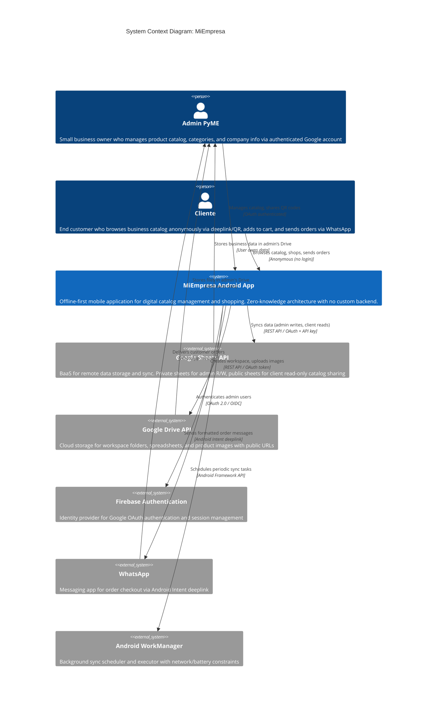

# C4 Context Level: MiEmpresa System Context

## System Overview

### Short Description

**MiEmpresa** is an offline-first Android mobile application that enables micro and small businesses (PyMEs) in Latin America to create, manage, and share digital product catalogs with their customers using Google Sheets as a zero-knowledge backend.

### Long Description

MiEmpresa is a thesis project (Trabajo de Grado) developed for Universidad Austral that addresses the digital transformation needs of PyMEs in Latin America. The system enables small business owners to digitize their product catalogs without requiring technical expertise or expensive infrastructure.

The application follows a **zero-knowledge architecture** where all user data remains in the user's Google Drive ecosystem—the developer never has access to business data. Using Google Sheets as a Backend-as-a-Service (BaaS), MiEmpresa eliminates the need for custom server infrastructure while providing full CRUD capabilities, offline-first data persistence, and seamless synchronization.

**Key Business Problems Solved:**
1. **Digital Transformation Accessibility**: PyMEs can create digital catalogs without technical expertise or expensive software
2. **Catalog Sharing**: Business owners can share catalogs via QR codes or deeplinks without requiring customers to install an app
3. **Zero Infrastructure Costs**: No backend servers, databases, or hosting costs—uses Google's free tier
4. **Data Privacy**: Business data stays in owner's Google Drive, developer has no access
5. **Offline Operation**: Full functionality without internet connectivity, with background sync when online

**Target Market**: Latin American micro and small businesses (artisans, retailers, service providers, food vendors) who need to share product catalogs with customers via WhatsApp.

**Development Context**: Academic MVP for thesis evaluation (February 2026) distributed via direct APK installation.

---

## Personas

### Admin PyME (Business Owner)

- **Type**: Human User - Authenticated
- **Description**: Small business owner or manager who manages their digital product catalog, categories, company information, and tracks orders. Typically non-technical users who need simple tools to digitize their business.
- **Authentication**: Google OAuth (Drive File + Sheets scopes)
- **Goals**: 
  - Digitize product catalog quickly without technical expertise
  - Share catalog with customers via WhatsApp and social media
  - Manage products, categories, and pricing
  - Track orders and customer interactions
  - Maintain control over business data
  - Work offline when internet is unavailable
- **Key Features Used**: 
  - Workspace onboarding and configuration
  - Product catalog management (CRUD)
  - Category management
  - QR code generation and catalog sharing
  - Manual order registration
  - Company settings configuration
  - Offline-first data management with sync

### Cliente (End Customer)

- **Type**: Human User - Anonymous (No Authentication)
- **Description**: End customer who discovers and browses a business catalog via QR code or deeplink. May or may not have the app installed. Can browse products, add items to cart, and send orders via WhatsApp without creating an account.
- **Authentication**: None required (anonymous access)
- **Goals**:
  - Browse product catalogs from favorite businesses
  - Search and filter products by category
  - Add products to shopping cart
  - Send orders to business via WhatsApp
  - Access catalogs offline after first visit
  - Return to previously visited stores
- **Key Features Used**:
  - Deeplink-based catalog access
  - Product browsing and search
  - Category filtering
  - Shopping cart with price validation
  - WhatsApp checkout
  - Offline catalog viewing
  - Multi-store history ("My Stores")

### Google Sheets API (Programmatic User)

- **Type**: External System / Programmatic User
- **Description**: Backend-as-a-Service that acts as both data storage and synchronization mechanism. Receives data from the Android app (admin writes) and serves public catalog data (client reads). Acts as a "passive backend" that stores data in structured spreadsheet tabs.
- **Integration Type**: REST API (bidirectional sync)
- **Purpose**: 
  - Store and retrieve business data (products, categories, orders)
  - Enable catalog sharing via public spreadsheets
  - Provide backup and data portability
- **Key Interactions**:
  - Receives product/category/order data from sync engine
  - Serves public catalog data to anonymous clients
  - Stores metadata in structured tabs (Info, Products, Categories, Orders)

### Google Drive API (Programmatic User)

- **Type**: External System / Programmatic User
- **Description**: Cloud storage service that manages the workspace folder structure and product image files. Creates and manages spreadsheets and folders in the user's Drive.
- **Integration Type**: REST API
- **Purpose**:
  - Create workspace folder structure (`MiEmpresa/[CompanyName]`)
  - Store product images with public URLs
  - Manage spreadsheet creation and permissions
  - Provide file management capabilities
- **Key Interactions**:
  - Creates folder hierarchy during onboarding
  - Uploads product images and generates public URLs
  - Creates and configures private/public spreadsheets
  - Manages file permissions (public/private)

### Firebase Authentication (Programmatic User)

- **Type**: External System / Programmatic User
- **Description**: Identity provider that manages Google OAuth authentication for admin users. Validates user identity and provides authentication tokens.
- **Integration Type**: OAuth 2.0 / OIDC
- **Purpose**:
  - Authenticate admin users via Google One Tap
  - Manage OAuth consent flow
  - Provide authentication tokens for Google API access
- **Key Interactions**:
  - Authenticates admin users during sign-in
  - Validates OAuth scopes (Drive File + Sheets)
  - Provides user identity (userId, email, profile picture)

### WhatsApp (Programmatic User)

- **Type**: External System / Programmatic User
- **Description**: Messaging application used as the checkout and order delivery mechanism. Receives pre-formatted order messages via Android Intent deeplink.
- **Integration Type**: Android Intent (whatsapp://send deeplink)
- **Purpose**:
  - Deliver customer orders to business WhatsApp number
  - Enable direct communication between customer and business
  - Provide familiar checkout experience for Latin American users
- **Key Interactions**:
  - Receives formatted order messages from cart checkout
  - Opens WhatsApp with pre-filled message and business phone number
  - Customer confirms and sends order to business

### Android WorkManager (Programmatic User)

- **Type**: External System / Runtime Environment
- **Description**: Android system service that schedules and executes background synchronization tasks. Ensures data sync happens reliably even when app is closed.
- **Integration Type**: Android Framework API
- **Purpose**:
  - Schedule periodic background sync (every 15 minutes)
  - Execute sync tasks with network and battery constraints
  - Retry failed syncs with exponential backoff
- **Key Interactions**:
  - Receives sync requests from Sync Engine component
  - Executes background sync workers
  - Manages sync constraints (network availability, battery level)

---

## System Features

### 1. Digital Catalog Management (CRUD)

- **Description**: Full product and category management with offline-first persistence. Admin can create, read, update, and delete products with images, prices, descriptions, and categories. Changes sync automatically to Google Sheets when online.
- **Users**: Admin PyME
- **User Journey**: [Admin Daily Management Journey](#admin-daily-management-journey)
- **Technical Scope**: 
  - Product CRUD with image upload to Drive
  - Category CRUD with emoji icons
  - Company metadata configuration
  - Dirty flag tracking for sync
  - Offline persistence with Room database

### 2. QR Code & Deeplink Catalog Sharing

- **Description**: Business owners can share their catalog via QR codes or deeplinks that open directly in client catalog view. QR codes can be printed, shared on social media, or sent via WhatsApp. Deeplinks support universal linking (app-installed users) and web fallback.
- **Users**: Admin PyME (shares), Cliente (consumes)
- **User Journey**: [Admin Sharing Journey](#admin-catalog-sharing-journey), [Client Discovery Journey](#client-catalog-discovery-journey)
- **Technical Scope**:
  - QR code generation with embedded deeplink
  - Deeplink routing (`miempresa://catalog/{companyId}`)
  - Public spreadsheet access via shared sheet ID
  - Anonymous client access (no authentication)

### 3. Offline-First Data Persistence

- **Description**: Full app functionality without internet connectivity. All data is stored locally in Room database with background synchronization when online. Clients can browse previously visited catalogs offline.
- **Users**: Admin PyME, Cliente
- **User Journey**: [Admin Offline Work Journey](#admin-offline-work-journey), [Client Offline Browse Journey](#client-offline-browse-journey)
- **Technical Scope**:
  - Room database as source of truth
  - WorkManager background sync (every 15 minutes)
  - Dirty flag conflict resolution
  - Network connectivity monitoring
  - CSV fallback for public catalog access

### 4. Shopping Cart with Price Validation

- **Description**: Clients can add products to cart, adjust quantities, and validate prices before checkout. Cart validates current prices against catalog to prevent stale pricing issues.
- **Users**: Cliente
- **User Journey**: [Client Shopping Journey](#client-shopping-and-checkout-journey)
- **Technical Scope**:
  - Cart persistence with multitenancy support
  - Real-time price validation against catalog
  - Cart summary with totals
  - Quantity adjustment with stock validation (future)

### 5. WhatsApp-Based Checkout

- **Description**: Customers complete checkout by sending pre-formatted order messages via WhatsApp to the business. Order includes product list, quantities, prices, and total. Business receives order in WhatsApp and can respond directly.
- **Users**: Cliente
- **User Journey**: [Client Shopping Journey](#client-shopping-and-checkout-journey)
- **Technical Scope**:
  - Pre-formatted WhatsApp message generation
  - Android Intent deeplink to WhatsApp
  - Order tracking in local database
  - Optional cart clearing after send

### 6. Manual Order Registration

- **Description**: Admin can manually register orders received via phone, WhatsApp, or in-person. Helps track sales and inventory even for orders placed outside the app.
- **Users**: Admin PyME
- **User Journey**: [Admin Order Tracking Journey](#admin-order-tracking-journey)
- **Technical Scope**:
  - Manual order entry form
  - Product selection from catalog
  - Order persistence and sync
  - Order history view

### 7. Multi-Store Client History

- **Description**: Clients can browse multiple business catalogs and access previously visited stores from "My Stores" list. Each store's catalog is cached for offline access.
- **Users**: Cliente
- **User Journey**: [Client Return Visit Journey](#client-return-visit-journey)
- **Technical Scope**:
  - Multi-company data isolation (multitenancy)
  - Company switching in UI
  - Visited store tracking in Room
  - Company-specific cart persistence

### 8. Workspace Onboarding

- **Description**: Guided onboarding flow for new admin users that creates workspace structure in Google Drive, initializes spreadsheets, and configures company metadata. Completes in under 2 minutes.
- **Users**: Admin PyME
- **User Journey**: [Admin Onboarding Journey](#admin-onboarding-journey)
- **Technical Scope**:
  - OAuth consent flow (Drive File + Sheets scopes)
  - Drive folder creation (`MiEmpresa/[CompanyName]`)
  - Private + public spreadsheet initialization
  - Metadata tab population
  - Progress tracking with 5-step wizard

---

## User Journeys

### Admin Onboarding Journey

**Persona**: Admin PyME (First-time user)  
**Goal**: Set up workspace and start managing catalog  
**Trigger**: User downloads APK and opens app for first time  
**Touchpoints**: SignInScreen → OnboardingScreen → HomeAdminScreen

#### Steps:

1. **Launch App**: User opens MiEmpresa for first time
   - **System Response**: Shows SignInScreen with "Continue with Google" button and privacy message
   
2. **Authenticate with Google**: User taps "Continue with Google"
   - **System Response**: Shows Google One Tap dialog
   - **External System**: Firebase Authentication validates identity
   
3. **Grant OAuth Permissions**: User approves Drive File + Sheets scopes
   - **System Response**: Shows OnboardingScreen with company setup form
   - **External System**: Firebase Authentication provides access tokens
   
4. **Enter Company Details**: User fills company name, WhatsApp number, optionally uploads logo
   - **System Response**: Validates inputs, enables "Continue" button
   
5. **Create Workspace**: User taps "Continue"
   - **System Response**: Shows progress indicator with 5 steps:
     - Step 1: Create Drive folder → Google Drive API
     - Step 2: Create private spreadsheet → Google Drive API + Sheets API
     - Step 3: Create public spreadsheet → Google Drive API + Sheets API
     - Step 4: Populate Info tabs → Sheets API
     - Step 5: Save company data → Room database
   - **External Systems**: Google Drive API, Google Sheets API
   - **Duration**: 30-45 seconds
   
6. **View Confirmation**: Workspace creation succeeds
   - **System Response**: Shows "Your workspace is ready!" with company summary
   
7. **Navigate to Dashboard**: User taps "Start Managing"
   - **System Response**: Shows HomeAdminScreen with empty catalog prompt
   
**Success Criteria**: User can add first product within 2 minutes of opening app

**Alternative Paths**:
- OAuth permission denied → Show error dialog with "Retry" option
- Workspace creation fails → Show error with specific step that failed + "Retry" option
- Network unavailable → Show "Requires internet connection" message

---

### Admin Daily Management Journey

**Persona**: Admin PyME (Returning user)  
**Goal**: Update catalog, add products, manage inventory  
**Trigger**: User opens app after onboarding complete  
**Touchpoints**: HomeAdminScreen → ProductsListScreen → AddProductScreen → ProductDetailScreen

#### Steps:

1. **Open App**: User launches MiEmpresa
   - **System Response**: Shows HomeAdminScreen with product count, category count, recent orders
   - **Sync Status**: Background sync starts (WorkManager)
   
2. **Navigate to Products**: User taps "Products" from navigation drawer
   - **System Response**: Shows ProductsListScreen with existing products
   - **Data Source**: Room database (offline-first)
   
3. **Search/Filter Products**: User types in search bar or selects category filter
   - **System Response**: Updates list in real-time (Room reactive query)
   
4. **Add New Product**: User taps FAB "+" button
   - **System Response**: Shows AddProductScreen with empty form
   
5. **Fill Product Details**: User enters name, price, description, selects category, uploads image
   - **System Response**: Validates inputs, shows image preview
   - **External System**: Google Drive API (uploads image, generates public URL)
   
6. **Save Product**: User taps "Save"
   - **System Response**: 
     - Saves to Room with `dirty=true` flag
     - Shows success message
     - Returns to ProductsListScreen with new product visible
   
7. **Background Sync**: WorkManager worker triggers (next 15-min interval or immediately if online)
   - **System Response**: Sync engine reads dirty records from Room
   - **External System**: Google Sheets API (writes product row to Products tab)
   - **System Response**: Updates `dirty=false` and `lastSyncedAt` timestamp
   
**Success Criteria**: Product visible immediately after save, synced to Sheets within 15 minutes

**Alternative Paths**:
- No internet during save → Product saved locally with dirty flag, syncs later
- Image upload fails → Shows error, allows retry or continue without image
- Duplicate product name → Shows warning, allows user to proceed or change name
- Category not created → Prompts user to create category first

---

### Admin Catalog Sharing Journey

**Persona**: Admin PyME  
**Goal**: Share catalog with customers via QR code or link  
**Trigger**: User wants to promote catalog on social media or print materials  
**Touchpoints**: ConfigScreen → ShareCatalogDialog → External sharing apps

#### Steps:

1. **Navigate to Settings**: User taps "Settings" from navigation drawer
   - **System Response**: Shows ConfigScreen with company info, sharing options
   
2. **Open Share Dialog**: User taps "Share Catalog" button
   - **System Response**: Shows ShareCatalogDialog with QR code and deeplink
   - **QR Code Contents**: `miempresa://catalog/{publicSheetId}`
   
3. **Select Sharing Method**: User chooses option:
   - **Option A: Download QR Image**: Saves QR PNG to device gallery
   - **Option B: Share Deeplink**: Opens Android share sheet
   - **Option C: Copy Link**: Copies deeplink to clipboard
   
4. **Share via WhatsApp/Social Media**: User pastes link or sends QR image
   - **External System**: WhatsApp, Instagram, Facebook, etc. (via Android Intent)
   
**Success Criteria**: Customer can access catalog via shared link/QR without app installed (web fallback) or directly in app if installed

**Alternative Paths**:
- Public spreadsheet not created → Shows error, prompts to complete onboarding
- Permission denied for saving image → Shows error dialog

---

### Admin Order Tracking Journey

**Persona**: Admin PyME  
**Goal**: Manually register orders received via phone or in-person  
**Trigger**: Customer places order outside app  
**Touchpoints**: PedidosListScreen → PedidoManualScreen

#### Steps:

1. **Navigate to Orders**: User taps "Orders" from navigation drawer
   - **System Response**: Shows PedidosListScreen with order history
   
2. **Add Manual Order**: User taps FAB "+" button
   - **System Response**: Shows PedidoManualScreen with product selection
   
3. **Select Products**: User searches and selects products, enters quantities
   - **System Response**: Shows running total, validates product availability
   
4. **Enter Customer Info**: User enters customer name, optional notes
   - **System Response**: Validates required fields
   
5. **Save Order**: User taps "Save"
   - **System Response**:
     - Saves order to Room with `dirty=true`
     - Shows success message
     - Returns to PedidosListScreen
   
6. **Background Sync**: WorkManager syncs order to Sheets Orders tab
   - **External System**: Google Sheets API
   
**Success Criteria**: Order visible in list immediately, synced to Sheets within 15 minutes

---

### Admin Offline Work Journey

**Persona**: Admin PyME  
**Goal**: Continue working when internet is unavailable  
**Trigger**: User loses internet connection or works in area with poor connectivity  
**Touchpoints**: All admin screens

#### Steps:

1. **Network Disconnection**: Internet becomes unavailable
   - **System Response**: Shows subtle "Offline" indicator in UI (status bar)
   
2. **Continue CRUD Operations**: User edits products, adds categories, etc.
   - **System Response**: All operations work normally, data saved to Room
   - **Dirty Flags**: All modified records marked with `dirty=true`
   
3. **View Offline Indicator**: User notices sync status icon
   - **System Response**: Shows "Changes will sync when online" tooltip
   
4. **Network Reconnection**: Internet becomes available
   - **System Response**: 
     - Updates status to "Syncing..."
     - WorkManager sync worker triggers immediately
   - **External System**: Google Sheets API (batch sync all dirty records)
   
5. **Sync Completion**: All dirty records synced successfully
   - **System Response**: Shows "Synced" indicator, updates timestamps
   
**Success Criteria**: No data loss, seamless transition online ↔ offline

**Alternative Paths**:
- Sync conflict (same product edited in Sheets and app) → Last-write-wins (app overwrites Sheets)
- Sync fails repeatedly → Exponential backoff retry, persistent dirty flags

---

### Client Catalog Discovery Journey

**Persona**: Cliente (First-time customer)  
**Goal**: Access business catalog from QR code or deeplink  
**Trigger**: Customer sees QR code on flyer, social media post, or WhatsApp message  
**Touchpoints**: External app/camera → MainActivity → CatalogoClienteScreen

#### Steps:

1. **Scan QR or Tap Deeplink**: Customer scans QR code or taps link
   - **Android System**: Parses deeplink `miempresa://catalog/{publicSheetId}`
   
2. **Open MiEmpresa (if installed)**: Android resolves deeplink
   - **System Response**: MainActivity receives deeplink intent, routes to CatalogoClienteScreen
   - **Alternative**: If app not installed → Opens web fallback (future feature)
   
3. **Fetch Catalog Data**: App loads catalog from public spreadsheet
   - **External System**: Google Sheets API (reads public Products tab)
   - **Fallback**: If API fails → CSV export parsing
   - **System Response**: Saves catalog to Room with `visited=true` flag
   
4. **View Catalog**: Customer sees company info banner and product grid
   - **System Response**: Shows CatalogoClienteScreen with products, search, category filter
   
5. **Add to My Stores**: Catalog automatically saved for future access
   - **System Response**: Company appears in MisTiendasScreen for return visits
   
**Success Criteria**: Customer can browse catalog within 5 seconds of tapping link

**Alternative Paths**:
- Network unavailable on first visit → Shows "Requires internet" error (first visit needs sync)
- Invalid sheet ID → Shows "Catalog not found" error
- Public permissions not set → Falls back to CSV export

---

### Client Shopping and Checkout Journey

**Persona**: Cliente  
**Goal**: Browse products, add to cart, send order via WhatsApp  
**Trigger**: Customer wants to purchase products from catalog  
**Touchpoints**: CatalogoClienteScreen → ProductDetailScreen → CarritoScreen → WhatsApp

#### Steps:

1. **Browse Products**: Customer scrolls product grid, uses search/filters
   - **System Response**: Shows real-time filtered results from Room
   
2. **View Product Details**: Customer taps product card
   - **System Response**: Shows ProductDetailScreen with full description, price, image
   
3. **Add to Cart**: Customer taps "Add to Cart" button, optionally adjusts quantity
   - **System Response**: 
     - Validates product still in catalog
     - Saves cart item to Room (multitenancy: filtered by companyId)
     - Shows "Added to cart" snackbar with cart icon badge update
   
4. **Continue Shopping or View Cart**: Customer taps cart icon in top bar
   - **System Response**: Shows CarritoScreen with cart items, quantities, subtotals
   
5. **Review Cart**: Customer reviews items, adjusts quantities, removes items
   - **System Response**: Updates totals in real-time
   
6. **Validate Prices**: System validates current catalog prices
   - **System Response**: 
     - Fetches current prices from Room
     - Compares with cart prices
     - Shows warning if prices changed ("Price updated: $X → $Y")
   
7. **Tap Checkout**: Customer taps "Send Order via WhatsApp"
   - **System Response**: Shows PreviewMensajeWhatsApp dialog with formatted message
   - **Message Format**:
     ```
     🛒 *New Order - [Company Name]*
     
     📦 Products:
     • Product A x2 - $10.00
     • Product B x1 - $5.00
     
     💰 Total: $25.00
     
     📍 [Optional customer notes]
     ```
   
8. **Confirm and Send**: Customer taps "Send"
   - **System Response**: 
     - Saves order to Room (for customer history)
     - Generates WhatsApp deeplink: `whatsapp://send?phone={businessPhone}&text={encodedMessage}`
     - Opens WhatsApp via Android Intent
   - **External System**: WhatsApp opens with pre-filled message
   
9. **Send in WhatsApp**: Customer taps Send in WhatsApp
   - **External System**: WhatsApp delivers message to business
   
10. **Return to App**: Customer returns to MiEmpresa
    - **System Response**: Shows "Order sent!" confirmation dialog with options:
      - **Clear Cart** (default)
      - **Keep Cart** (for ordering again)
   
**Success Criteria**: Order received by business via WhatsApp, customer experience seamless

**Alternative Paths**:
- WhatsApp not installed → Shows error "WhatsApp required", option to copy message to clipboard
- Product removed from catalog after adding to cart → Shows warning during price validation
- Price increased significantly → Shows alert, requires customer confirmation to proceed
- Network unavailable → Order saved locally, WhatsApp still works (uses Android Intent, not internet)

---

### Client Offline Browse Journey

**Persona**: Cliente  
**Goal**: Browse previously visited catalog without internet  
**Trigger**: Customer opens app while offline  
**Touchpoints**: MisTiendasScreen → CatalogoClienteScreen

#### Steps:

1. **Open App Offline**: Customer launches app without internet
   - **System Response**: Shows offline indicator in status bar
   
2. **Navigate to My Stores**: Customer taps "My Stores" from drawer
   - **System Response**: Shows MisTiendasScreen with visited companies (from Room)
   
3. **Select Store**: Customer taps on previously visited store
   - **System Response**: Shows CatalogoClienteScreen with cached catalog
   - **Data Source**: Room database (last synced version)
   - **Indicator**: Shows "Last updated: [timestamp]" banner
   
4. **Browse Products**: Customer uses search, filters, views product details
   - **System Response**: All read operations work from local cache
   
5. **Add to Cart**: Customer adds products to cart
   - **System Response**: Cart operations work normally (local persistence)
   
6. **Attempt Checkout**: Customer tries to send order via WhatsApp
   - **System Response**: 
     - Validates prices against local cache
     - WhatsApp Intent works (doesn't require internet)
     - Order saved locally with `dirty=true` (will sync when online)
   
**Success Criteria**: Full shopping experience works offline except initial catalog fetch

**Alternative Paths**:
- Customer never visited store before → Must be online for first access
- Catalog very stale (>7 days) → Shows warning banner suggesting refresh when online

---

### Client Return Visit Journey

**Persona**: Cliente (Returning customer)  
**Goal**: Quickly access previously visited store catalog  
**Trigger**: Customer wants to re-order from favorite business  
**Touchpoints**: MisTiendasScreen → CatalogoClienteScreen

#### Steps:

1. **Open App**: Customer launches MiEmpresa
   - **System Response**: Shows home screen with navigation drawer
   
2. **Navigate to My Stores**: Customer taps "My Stores"
   - **System Response**: Shows MisTiendasScreen with visited companies, sorted by recent
   
3. **Select Favorite Store**: Customer taps on store card
   - **System Response**: 
     - Switches context to selected company (multitenancy)
     - Shows CatalogoClienteScreen with catalog
     - Background sync refreshes catalog if online
   
4. **Browse Updated Catalog**: Customer sees latest products
   - **System Response**: Shows any new products added since last visit
   - **Indicator**: "New" badge on products added after last visit timestamp
   
5. **Continue Shopping**: Customer adds to cart, checks out as normal
   - **Cart Isolation**: Cart is company-specific (multitenancy by companyId)
   
**Success Criteria**: Customer can switch between multiple store catalogs seamlessly

**Alternative Paths**:
- Store removed from system → Shows "Catalog no longer available" error
- Multiple carts active → Each store maintains separate cart

---

## External Systems and Dependencies

### 1. Google Sheets API (v4)

- **Type**: Backend-as-a-Service (BaaS) / REST API
- **Description**: Cloud-based spreadsheet service that acts as the remote data storage and synchronization backend. Each company workspace consists of two spreadsheets: private (admin R/W) and public (client read-only).
- **Integration Type**: REST over HTTPS
- **Purpose**: 
  - Remote data persistence and backup
  - Enable catalog sharing via public spreadsheets
  - Provide data portability (users own their data)
  - Zero-knowledge architecture (developer has no access)
- **Authentication**: 
  - **Admin Flow**: OAuth 2.0 Bearer token (Drive.File + Spreadsheets scopes)
  - **Client Flow**: Public API key (optional) + CSV export fallback
- **Criticality**: HIGH - System can operate offline, but sync requires Sheets API
- **Failure Modes**: 
  - API quota exceeded → Falls back to CSV export for public reads
  - Network unavailable → Queues operations with dirty flags
  - Permission errors → Prompts user to re-authorize OAuth
- **Data Flow**: 
  - **Admin → Sheets**: Room dirty records → Sync engine → Sheets API (Products, Categories, Orders tabs)
  - **Sheets → Client**: Sheets API → Local cache (Room) → UI
- **Key Endpoints Used**:
  - `GET /v4/spreadsheets/{id}/values/{range}` - Read ranges
  - `POST /v4/spreadsheets/{id}/values/{range}:append` - Append rows
  - `PUT /v4/spreadsheets/{id}/values/{range}` - Update ranges
  - `POST /v4/spreadsheets/{id}:batchUpdate` - Delete rows, hide columns
- **Spreadsheet Structure**:
  - **Private Sheet** (Admin R/W): Info, Products, Categories, Orders tabs
  - **Public Sheet** (Client R): Info, Products tabs (view-only permissions)
- **References**:
  - [c4-container.md - External: Android App → Google Sheets API](./c4-container.md#external-android-app--google-sheets-api)
  - [c4-component.md - API Gateway Component](./c4-component.md#1-api-gateway-component)

---

### 2. Google Drive API (v3)

- **Type**: Cloud File Storage / REST API
- **Description**: Cloud storage service that manages workspace folder structure, spreadsheet files, and product images. Creates and maintains file hierarchy in user's Google Drive.
- **Integration Type**: REST over HTTPS
- **Purpose**:
  - Create workspace folder structure (`MiEmpresa/[CompanyName]`)
  - Upload and host product images with public URLs
  - Create and manage spreadsheet files
  - Set file/folder permissions (public/private)
- **Authentication**: OAuth 2.0 Bearer token (Drive.File scope - limited access)
- **Criticality**: HIGH - Required for onboarding, image uploads, and spreadsheet creation
- **Failure Modes**:
  - Quota exceeded → Shows error, prompts retry later
  - Permission errors → Re-authorization flow
  - Network unavailable → Queues operations, retries later
- **Data Flow**:
  - **Onboarding**: App → Drive API → Create folder + spreadsheets
  - **Image Upload**: App → Drive API → Returns public image URL → Stored in Room + Sheets
- **Key Endpoints Used**:
  - `POST /drive/v3/files` - Create folders, upload files
  - `GET /drive/v3/files?q={query}` - List files/folders
  - `DELETE /drive/v3/files/{fileId}` - Delete files
  - `POST /drive/v3/files/{fileId}/permissions` - Set public permissions
- **Folder Structure**:
  ```
  Google Drive/
  └── MiEmpresa/                    (Main app folder)
      └── [Company Name]/           (Company workspace)
          ├── [CompanyName]_Private.gsheet
          ├── [CompanyName]_Public.gsheet
          └── images/               (Product images)
              ├── product_001.jpg
              ├── product_002.png
              └── ...
  ```
- **References**:
  - [c4-container.md - External: Android App → Google Drive API](./c4-container.md#external-android-app--google-drive-api)
  - [c4-component.md - API Gateway Component](./c4-component.md#1-api-gateway-component)

---

### 3. Firebase Authentication

- **Type**: Identity Provider / OAuth 2.0 Service
- **Description**: Google's authentication service that manages user identity and OAuth consent flows. Provides secure authentication for admin users without custom backend.
- **Integration Type**: OAuth 2.0 / OpenID Connect (OIDC)
- **Purpose**:
  - Authenticate admin users via Google accounts
  - Manage OAuth 2.0 consent flow (Drive.File + Spreadsheets scopes)
  - Provide authentication tokens for Google API calls
  - Secure session management
- **Authentication**: Google One Tap (Credential Manager API)
- **Criticality**: CRITICAL - Required for admin access
- **Failure Modes**:
  - User denies OAuth consent → Shows error, blocks admin features
  - Network unavailable → Cannot authenticate (requires online)
  - Token expired → Automatic refresh via Credential Manager
- **Data Flow**:
  - App → Firebase Auth → Google Identity → OAuth Consent → Access Token → Google APIs
- **Scopes Requested**:
  - `https://www.googleapis.com/auth/drive.file` - Access to app-created files only
  - `https://www.googleapis.com/auth/spreadsheets` - Full spreadsheet access
- **User Data Collected**:
  - User ID (Firebase UID)
  - Email address
  - Display name
  - Profile picture URL
- **Security Features**:
  - Secure nonce generation (OIDC)
  - Token encryption in Android Keystore
  - Automatic token refresh
- **References**:
  - [c4-container.md - External: Android App → Firebase Authentication](./c4-container.md#external-android-app--firebase-authentication)
  - [c4-component.md - Authentication Component](./c4-component.md#2-authentication-component)

---

### 4. WhatsApp

- **Type**: External Messaging Application
- **Description**: Third-party messaging app used as the checkout and order delivery mechanism. Receives pre-formatted order messages via Android Intent deeplink.
- **Integration Type**: Android Intent (URL Scheme: `whatsapp://send`)
- **Purpose**:
  - Enable familiar checkout experience for Latin American users
  - Deliver customer orders directly to business WhatsApp number
  - Facilitate direct communication between customer and business
  - Eliminate need for in-app payment processing
- **Authentication**: None (uses Android Intent system)
- **Criticality**: HIGH - Primary checkout mechanism (no alternative payment flow)
- **Failure Modes**:
  - WhatsApp not installed → Shows error + option to copy message to clipboard
  - Invalid phone number format → Pre-validated during onboarding
  - User cancels send in WhatsApp → Order saved but not sent (can retry)
- **Data Flow**:
  - App generates formatted message → Opens WhatsApp via Intent → User sends manually
- **Message Format**:
  ```
  🛒 *New Order - [Company Name]*
  
  📦 Products:
  • [Product Name] x[Qty] - $[Price]
  • [Product Name] x[Qty] - $[Price]
  
  💰 Total: $[Amount]
  
  📝 [Optional customer notes]
  ```
- **Intent Parameters**:
  - `phone`: Business WhatsApp number (international format, no +)
  - `text`: URL-encoded order message
- **Technical Constraints**:
  - No delivery confirmation (user manually sends)
  - No in-app chat integration
  - Requires WhatsApp installed on device
- **References**:
  - [c4-container.md - External: Android App → WhatsApp](./c4-container.md#external-android-app--whatsapp)
  - [c4-component.md - Cart & Checkout Component](./c4-component.md#9-cart--checkout-component)

---

### 5. Android WorkManager

- **Type**: Android System Service / Background Execution Runtime
- **Description**: Android Jetpack library that schedules and executes deferrable, guaranteed background work. Manages periodic sync tasks with intelligent scheduling based on system constraints.
- **Integration Type**: Android Framework API
- **Purpose**:
  - Schedule periodic background sync (every 15 minutes)
  - Execute sync tasks reliably across device reboots
  - Respect system constraints (network, battery, charging state)
  - Retry failed syncs with exponential backoff
- **Authentication**: None (internal Android component)
- **Criticality**: HIGH - Required for background synchronization
- **Failure Modes**:
  - Low battery → Sync deferred until charging
  - No network → Sync queued until connectivity restored
  - Sync worker crashes → Automatic retry with exponential backoff
- **Data Flow**:
  - Sync Engine → WorkManager → SyncWorker → Room (read dirty records) → Sheets API (write) → Room (clear dirty flags)
- **Scheduling Constraints**:
  - **Trigger**: Every 15 minutes (periodic)
  - **Required**: Network connectivity (unmetered preferred)
  - **Optional**: Device charging, battery not low
- **Sync Worker Logic**:
  1. Check network connectivity
  2. Query Room for dirty records (products, categories, orders)
  3. Batch write to Google Sheets API
  4. Update `dirty=false` and `lastSyncedAt` in Room
  5. Handle conflicts (last-write-wins strategy)
  6. Retry on failure (exponential backoff: 30s, 2m, 10m)
- **Technical Constraints**:
  - Minimum Android API 24 (Nougat 7.0)
  - Background execution limits on Android 12+ (doze mode)
  - WorkManager constraints may delay sync (acceptable for MVP)
- **References**:
  - [c4-container.md - External: Android App → Android WorkManager](./c4-container.md#external-android-app--android-workmanager)
  - [c4-component.md - Sync Engine Component](./c4-component.md#4-sync-engine-component)

---

### 6. Android OS (Platform)

- **Type**: Mobile Operating System / Runtime Environment
- **Description**: Android operating system that provides core platform services, app lifecycle management, storage, networking, and security features.
- **Integration Type**: Native Android SDK (API Level 24-34)
- **Purpose**:
  - App lifecycle management (activities, services, receivers)
  - Local data storage (Room SQLite, DataStore)
  - Network connectivity monitoring
  - Intent system (deeplinks, app switching)
  - Background task execution (WorkManager)
  - Security (Keystore, EncryptedSharedPreferences)
- **Version Support**: Android 7.0 Nougat (API 24) to Android 14 (API 34)
- **Criticality**: CRITICAL - Platform dependency
- **Key Platform Features Used**:
  - **Room Persistence Library**: SQLite database abstraction
  - **DataStore**: Secure preference storage
  - **Credential Manager**: OAuth token management
  - **Intent System**: Deeplink routing, WhatsApp integration
  - **Jetpack Compose**: Declarative UI framework
  - **Material Design 3**: UI component library
- **Technical Constraints**:
  - Minimum SDK 24 (95%+ device coverage in Latin America)
  - Target SDK 34 (required for Play Store, though MVP uses direct APK)
  - Offline-first architecture (compensates for poor connectivity)
- **References**:
  - [c4-container.md - Container 1: Android Application](./c4-container.md#1-android-application-container)

---

## System Context Diagram



**Diagram Notes**:
- **System Boundary**: MiEmpresa Android App (single deployment unit)
- **Human Users**: Admin PyME (authenticated), Cliente (anonymous)
- **Programmatic Users**: Google Sheets API, Google Drive API, Firebase Auth, WhatsApp, WorkManager
- **Data Ownership**: All user data stored in admin's Google Drive (zero-knowledge architecture)
- **No Custom Backend**: System relies entirely on Google ecosystem as BaaS
- **Primary Integration**: REST APIs (Drive + Sheets) + Android Intents (WhatsApp) + Framework APIs (WorkManager)

---

## System Boundaries

### Inside the System (MiEmpresa Android App)

**Components Included**:
- All 11 components from Component-level architecture
- Infrastructure layer (API Gateway, Auth, Data Persistence, Sync Engine, Network Monitor)
- Business logic layer (Workspace, Admin Catalog, Client Catalog, Cart, Orders)
- Presentation layer (Navigation, UI components, ViewModels)

**Responsibilities**:
- User interface and interaction
- Business logic execution
- Local data persistence (Room database)
- Background synchronization orchestration
- OAuth consent management
- Offline-first operations
- Multitenancy and data isolation

### Outside the System (External Dependencies)

**Not Included**:
- Backend servers or custom APIs (system uses BaaS instead)
- Database servers (uses Room SQLite locally + Sheets remotely)
- Authentication servers (uses Firebase Auth)
- File storage servers (uses Google Drive)
- Payment processing (uses WhatsApp for order delivery)
- Push notifications (not required for MVP)
- Analytics tracking (not required for MVP)

**External System Ownership**:
- Google owns Sheets/Drive/Firebase infrastructure
- User owns their data (stored in user's Google Drive)
- WhatsApp (Meta) owns messaging infrastructure
- Android OS (Google) owns platform runtime

---

## Related Documentation

### Lower-Level C4 Documentation

- **[Container Documentation](./c4-container.md)** - Deployment architecture with 6 containers
- **[Component Documentation](./c4-component.md)** - Logical component structure with 11 components
- **[Code Documentation - Core](./c4-code-core.md)** - Infrastructure layer code details
- **[Code Documentation - Features](./c4-code-features.md)** - Business logic layer code details
- **[Code Documentation - Cart](./c4-code-cart.md)** - Cart & checkout implementation details

### Architecture Decisions

- **[ADR-001: Package-by-Feature + Clean Architecture](../decisions/ADR-001-package-by-feature-clean-architecture.md)** - Architectural pattern decisions
- **[ADR-002: Navigation Architecture](../decisions/ADR-002-navigation-architecture.md)** - Navigation routing strategy

### System Documentation

- **[Architecture README](../README.md)** - Architecture overview and principles
- **[User Stories](../../context/UserStories_MVP.md)** - Detailed user stories for all features (42 stories across 10 epics)
- **[Architecture Information](../../context/ArquitecturaInformacion_MVP.md)** - UI screens, navigation flows, and information architecture
- **[Technical Decisions](../../context/Decisiones_Tecnicas_y_Alcance_MVP.md)** - Technical decisions and MVP scope
- **[Validation Criteria](../../context/Criterios_Validacion_MVP_Actualizado.md)** - Success metrics and validation criteria

### User and Task Context

- **[Users and Tasks](../../context/Usuarios_y_Tareas.md)** - Proto-personas, scenarios, and Jobs-to-be-Done
- **[Benchmark](../../context/benchmark_consolidado.md)** - Competitive analysis

---

## Glossary

### Business Terms

- **PyME**: Pequeña y Mediana Empresa (Small and Medium Enterprise) - micro/small businesses in Latin America
- **Admin PyME**: Business owner or manager role who manages the catalog
- **Cliente**: End customer who browses and purchases from catalog
- **Catálogo**: Product catalog (digital version of printed price list)
- **Pedido**: Order placed by customer
- **Workspace**: Admin's company data environment (Drive folder + Sheets + Room records)

### Technical Terms

- **BaaS**: Backend-as-a-Service - using third-party services (Google Sheets) instead of custom backend
- **Zero-Knowledge Architecture**: System design where developer has no access to user data (data stays in user's Google Drive)
- **Offline-First**: Architectural pattern where app works fully offline with background sync
- **Dirty Flag**: Boolean field marking local records that need sync to remote
- **Multitenancy**: Support for multiple companies (workspaces) in single app installation
- **Deeplink**: URL that opens specific content in app (`miempresa://catalog/{id}`)
- **OAuth Scope**: Permission level requested during Google authentication (`drive.file`, `spreadsheets`)

### System Components

- **Room**: Android SQLite abstraction library for local persistence
- **WorkManager**: Android background task scheduler
- **Jetpack Compose**: Declarative UI framework
- **ViewModel**: UI state management component (follows Android Architecture Components pattern)
- **Repository**: Data abstraction interface (Clean Architecture pattern)

---

## Version History

| Version | Date | Author | Changes |
|---------|------|--------|---------|
| 1.0 | 2026-02-19 | System | Initial C4 Context documentation - synthesized from Container, Component, and system docs |

---

## Document Metadata

**Document Type**: C4 Context-level Architecture Documentation  
**Scope**: System-wide context view (highest C4 level)  
**Audience**: Technical and non-technical stakeholders, thesis evaluators, future maintainers  
**Maintenance**: Update when system boundaries change, new external systems added, or personas evolve  
**Related Standards**: C4 Model (https://c4model.com)

---

**End of C4 Context Documentation**
